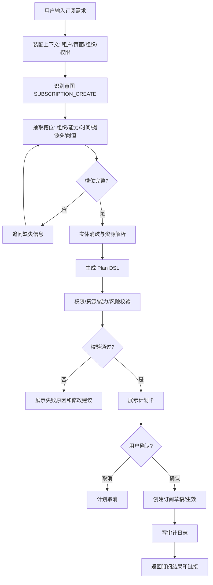

# 万象 AGI 巡检对话式产品 PRD

| 项目 | 内容 |
|---|---|
| 文档版本 | v1.0 |
| 日期 | 2026-06-24 |
| 产品名称 | 万象 AGI 巡检 |
| 产品形态 | Web 控制台 + 全局对话助手 + AI 巡检能力工厂 |
| 目标版本 | P0 MVP |
| 参考输入 | 自进化飞轮蓝图、`AGI巡检助理.pdf`、`万象AGI巡检`原型包、`AGI巡检对话式产品落地方案.md` |
| 主要读者 | CEO、产品、设计、算法、后端、前端、测试、交付、售前 |

## 1. 产品概述

### 1.1 背景

当前 AI 巡检产品正在从“人工配置巡检项 + 固定算法能力 + 项目制交付”转向“客户自助订阅能力 + 对话式业务操作 + 模型与工作流自进化”。已有 `万象AGI巡检` 原型已经覆盖应用广场、应用编排、数据源节点、小模型节点、大模型节点、工具库节点、应用订阅、摄像头关联和布防时间等能力，但客户仍需要理解较复杂的后台配置逻辑。

本 PRD 目标是定义一个基于对话模式的 AI 巡检产品，使客户可以通过自然语言完成平台摄像头接入、巡检功能订阅、即时巡检、结果查看、数据统计分析、误报反馈和能力迭代相关操作。

### 1.2 产品定位

**万象 AGI 巡检是面向连锁门店、汽车展厅、园区、物业、校园等线下场景的对话式 AI 巡检运营工作台。**

它不是单纯 Chatbot，而是一个把自然语言转成可校验、可确认、可执行、可审计巡检任务的业务操作系统。

### 1.3 核心价值

1. **降低配置门槛**：客户不用理解复杂工作流节点，也能用自然语言创建订阅和查询结果。
2. **提升巡检覆盖率**：通过摄像头推荐、自动标定候选、能力模板和批量订阅，提高上线效率。
3. **提升可信度**：所有巡检结论绑定证据，包括截图、视频片段、检测框、事件 ID、模型版本和查询口径。
4. **形成自进化飞轮**：误报、漏报、标注、badcase、评测和发布闭环进入模型进化体系。
5. **兼容现有画布**：对话生成的是可编辑的计划或工作流草稿，现有画布仍是高级配置和能力工厂。

### 1.4 产品目标

P0 MVP 目标：

1. 支持客户通过全局对话助手创建巡检订阅草稿，并在确认后生效。
2. 支持客户通过对话查询巡检结果和证据。
3. 支持客户通过对话进行基础数据统计分析。
4. 支持客户对事件进行真警、误报、忽略和 badcase 反馈。
5. 支持所有高风险写操作经过计划卡确认、权限校验、审计记录。

### 1.5 成功指标

| 指标 | P0 目标 |
|---|---|
| 对话创建订阅草稿成功率 | 高频场景 >= 80% |
| 高频意图 Top1 准确率 | >= 90% |
| 高频意图 Top3 召回率 | >= 97% |
| 关键槽位准确率 | >= 92% |
| 结果类回答证据绑定率 | 100% |
| 高风险误执行次数 | 0 |
| 跨租户数据泄漏 | 0 |
| 查询结果首屏响应 | <= 30 秒 |
| 订阅计划生成响应 | <= 10 秒 |

### 1.6 P0 范围

P0 包含：

1. 独立产品入口：AI 巡检助理工作台。
2. 嵌入式入口：可在多个平台页面中打开的 Chat Widget / Chat Panel。
3. 全局对话助手 Chat Portal。
4. Plan DSL 与计划卡确认。
5. 意图识别与槽位抽取第一版。
6. 订阅创建和订阅查询。
7. 结果查询、证据查看和事件反馈。
8. 数据统计问答第一版。
9. 现有应用广场、应用编排、应用订阅页面的对话联动。
10. 审计日志和权限校验。

P0 不包含：

1. 完全自动训练或自动发布新模型。
2. 面向第三方开放的完整 Agent SDK。
3. 任意互联网开放搜索。
4. 无人工确认的自动标定生效。
5. 客户自助创建全新算法模型。
6. 删除、批量修改核心配置的无确认执行。

### 1.7 P1/P2 范围预告

P1：

1. 摄像头接入助手。
2. 自动选点和自动标定候选。
3. SOP 知识库导入和 RAG。
4. 对话生成工作流草稿。
5. 即时巡检。
6. 导出和日报。

P2：

1. 行业模板市场。
2. 多模型评测和灰度发布。
3. 第三方工具生态。
4. 客户自助能力创建和发布审批。
5. 计量计费和套餐化。
6. 自进化运营看板。

### 1.8 需求优先级总表

| 需求 ID | 需求名称 | 优先级 | 版本 | 说明 |
|---|---|---|---|---|
| FR-001 | 全局对话助手入口 | P0 | MVP | 所有核心页面可唤起助手 |
| FR-002 | 对话会话与历史记录 | P0 | MVP | 支持历史会话、消息、关联计划 |
| FR-003 | 意图识别与槽位抽取 | P0 | MVP | 覆盖订阅、结果、统计、反馈、帮助 |
| FR-004 | Plan DSL 与计划卡 | P0 | MVP | 写操作必须先生成计划 |
| FR-005 | 计划确认与取消 | P0 | MVP | 用户确认后才执行高风险动作 |
| FR-006 | 订阅创建对话闭环 | P0 | MVP | 自然语言创建订阅草稿或生效订阅 |
| FR-007 | 应用订阅页面联动 | P0 | MVP | 对话生成内容可回填订阅页 |
| FR-008 | 结果中心列表 | P0 | MVP | 查询和筛选巡检事件 |
| FR-009 | 事件详情与证据卡 | P0 | MVP | 展示截图、视频、检测框和规则 |
| FR-010 | 误报/真警反馈 | P0 | MVP | 反馈进入 badcase 或事件处理记录 |
| FR-011 | 数据统计问答 | P0 | MVP | 基于语义指标层回答统计问题 |
| FR-012 | 工具网关与审计 | P0 | MVP | 统一工具调用、脱敏、日志 |
| FR-013 | 权限与数据范围校验 | P0 | MVP | 租户、组织、角色隔离 |
| FR-014 | 应用广场 AI 创建入口 | P0 | MVP | 从应用广场唤起“用 AI 创建应用” |
| FR-015 | 低置信澄清与实体消歧 | P0 | MVP | 避免误识别和误执行 |
| FR-016 | 摄像头接入助手 | P1 | 增强版 | 对话导入、测试取流、失败诊断 |
| FR-017 | 即时巡检 | P1 | 增强版 | 指定摄像头立即分析 |
| FR-018 | 自动选点候选 | P1 | 增强版 | LLM 生成候选，人工确认 |
| FR-019 | 自动标定候选 | P1 | 增强版 | OVD/多模态生成区域候选 |
| FR-020 | SOP 知识库 RAG | P1 | 增强版 | 文档导入、检索、来源引用 |
| FR-021 | 对话生成工作流草稿 | P1 | 增强版 | 生成画布节点草稿 |
| FR-022 | 导出与日报 | P1 | 增强版 | 事件和统计导出 |
| FR-023 | 行业模板市场 | P2 | 产品化 | 汽车、零售、物业、校园模板 |
| FR-024 | 多模型评测与灰度 | P2 | 产品化 | 版本对比、灰度、回滚 |
| FR-025 | Agent SDK | P2 | 产品化 | 第三方工具接入 |
| FR-026 | 计量计费 | P2 | 产品化 | Token、任务、摄像头、订阅计量 |
| FR-027 | 独立 AI 巡检助理工作台 | P0 | MVP | 独立 URL 入口，支持完整对话式巡检操作 |
| FR-028 | 嵌入式 Chat Widget | P0 | MVP | 可被万象、星象、天工及客户平台内嵌 |
| FR-029 | 页面样式 token 与主题配置 | P0 | MVP | 支持独立入口和嵌入入口视觉一致 |
| FR-030 | 页面上下文注入 | P0 | MVP | 嵌入时识别租户、组织、页面和当前对象 |

## 2. 术语与业务对象

### 2.1 术语

| 术语 | 定义 |
|---|---|
| 对话助手 | 全局可唤起的 AI 交互入口，负责理解用户意图、生成计划、执行查询和引导操作 |
| Plan DSL | 由自然语言解析得到的结构化执行计划，包含意图、槽位、动作、风险、校验器和确认要求 |
| 计划卡 | 面向用户展示的计划摘要，用户确认后才允许执行写操作 |
| 能力 | 可被订阅或编排的巡检能力，如离岗检测、消防通道占用、抽烟检测 |
| 模型应用 | 由数据源、小模型、大模型、工具库节点组合形成的可发布巡检应用 |
| 应用订阅 | 将某个模型应用应用到组织、门店、摄像头和布防时间的业务配置 |
| 即时巡检 | 对指定摄像头或点位发起一次性巡检任务 |
| 事件/告警 | 巡检任务输出的结构化异常结果 |
| 证据 | 支撑事件判断的截图、视频片段、检测框、模型输出和规则信息 |
| 标定 | 为摄像头画面指定检测区域或排除区域 |
| badcase | 被人工反馈为误报、漏报、边界问题或模型效果异常的样本 |
| 语义指标层 | 面向自然语言问数的统一指标、维度和查询口径层 |

### 2.2 核心业务对象

| 对象 | 说明 |
|---|---|
| Tenant | 租户，如极狐汽车、某物业集团 |
| Organization | 组织树，包括区域、城市、门店、楼栋、楼层等 |
| Camera | 摄像头资源，包含点位、在线状态、流状态、快照 |
| Capability | 巡检能力定义，包含能力名称、适用场景、输入输出、阈值和评测指标 |
| WorkflowApp | 模型应用，由画布节点组成 |
| WorkflowVersion | 模型应用版本，订阅必须绑定明确版本 |
| Subscription | 功能订阅，绑定组织、摄像头、能力、时间和阈值 |
| InspectionTask | 巡检任务，包括即时任务、定时任务、批量任务 |
| InspectionEvent | 巡检事件/告警 |
| Evidence | 事件证据 |
| Conversation | 对话会话 |
| Message | 对话消息 |
| Plan | 结构化执行计划 |
| ToolCall | 工具调用记录 |
| Feedback | 用户反馈，包括真警、误报、漏报、忽略 |
| KnowledgeDocument | SOP、制度、能力说明等知识文档 |
| AuditLog | 审计日志 |

## 3. 用户角色与权限

### 3.1 用户角色

| 角色 | 典型用户 | 核心目标 |
|---|---|---|
| 租户管理员 | 客户总部管理员 | 管组织、账号、摄像头、权限、订阅和审计 |
| 区域运营负责人 | 区域经理、城市经理 | 查看区域巡检效果，创建区域订阅，处理异常 |
| 门店/现场负责人 | 店长、物业经理、安保负责人 | 查看本门店异常、确认事件、反馈误报 |
| 一线处理人员 | 安保、保洁、工程人员 | 接收告警、查看证据、处理闭环 |
| 内部交付人员 | 深象交付/实施 | 协助客户接入、配置、标定、验证 |
| 算法/模型工程师 | 算法、模型运维 | 创建能力、处理 badcase、评测和发布版本 |
| 系统管理员 | 平台管理员 | 管租户、系统配置、模型资源、审计策略 |
| 审计/管理层 | 客户管理层 | 查看报表、审计记录和运行风险 |

### 3.2 权限矩阵

| 功能 | 租户管理员 | 区域运营 | 门店负责人 | 一线人员 | 内部交付 | 算法工程师 | 系统管理员 |
|---|---:|---:|---:|---:|---:|---:|---:|
| 查看组织树 | 全租户 | 授权区域 | 本门店 | 指派范围 | 授权租户 | 按授权 | 全平台 |
| 查看摄像头 | 全租户 | 授权区域 | 本门店 | 指派范围 | 授权租户 | 必要脱敏 | 全平台 |
| 查看原始流地址 | 否 | 否 | 否 | 否 | 脱敏/受控 | 否 | 受控 |
| 测试摄像头取流 | 是 | 是 | 可配置 | 否 | 是 | 否 | 是 |
| 创建应用订阅 | 是 | 授权区域 | 可配置 | 否 | 代配置 | 否 | 是 |
| 修改订阅 | 是 | 授权区域 | 可配置 | 否 | 代配置 | 否 | 是 |
| 删除订阅 | 是 | 可配置 | 否 | 否 | 代配置 | 否 | 是 |
| 查看事件结果 | 全租户 | 授权区域 | 本门店 | 指派事件 | 授权租户 | 样本脱敏 | 全平台 |
| 确认真警/误报 | 是 | 是 | 是 | 指派事件 | 是 | 否 | 是 |
| 导出数据 | 是 | 授权区域 | 可配置 | 否 | 可配置 | 否 | 是 |
| 编辑工作流 | 可配置 | 否 | 否 | 否 | 是 | 是 | 是 |
| 发布模型应用 | 可配置 | 否 | 否 | 否 | 可配置 | 是 | 是 |
| 管理 AI 助手配置 | 是 | 否 | 否 | 否 | 可配置 | 可配置 | 是 |
| 查看审计日志 | 是 | 可配置 | 否 | 否 | 可配置 | 否 | 是 |

### 3.3 数据范围规则

1. 所有查询必须带 `tenant_id`。
2. 所有组织、摄像头、订阅、事件必须校验用户授权组织范围。
3. 对话助手不得越过当前用户权限执行工具。
4. 页面上隐藏按钮不是权限边界，后端必须二次校验。
5. 导出、证据下载、视频片段查看、批量写操作必须记录审计。
6. 原始流地址、设备密码、API Key、厂商凭证不返回前端明文。

## 4. 信息架构

### 4.1 一级导航

| 一级模块 | 子模块 | P0 | 说明 |
|---|---|---:|---|
| 首页 | 运行概览、待处理、最近对话 | 可选 | P0 可先做轻量入口 |
| 巡检中心 | 事件结果、任务中心、统计分析 | 是 | 客户高频使用 |
| 模型应用 | 应用广场、应用编排、应用订阅 | 是 | 复用现有原型并补对话入口 |
| 摄像头管理 | 摄像头列表、接入检测、点位标定 | P1 | P0 可只提供读取和选择 |
| 知识库 | SOP、业务词典、能力说明 | P1 | P0 可后台配置 |
| AI 配置 | 意图、槽位、工具、风险策略 | P1 | P0 内部配置 |
| 反馈中心 | badcase、误报、漏报、评测状态 | P0/P1 | P0 从事件反馈切入 |
| 系统管理 | 组织、账号、角色、审计 | 是 | 复用已有平台能力 |

### 4.2 全局组件

| 组件 | 说明 | P0 |
|---|---|---:|
| 全局对话助手入口 | 顶部或右下角图标，所有页面可唤起 | 是 |
| 右侧聊天抽屉 | 展示对话历史、输入框、系统回复、计划卡 | 是 |
| 计划卡 | 展示意图、对象、影响范围、缺失信息、风险、确认按钮 | 是 |
| 执行进度条 | 展示工具调用状态和业务状态 | 是 |
| 证据卡 | 展示事件摘要、图片、视频片段、检测框、置信度 | 是 |
| 组织上下文选择器 | 当前租户、区域、门店 | 是 |
| 通知中心 | 执行结果、失败、告警通知 | 可选 |

## 5. 页面需求

### 5.1 全局对话助手 Chat Portal

#### 5.1.1 页面目标

让用户在任意页面用自然语言完成巡检相关查询、订阅、统计、结果查看和反馈操作。

#### 5.1.2 页面入口

1. 顶部导航 AI 助手图标。
2. 页面右下角悬浮入口。
3. 应用广场、应用订阅、结果中心、统计分析页面的“问助手”按钮。
4. 计划卡、事件卡、订阅卡的“继续追问”入口。

#### 5.1.3 布局

右侧抽屉，宽度建议 420 到 520px，可展开为半屏模式。

区域：

1. 会话标题和当前上下文。
2. 对话历史列表。
3. 消息内容区。
4. 计划卡/证据卡/图表卡嵌入区。
5. 输入框和快捷指令。
6. 历史会话列表入口。

#### 5.1.4 字段与显示

会话头部：

| 字段 | 说明 |
|---|---|
| 当前租户 | 如极狐汽车 |
| 当前组织 | 如华东区/广州悦汇城 |
| 当前页面 | 如应用订阅 |
| 会话标题 | 自动生成，可编辑 |
| 会话状态 | 进行中、已完成、异常中断 |

消息：

| 字段 | 说明 |
|---|---|
| message_id | 消息 ID |
| sender | user/assistant/system |
| content | 消息内容 |
| created_at | 发送时间 |
| linked_plan_id | 关联计划 |
| linked_object | 关联订阅、事件、任务、图表 |

输入框：

1. 支持文本输入。
2. 支持换行。
3. 支持上传图片/文件作为 P1。
4. 支持快捷指令：
   - 创建订阅
   - 查询告警
   - 统计分析
   - 查看摄像头
   - 反馈误报

#### 5.1.5 交互

1. 用户输入自然语言后，系统展示“正在理解需求”状态。
2. 如果缺少关键槽位，助手必须追问，不进入执行。
3. 如果是读操作且校验通过，助手可以直接执行查询。
4. 如果是写操作，助手必须生成计划卡并等待确认。
5. 用户可以点击计划卡的“修改”进入补充槽位。
6. 用户可以点击“在页面中打开”，跳转到对应页面并保留对话窗口。
7. 用户可以取消计划，取消后计划状态为 `CANCELLED`。
8. 工具调用失败时展示失败原因和可重试动作。

#### 5.1.6 状态

| 状态 | 页面表现 |
|---|---|
| 空状态 | 展示欢迎语和 4 到 6 个推荐问题 |
| 理解中 | 输入框禁用或显示加载状态，可取消 |
| 缺槽追问 | 高亮缺失信息，如门店、时间、能力 |
| 待确认 | 展示计划卡和确认/取消按钮 |
| 执行中 | 展示进度、已完成工具、当前工具 |
| 成功 | 展示结果卡和下一步建议 |
| 部分失败 | 展示成功数量、失败数量、失败明细 |
| 失败 | 展示错误原因、重试、转人工 |
| 无权限 | 说明权限不足，不展示敏感对象 |

#### 5.1.7 异常场景

1. 无法识别意图：展示可选意图，不执行。
2. 多个门店重名：展示候选门店并要求选择。
3. 查询范围超出权限：只展示授权范围内结果，并提示已过滤。
4. 写操作影响范围过大：要求二次确认。
5. 工具超时：展示超时原因和稍后查看入口。

#### 5.1.8 验收标准

1. 用户在任意页面唤起助手时，助手能显示当前租户、组织和页面上下文。
2. 对“创建订阅”类写操作，未确认前不得调用创建接口。
3. 对“昨天广州悦汇城有哪些离岗告警”类读操作，能返回事件列表和证据入口。
4. 低置信度意图不得直接执行。
5. 所有工具调用必须在审计中可追踪。

### 5.2 计划卡 Plan Card

#### 5.2.1 目标

让用户在执行前清楚知道系统准备做什么、影响哪些对象、还缺什么信息、风险是什么。

#### 5.2.2 显示字段

| 字段 | 说明 |
|---|---|
| 计划标题 | 如“创建华东区迎宾巡检订阅” |
| 意图类型 | 创建订阅、查询结果、即时巡检、统计分析 |
| 风险等级 | 低、中、高 |
| 影响范围 | 组织、门店数、摄像头数 |
| 能力 | 模型应用名称、版本、能力类型 |
| 时间 | 生效日期、布防时段、查询时间 |
| 阈值 | 离岗时长、去重时间、置信度 |
| 通知对象 | 接收人或接收组 |
| 缺失信息 | 缺少时展示 |
| 校验结果 | 权限、摄像头、能力、额度 |
| 预计结果 | 将创建的订阅数、任务数或查询结果范围 |
| 操作按钮 | 确认执行、修改、取消、打开页面 |

#### 5.2.3 交互

1. 所有高风险写操作展示红色或醒目标识。
2. 批量操作显示影响门店和摄像头数量。
3. 如果存在离线摄像头，计划卡展示“部分摄像头不可用”。
4. 用户点击“修改”后，进入槽位编辑模式。
5. 用户点击“确认执行”后，按钮进入 loading，并禁止重复点击。
6. 支持展开查看详细对象列表。

#### 5.2.4 验收标准

1. 计划卡必须展示风险等级和确认要求。
2. 缺槽计划不得展示“确认执行”按钮。
3. 执行后的计划卡状态必须变为成功、部分成功或失败。
4. 用户可从执行结果追溯到原始对话和计划。

### 5.3 应用广场

#### 5.3.1 目标

展示可复用模型应用，支持搜索、新建、复制、查看详情和订阅。

#### 5.3.2 现有能力继承

继承当前原型：

1. 应用广场空状态。
2. 应用搜索。
3. 新增应用编排。
4. 复制应用。
5. 组织树选择。

#### 5.3.3 新增需求

1. 新增“用 AI 创建应用”入口。
2. 应用卡片增加适用场景、数据源要求、是否需要标定、推荐摄像头点位。
3. 应用详情增加版本、效果指标、最近发布记录、已订阅组织。
4. 从对话生成工作流草稿后，可跳转到应用编排页面。

#### 5.3.4 应用卡字段

| 字段 | 说明 |
|---|---|
| 应用名称 | 如离岗检测应用 |
| 应用 ID | 系统 ID |
| 版本 | 当前发布版本 |
| 能力标签 | 小模型、大模型、工具库 |
| 适用场景 | 门店、展厅、消防通道等 |
| 数据源类型 | 视频帧、视频流 |
| 是否需标定 | 是/否/建议 |
| 最近更新 | 更新时间 |
| 操作 | 查看、编辑、复制、订阅 |

#### 5.3.5 验收标准

1. 未选择门店时点击新增应用编排，按现有原型提示选择组织。
2. 点击“用 AI 创建应用”可唤起助手，并带入当前组织上下文。
3. 复制应用失败时保留弹窗和已选内容。
4. 无权限用户不可看到编辑和发布入口。

### 5.4 应用编排画布

#### 5.4.1 目标

支持高级用户通过画布创建、编辑、校验和发布模型应用；支持对话生成工作流草稿后人工确认和调整。

#### 5.4.2 现有能力继承

继承当前原型：

1. 数据源节点：视频帧、视频流。
2. 小模型能力节点。
3. 大模型能力节点。
4. 工具库节点。
5. 节点拖拽和连接。
6. 节点属性配置。
7. 必填项校验。
8. 节点类型顺序校验。

#### 5.4.3 新增需求

1. 顶部增加“AI 生成草稿”按钮。
2. AI 生成的节点标识来源为“AI 生成”。
3. 右侧增加“生成依据”面板，展示来自 SOP、能力库或用户输入的依据。
4. 支持使用样例图片、视频或摄像头快照进行测试。
5. 保存前展示校验报告。
6. 发布前生成版本号和变更说明。
7. 支持从计划卡打开并定位到对应草稿。

#### 5.4.4 节点规则

| 规则 | 说明 |
|---|---|
| 首节点 | 必须是数据源节点 |
| 视频流后置 | 视频流后必须先接小模型能力节点，不允许直接接大模型 |
| 视频帧后置 | 视频帧后可接小模型或大模型 |
| 大模型后置 | 大模型后可接工具库或结果输出，不允许回接数据源 |
| 工具库节点 | 作为条件过滤或底库增强，不直接生成事件 |
| 必填校验 | 未填必填字段时节点标红 |
| 能力校验 | 至少包含一个小模型或大模型能力节点 |

#### 5.4.5 验收标准

1. 从对话生成工作流后，画布能展示草稿节点和连接关系。
2. 不符合节点顺序时，无法保存并显示节点级错误。
3. 保存时必须通过必填项、节点顺序和能力完整性校验。
4. 发布后生成不可变版本，订阅必须绑定版本。
5. 无发布权限用户只能保存草稿，不能发布。

### 5.5 应用订阅列表

#### 5.5.1 目标

展示当前组织范围内的模型应用订阅，支持筛选、查看、上线、下线、编辑、删除和新增。

#### 5.5.2 字段

| 字段 | 说明 |
|---|---|
| 订阅名称 | 如广州悦汇城离岗检测 |
| 模型应用 | 绑定应用 |
| 应用版本 | 绑定版本 |
| 所属组织 | 区域/门店 |
| 关联摄像头 | 摄像头数量和点位 |
| 布防时间 | 周模式/天模式 |
| 有效期 | 开始和结束 |
| 状态 | 草稿、生效、暂停、过期、失败 |
| 创建来源 | 手动、对话、复制 |
| 最近执行 | 最近任务时间 |
| 操作 | 查看、编辑、上线、下线、删除 |

#### 5.5.3 筛选

1. 模型应用名称。
2. 组织。
3. 状态。
4. 创建来源。
5. 有效期。
6. 是否即将过期。

#### 5.5.4 交互

1. 点击新增应用订阅进入新增页面。
2. 从计划卡确认创建后，跳转到订阅详情或列表并高亮新增项。
3. 上线/下线需要确认。
4. 删除需要强确认，P0 可只允许管理员删除。
5. 状态异常的订阅展示失败原因。

#### 5.5.5 验收标准

1. 不同角色只能看到授权范围内订阅。
2. 对话创建的订阅必须显示来源和关联计划。
3. 下线订阅不再生成新任务。
4. 过期订阅自动下线。

### 5.6 新增/编辑应用订阅

#### 5.6.1 目标

完成模型应用、组织、摄像头、布防时间、有效期、阈值、去重和告警策略配置。

#### 5.6.2 字段

基础信息：

| 字段 | 必填 | 说明 |
|---|---:|---|
| 订阅名称 | 是 | 默认根据组织和应用生成，可编辑 |
| 订阅应用 | 是 | 选择已发布模型应用 |
| 所属组织 | 是 | 当前组织上下文 |
| 应用版本 | 是 | 默认最新稳定版本 |
| 应用有效期 | 是 | 到期自动下线 |
| 创建来源 | 否 | 手动/对话/复制 |

摄像头：

| 字段 | 必填 | 说明 |
|---|---:|---|
| 关联摄像头 | 是 | 支持多选 |
| 摄像头状态 | 否 | 在线、离线、取流失败 |
| 点位 | 否 | 门口、收银台、消防通道等 |
| 标定状态 | 按能力 | 待标定、已标定、不需要 |
| 标定内容 | 按能力 | 区域、排除区域、全画面 |

布防：

| 字段 | 必填 | 说明 |
|---|---:|---|
| 布防时间 | 是 | 周模式/天模式 |
| 去重策略 | 是 | 去重/不去重 |
| 去重时间 | 条件必填 | 同类型同设备告警去重 |
| 阈值配置 | 按能力 | 离岗时长、占用时长、置信度 |
| 通知对象 | P1 | 告警接收人或接收组 |

#### 5.6.3 对话联动

1. 从对话计划创建订阅时，页面自动填充已解析槽位。
2. 缺失字段高亮，并在聊天窗追问。
3. 用户在页面修改字段后，计划卡同步更新。
4. 点击提交前展示影响范围。

#### 5.6.4 校验

1. 必须选择模型应用。
2. 必须选择组织。
3. 必须选择至少一个摄像头。
4. 必须设置有效期。
5. 必须设置布防时间。
6. 如果能力要求标定，未标定时允许保存草稿，不允许上线；若业务允许全画面检测，必须提示准确率风险。
7. 离线摄像头允许保存但不允许上线，或上线时标记部分失败，具体由配置决定。

#### 5.6.5 验收标准

1. 用户通过对话创建订阅时，进入页面后字段应自动填充。
2. 未标定能力上线时必须拦截或提示风险。
3. 批量创建订阅时必须展示门店数和摄像头数。
4. 提交成功后能在订阅列表查看。
5. 提交失败时保留用户已填内容。

### 5.7 结果中心

#### 5.7.1 目标

统一查看巡检事件、证据、处理状态、反馈状态和导出结果。

#### 5.7.2 页面入口

1. 巡检中心 -> 事件结果。
2. 对话助手查询结果返回。
3. 订阅详情 -> 最近事件。
4. 统计分析 -> 下钻。

#### 5.7.3 列表字段

| 字段 | 说明 |
|---|---|
| 事件 ID | 唯一 ID |
| 事件类型 | 离岗、抽烟、占用等 |
| 组织/门店 | 所属范围 |
| 摄像头 | 摄像头名称和点位 |
| 发生时间 | 开始、结束、持续时长 |
| 事件等级 | 一般、重要、紧急 |
| 置信度 | 模型输出置信度 |
| 处理状态 | 待确认、真警、误报、忽略、已派单、已关闭 |
| 证据 | 缩略图、视频片段入口 |
| 来源订阅 | 订阅名称 |
| 模型版本 | 触发模型版本 |
| 操作 | 查看、确认、反馈、导出 |

#### 5.7.4 筛选

1. 时间范围。
2. 组织/门店。
3. 事件类型。
4. 摄像头。
5. 处理状态。
6. 订阅。
7. 置信度区间。
8. 是否已反馈。

#### 5.7.5 事件详情

详情内容：

1. 基础信息：事件 ID、类型、等级、时间、组织、摄像头。
2. 证据区：关键帧、检测框、视频片段、快照时间。
3. 判定信息：能力、规则、阈值、模型版本、置信度。
4. 处理记录：处理人、处理时间、处理结论。
5. 反馈记录：误报原因、漏报说明、badcase 标签。
6. 操作区：确认真警、标记误报、忽略、导出、创建相似订阅。

#### 5.7.6 对话联动

1. 用户问“为什么判定为离岗”，助手必须基于事件证据、规则和模型输出回答。
2. 用户问“只看误报”，列表自动筛选。
3. 用户说“这个是误报”，系统生成反馈计划，确认后写入反馈。

#### 5.7.7 验收标准

1. 每条事件必须至少绑定一个证据对象。
2. 没有证据的事件不得展示为已确认结论，应标记为证据缺失。
3. 用户无权限查看的视频片段不得打开。
4. 误报反馈必须写入 badcase 或反馈记录。
5. 事件导出必须记录审计。

### 5.8 任务中心

#### 5.8.1 目标

查看即时巡检、定时巡检、批量巡检任务的执行状态和失败原因。

#### 5.8.2 P0 范围

P0 可先支持订阅触发任务和对话触发查询任务的状态查看；即时巡检作为 P1。

#### 5.8.3 字段

| 字段 | 说明 |
|---|---|
| 任务 ID | 唯一 ID |
| 任务类型 | 定时、即时、批量 |
| 来源 | 订阅、对话、手动 |
| 组织 | 所属组织 |
| 摄像头数 | 涉及摄像头数量 |
| 能力 | 巡检能力 |
| 状态 | 排队、执行中、成功、部分失败、失败、取消 |
| 开始/结束时间 | 执行时间 |
| 结果数 | 生成事件数 |
| 失败原因 | 取流失败、模型超时、配置错误等 |

#### 5.8.4 验收标准

1. 用户能从订阅详情查看最近任务。
2. 部分失败必须展示失败摄像头和原因。
3. 任务状态变化应可追踪。

### 5.9 数据统计分析中心

#### 5.9.1 目标

支持用户通过筛选或自然语言查看巡检运营数据，包括趋势、排行、误报率、覆盖率和设备状态。

#### 5.9.2 页面布局

1. 顶部筛选区：时间、组织、能力、事件类型。
2. 核心指标卡：事件总数、真警数、误报数、待确认数、覆盖率。
3. 趋势图：按天/周/月。
4. 排行榜：门店、摄像头、事件类型。
5. 设备状态：在线率、取流成功率。
6. AI 问数入口。

#### 5.9.3 指标

| 指标 | 口径 |
|---|---|
| 事件总数 | 查询范围内所有巡检事件 |
| 真警数 | 处理状态为真警的事件 |
| 误报数 | 处理状态为误报的事件 |
| 待确认数 | 处理状态为待确认的事件 |
| 误报率 | 误报数 / 已处理事件数 |
| 巡检覆盖率 | 实际巡检摄像头数 / 应巡检摄像头数 |
| 取流成功率 | 成功取流任务数 / 总取流任务数 |
| 订阅生效率 | 生效订阅数 / 总订阅数 |

#### 5.9.4 自然语言问数

支持问题：

1. “上周华东区消防通道占用最多的 10 家门店是哪些？”
2. “昨天广州悦汇城离岗事件趋势。”
3. “近 7 天误报最多的摄像头。”
4. “哪些门店摄像头在线率低于 90%？”

要求：

1. 所有问数经过语义指标层。
2. 回答必须展示时间、组织、指标口径。
3. 图表必须绑定查询 ID。
4. 不能回答没有权限或没有数据来源的问题。

#### 5.9.5 验收标准

1. 对话问数返回结果时，必须说明数据范围和口径。
2. 用户可从排行榜下钻到事件列表。
3. SQL 或查询失败时显示可理解错误，不暴露数据库细节。
4. 查询不得跨租户。

### 5.10 摄像头管理与接入中心

#### 5.10.1 P0/P1 范围

P0：

1. 支持在订阅和结果中查询摄像头。
2. 支持展示摄像头状态和快照。

P1：

1. 支持对话接入摄像头。
2. 支持批量导入和取流测试。
3. 支持 AI 推荐点位和标定候选。

#### 5.10.2 摄像头字段

| 字段 | 说明 |
|---|---|
| camera_id | 摄像头 ID |
| camera_name | 摄像头名称 |
| org_id | 所属组织 |
| point_label | 点位标签 |
| vendor | 厂商 |
| stream_protocol | RTSP/RTMP/GB28181/SDK |
| stream_status | 正常、离线、鉴权失败、取流失败 |
| snapshot_url | 快照地址 |
| last_online_at | 最近在线时间 |
| calibration_status | 未标定、已标定、不需要 |

#### 5.10.3 验收标准

1. 前端不得展示原始流地址。
2. 快照获取失败时展示失败原因。
3. 摄像头必须归属组织，不能存在无租户摄像头。

### 5.11 知识库与业务词典

#### 5.11.1 目标

为对话理解、能力推荐、SOP 解释和工作流生成提供可信知识来源。

#### 5.11.2 P0/P1 范围

P0：

1. 后台维护业务词典。
2. 支持能力同义词映射。

P1：

1. SOP 文档上传。
2. 文档解析和分段。
3. RAG 检索。
4. 来源引用。

#### 5.11.3 词典字段

| 字段 | 说明 |
|---|---|
| term | 业务词 |
| synonyms | 同义词 |
| mapped_type | 映射类型：能力、点位、组织、指标 |
| mapped_id | 映射对象 ID |
| tenant_scope | 租户范围 |
| confidence | 默认置信度 |
| status | 启用/停用 |

#### 5.11.4 验收标准

1. “迎宾”“接待”“无人招呼”可以映射到接待类巡检能力。
2. 租户词典优先于平台通用词典。
3. 未命中词典时，系统可追问或使用候选意图。

### 5.12 反馈与 badcase 中心

#### 5.12.1 目标

收集误报、漏报、标注调整和模型效果问题，进入模型自进化流程。

#### 5.12.2 反馈类型

| 类型 | 说明 |
|---|---|
| 真警 | 用户确认事件真实 |
| 误报 | 系统告警但实际不是异常 |
| 漏报 | 实际异常但系统未告警 |
| 忽略 | 无需处理但不一定是误报 |
| 标定问题 | 检测区域不准确 |
| 摄像头问题 | 遮挡、模糊、角度不合适 |
| 规则问题 | 阈值、去重或时间设置不合理 |
| 模型问题 | 检测或识别错误 |

#### 5.12.3 字段

| 字段 | 说明 |
|---|---|
| feedback_id | 反馈 ID |
| event_id | 关联事件 |
| feedback_type | 类型 |
| reason | 原因 |
| description | 补充说明 |
| evidence_id | 证据 |
| created_by | 反馈人 |
| status | 待处理、已确认、已入库、已关闭 |
| badcase_id | 关联 badcase |

#### 5.12.4 验收标准

1. 用户在事件详情可一键标记误报。
2. 误报反馈必须可归因到规则、模型、摄像头、标定或其他。
3. 反馈创建后事件状态同步更新。
4. 算法团队可按能力、模型版本、客户筛选 badcase。

### 5.13 AI 配置中心

#### 5.13.1 P0/P1 范围

P0 可作为后台配置，不一定开放给客户。

模块：

1. 意图配置。
2. 槽位配置。
3. 工具 allowlist。
4. 风险等级。
5. 确认策略。
6. 追问话术。
7. 业务词典。
8. 评测集。

#### 5.13.2 验收标准

1. 写操作默认需要确认。
2. 批量影响超过阈值时进入强确认。
3. 被停用工具不能被 LLM 调用。
4. 意图、工具、风险策略变更必须记录审计。

### 5.14 审计日志

#### 5.14.1 目标

保障企业级安全、追责和合规。

#### 5.14.2 必须审计的动作

1. 登录和登出。
2. 角色和权限变更。
3. 对话触发的写操作。
4. 订阅创建、修改、上线、下线、删除。
5. 工作流发布。
6. 摄像头凭证变更。
7. 证据查看、下载、导出。
8. 事件状态变更。
9. badcase 反馈。
10. AI 配置变更。

#### 5.14.3 审计字段

| 字段 | 说明 |
|---|---|
| audit_id | 审计 ID |
| user_id | 操作人 |
| tenant_id | 租户 |
| action | 操作 |
| object_type | 对象类型 |
| object_id | 对象 ID |
| before | 变更前，敏感字段脱敏 |
| after | 变更后，敏感字段脱敏 |
| source | 页面/对话/API |
| plan_id | 关联计划 |
| ip/device | 设备信息 |
| created_at | 时间 |

#### 5.14.4 验收标准

1. 对话创建订阅后，审计中能看到原始计划和最终执行对象。
2. 敏感字段必须脱敏。
3. 审计日志不可被普通用户删除。

### 5.15 独立产品入口与嵌入式集成

#### 5.15.1 产品入口定位

万象 AGI 巡检需要具备一个独立产品入口，同时可以作为组件被集成到多个平台中。建议采用“两层入口”：

1. **独立入口：AI 巡检助理工作台**  
   作为完整产品使用，客户可以直接进入一个独立页面完成对话、计划确认、任务执行、结果查看和统计分析。
2. **嵌入入口：Chat Widget / Chat Panel**  
   作为可嵌入组件接入万象服务平台、星象开放平台、天工基础模型平台，以及客户已有业务系统，在不同页面中承接上下文对话交互。

独立入口解决“从 0 开始完成任务”的问题；嵌入入口解决“用户在某个业务页面中，需要 AI 帮助理解、生成、查询、修改”的问题。

#### 5.15.2 独立入口信息架构

独立入口建议命名为 **AGI 巡检助理工作台**，路由建议：

| 页面 | 路由建议 | 说明 |
|---|---|---|
| 工作台首页 | `/agi-inspection` | 独立产品总入口 |
| 会话工作台 | `/agi-inspection/conversations/:id` | 对话、计划、结果联动 |
| 计划中心 | `/agi-inspection/plans` | 查看所有由 AI 生成的计划 |
| 任务中心 | `/agi-inspection/tasks` | 查看执行状态 |
| 结果中心 | `/agi-inspection/events` | 查看事件和证据 |
| 统计分析 | `/agi-inspection/analytics` | 图表和问数 |
| 集成配置 | `/agi-inspection/integrations` | 嵌入配置、主题、权限 |

独立入口一级布局：

```text
+--------------------------------------------------------------------------------+
| 顶部栏：租户/组织切换 | 全局搜索 | 通知 | 用户                                  |
+----------------------+---------------------------------------------------------+
| 左侧导航             | 主工作区                                                |
| - 今日工作台         | +-----------------------------------------------------+ |
| - 对话历史           | | 中央：对话/页面内容                                  | |
| - 计划中心           | +-----------------------------------------------------+ |
| - 任务中心           | | 右侧：上下文面板/计划卡/证据卡/图表解释               | |
| - 结果中心           | +-----------------------------------------------------+ |
| - 数据分析           |                                                         |
| - 配置中心           |                                                         |
+----------------------+---------------------------------------------------------+
```

#### 5.15.3 独立入口首页

页面目标：让客户一进入产品就知道“我可以让 AI 帮我做什么”，并快速进入最近任务、待确认计划、待处理事件和常用巡检场景。

页面布局：

| 区域 | 内容 | 样式建议 |
|---|---|---|
| 顶部上下文区 | 当前租户、组织范围、时间范围、用户角色 | 高度 56px，白底，底部 1px 分隔线 |
| 首屏对话区 | 大输入框、快捷指令、示例问题 | 页面主视觉，占主区域 40% 高度 |
| 待确认计划 | AI 生成但未确认的计划 | 表格或列表，不嵌套卡片 |
| 待处理事件 | 待确认、误报待处理、证据缺失 | 列表，状态色明确 |
| 常用场景 | 创建订阅、查结果、统计分析、反馈误报、摄像头检测 | 图标 + 短文本按钮 |
| 运行概览 | 今日事件数、真警数、误报数、在线率、任务成功率 | 指标条，不做大面积装饰 |

首页空状态：

1. 如果没有历史会话，展示 5 个示例问题。
2. 如果没有订阅，推荐“创建第一个巡检订阅”。
3. 如果当前组织无摄像头，推荐“接入摄像头”。
4. 如果无权限，展示权限申请引导。

快捷指令：

1. “帮我创建一个巡检订阅”
2. “查询昨天的异常事件”
3. “统计上周各门店告警排行”
4. “查看离线摄像头”
5. “反馈这个事件是误报”

#### 5.15.4 嵌入式入口形态

嵌入式入口需要支持四种形态：

| 形态 | 适用场景 | 显示方式 |
|---|---|---|
| Floating Button | 客户业务系统、万象服务平台多数页面 | 页面右下角悬浮 AI 按钮 |
| Side Panel | 应用订阅、结果中心、摄像头列表 | 右侧抽屉，宽 420 到 560px |
| Inline Assistant | 工作流画布、统计分析、配置页 | 页面内部区域，作为辅助面板 |
| Full Page Embed | 第三方平台独立菜单 | iframe 或微前端整页嵌入 |

嵌入入口必须接收上下文：

| 参数 | 必填 | 说明 |
|---|---:|---|
| `tenant_id` | 是 | 租户 |
| `user_id` | 是 | 当前用户 |
| `role_codes` | 是 | 角色 |
| `org_id` | 否 | 当前组织 |
| `page_code` | 否 | 当前页面 |
| `object_type` | 否 | 当前对象类型，如 subscription/event/camera |
| `object_id` | 否 | 当前对象 ID |
| `theme` | 否 | light/dark/custom |
| `locale` | 否 | zh-CN 默认 |

嵌入安全：

1. 不允许通过前端参数声明权限，权限必须由服务端根据登录态和租户校验。
2. 第三方系统嵌入时使用短期签名 context token。
3. iframe 场景通过 postMessage 通知页面跳转、计划确认、对象打开。
4. 嵌入组件不得持久化明文 Token。
5. 嵌入组件必须支持敏感字段脱敏。

#### 5.15.5 嵌入 SDK 能力

嵌入 SDK 需要支持：

1. 打开/关闭助手。
2. 传入当前页面上下文。
3. 发送预置问题。
4. 接收计划生成事件。
5. 接收计划执行完成事件。
6. 打开业务对象详情。
7. 切换主题。
8. 控制可用工具范围。

SDK 事件：

| 事件 | 方向 | 说明 |
|---|---|---|
| `assistant.open` | 宿主 -> 助手 | 打开助手 |
| `assistant.close` | 宿主 -> 助手 | 关闭助手 |
| `context.update` | 宿主 -> 助手 | 更新页面上下文 |
| `plan.generated` | 助手 -> 宿主 | 计划生成 |
| `plan.confirmed` | 助手 -> 宿主 | 用户确认计划 |
| `action.completed` | 助手 -> 宿主 | 工具执行完成 |
| `object.open` | 助手 -> 宿主 | 请求打开业务对象 |
| `error` | 双向 | 错误通知 |

### 5.16 页面样式与组件规范

#### 5.16.1 设计原则

1. **工作台感优先**：面向高频运营操作，界面应克制、清晰、可扫描，避免营销化大图和夸张装饰。
2. **对话和业务对象并重**：AI 回复不能孤立存在，必须能落到计划卡、事件卡、订阅表、证据和图表。
3. **风险状态显性化**：高风险操作、批量影响、权限不足、证据缺失必须醒目表达。
4. **嵌入一致性**：独立入口和嵌入入口使用同一套组件 token，但允许宿主平台覆盖主色和圆角。
5. **可审计感**：执行链路应展示“理解、计划、校验、确认、执行、结果”的步骤。

#### 5.16.2 视觉风格

建议风格：**企业级 AI 运营控制台**。

关键词：

1. 清晰。
2. 克制。
3. 可信。
4. 可审计。
5. 轻量智能感。

不建议：

1. 大面积渐变背景。
2. 过多发光边框。
3. 单一深蓝或单一紫色主题。
4. 复杂装饰插画。
5. 在操作台页面使用营销型 hero。

#### 5.16.3 基础样式 token

颜色：

| Token | 建议值 | 用途 |
|---|---|---|
| `color.primary` | `#246BFE` | 主按钮、链接、选中态 |
| `color.primary.hover` | `#1D56D9` | 主按钮 hover |
| `color.success` | `#17A66A` | 在线、成功、真警确认 |
| `color.warning` | `#F59E0B` | 待确认、部分失败、风险提示 |
| `color.danger` | `#D93026` | 删除、失败、高风险 |
| `color.info` | `#0EA5E9` | 处理中、系统信息 |
| `color.bg.page` | `#F5F7FA` | 页面背景 |
| `color.bg.surface` | `#FFFFFF` | 面板背景 |
| `color.border` | `#E5E7EB` | 边框 |
| `color.text.primary` | `#1F2937` | 主文本 |
| `color.text.secondary` | `#667085` | 次文本 |
| `color.text.disabled` | `#98A2B3` | 禁用文本 |

字号：

| Token | 建议值 | 用途 |
|---|---:|---|
| `font.size.pageTitle` | 20px | 页面标题 |
| `font.size.sectionTitle` | 16px | 区块标题 |
| `font.size.body` | 14px | 正文 |
| `font.size.assist` | 13px | 辅助说明 |
| `font.size.caption` | 12px | 表格说明、标签 |

间距：

| Token | 建议值 |
|---|---:|
| `space.xs` | 4px |
| `space.sm` | 8px |
| `space.md` | 12px |
| `space.lg` | 16px |
| `space.xl` | 24px |
| `space.2xl` | 32px |

圆角：

| Token | 建议值 | 说明 |
|---|---:|---|
| `radius.control` | 4px | 输入框、按钮 |
| `radius.panel` | 6px | 面板 |
| `radius.card` | 8px | 独立卡片上限 |
| `radius.modal` | 8px | 弹窗 |

阴影：

| Token | 建议 |
|---|---|
| `shadow.panel` | 右侧抽屉和浮层使用轻阴影 |
| `shadow.card` | 仅用于可点击独立卡片，不用于页面分区 |
| `shadow.modal` | 弹窗使用中等阴影 |

#### 5.16.4 组件规范

| 组件 | 使用场景 | 样式要求 |
|---|---|---|
| AI 悬浮按钮 | 嵌入入口 | 圆形 48px，AI 图标，支持未读/待确认角标 |
| 聊天抽屉 | 嵌入式对话 | 宽 420 到 560px，右侧进入，顶部显示上下文 |
| 消息气泡 | 对话 | 用户右侧、助手左侧；业务卡片不嵌在气泡内，而是紧随消息展示 |
| 计划卡 | 写操作确认 | 白底、左侧风险条、顶部状态、底部确认按钮 |
| 证据卡 | 事件证据 | 缩略图、事件信息、查看详情按钮 |
| 指标条 | 首页和统计页 | 轻量指标，不做厚重卡片堆叠 |
| 状态标签 | 表格和详情 | 颜色固定，文案简短 |
| 步骤条 | 计划执行 | 理解、校验、确认、执行、完成 |
| 对象选择器 | 组织/摄像头/能力 | 支持搜索、多选、已选摘要 |
| 风险确认弹窗 | 批量/删除/上线 | 明确影响范围和不可逆风险 |
| 来源引用 | RAG/知识库 | 展示文档名、段落、更新时间 |

状态标签颜色：

| 状态 | 颜色 |
|---|---|
| 生效/在线/成功/真警 | success |
| 待确认/草稿/部分成功 | warning |
| 失败/离线/误报/高风险 | danger |
| 执行中/校验中 | info |
| 已忽略/已过期/禁用 | secondary |

### 5.17 核心链路页面蓝图

#### 5.17.1 链路一：从独立入口创建订阅

目标用户：租户管理员、区域运营、内部交付。

页面链路：

```text
AI 巡检助理工作台
  -> 对话输入
  -> 计划卡
  -> 缺槽追问/对象选择器
  -> 风险确认
  -> 应用订阅详情
  -> 任务中心/结果中心
```

页面 1：AI 巡检助理工作台

| 区域 | 内容 |
|---|---|
| 顶部 | 租户、组织、时间范围、全局搜索 |
| 左侧 | 最近会话、计划中心、任务中心、结果中心 |
| 中央 | 对话输入和推荐指令 |
| 右侧 | 当前上下文、待确认计划、待处理事件 |

页面 2：计划卡确认

| 模块 | 内容 |
|---|---|
| 计划摘要 | “为广州悦汇城创建离岗检测订阅” |
| 影响范围 | 门店数、摄像头数、能力版本 |
| 配置摘要 | 布防时间、阈值、去重、有效期 |
| 校验结果 | 权限通过、摄像头在线数量、待标定数量 |
| 风险提示 | 未标定、离线摄像头、批量影响 |
| 操作 | 确认执行、修改、取消、打开订阅页 |

页面 3：应用订阅详情

| 模块 | 内容 |
|---|---|
| 基础信息 | 订阅名称、应用、版本、状态 |
| 摄像头 | 已关联摄像头、在线状态、标定状态 |
| 布防 | 周模式/天模式，有效期 |
| 执行 | 最近任务、失败原因 |
| 来源 | 来源会话、plan_id、创建人 |
| 操作 | 上线、暂停、编辑、查看结果 |

样式重点：

1. 创建订阅链路以“计划卡”为核心，不把所有配置塞进聊天气泡。
2. 批量影响数字要显著，例如“将影响 36 家门店、108 路摄像头”。
3. 对话窗口和订阅详情可以并排展示，避免用户在多个页面跳来跳去。

#### 5.17.2 链路二：嵌入应用订阅页辅助创建

目标用户：已经在万象服务平台“应用订阅”页的运营人员。

页面链路：

```text
万象服务平台 - 应用订阅
  -> 右侧 Chat Panel
  -> AI 回填订阅表单
  -> 用户手动调整
  -> 提交
```

页面布局：

```text
+-----------------------------------------------+----------------------+
| 应用订阅表单                                  | AI 助手抽屉          |
| - 订阅应用                                    | 当前页面：应用订阅   |
| - 所属组织                                    | 用户输入             |
| - 关联摄像头                                  | 计划卡               |
| - 布防时间                                    | 缺槽追问             |
| - 有效期                                      | 执行状态             |
| - 去重/阈值                                   |                      |
+-----------------------------------------------+----------------------+
```

交互要求：

1. 用户在 AI 助手中输入需求后，AI 不直接提交表单，只回填表单草稿。
2. 被 AI 回填的字段显示浅蓝底或“AI 已填写”标记。
3. 用户手动修改字段后，计划卡同步更新。
4. 提交时仍按订阅页面校验规则执行。
5. 关闭 AI 助手不清空已回填表单。

样式重点：

1. AI 抽屉宽度默认 480px。
2. 表单区保持原平台样式，AI 填写标记要轻量，不破坏宿主页面。
3. AI 抽屉顶部显示“已接入页面上下文：应用订阅 / 广州悦汇城”。

#### 5.17.3 链路三：查询结果与证据

目标用户：区域运营、门店负责人、一线处理人员。

页面链路：

```text
对话输入“昨天广州悦汇城离岗超过 5 分钟有哪些”
  -> 结果摘要
  -> 事件列表
  -> 事件详情
  -> 证据查看
  -> 真警/误报反馈
```

页面 1：结果摘要卡

| 模块 | 内容 |
|---|---|
| 查询条件 | 时间、组织、事件类型、阈值 |
| 统计摘要 | 总数、真警、误报、待确认 |
| 口径说明 | 数据来源、是否包含已忽略事件 |
| 操作 | 查看全部、导出、继续追问 |

页面 2：事件列表

| 列 | 说明 |
|---|---|
| 缩略图 | 关键帧 |
| 事件类型 | 离岗、占用、抽烟 |
| 门店/摄像头 | 组织和点位 |
| 时间/持续时长 | 发生时间 |
| 状态 | 待确认、真警、误报 |
| 置信度 | 模型置信度 |
| 操作 | 查看证据、反馈 |

页面 3：事件详情

| 区域 | 内容 |
|---|---|
| 左侧证据区 | 图片、视频片段、检测框 |
| 右侧信息区 | 事件属性、规则、模型版本 |
| 下方处理区 | 处理记录、反馈记录、操作按钮 |

样式重点：

1. 证据是主视觉，事件详情中证据区优先级高于文字解释。
2. “证据缺失”必须用 warning 状态，不允许显示为正常结论。
3. 误报按钮和删除类操作区分，不使用危险色误导用户。

#### 5.17.4 链路四：数据统计分析

目标用户：区域运营、租户管理员、管理层。

页面链路：

```text
数据分析页 / 对话问数
  -> 指标卡
  -> 趋势图
  -> Top 排行
  -> 下钻事件列表
  -> 导出
```

页面布局：

| 区域 | 内容 |
|---|---|
| 筛选区 | 时间、组织、能力、事件类型、状态 |
| 问数输入 | “上周华东区抽烟告警最多门店 Top10” |
| 指标条 | 事件数、真警数、误报率、覆盖率 |
| 图表区 | 趋势、分布、排行 |
| 口径区 | 查询 ID、指标定义、更新时间 |
| 下钻区 | 点击图表后展示事件列表 |

样式重点：

1. 图表必须有口径说明，不隐藏在 hover 中。
2. 图表颜色不超过 6 个主分类色。
3. Top 排行支持点击下钻。
4. 对话生成的图表标注“由 AI 问数生成”，并显示 query_id。

#### 5.17.5 链路五：摄像头接入与点位识别 P1

目标用户：内部交付、租户管理员。

页面链路：

```text
摄像头接入中心
  -> 批量导入/厂商同步
  -> 取流检测
  -> 快照预览
  -> AI 点位推荐
  -> 人工确认
  -> 加入可订阅摄像头池
```

页面 1：摄像头接入列表

| 列 | 说明 |
|---|---|
| 摄像头名称 | 名称 |
| 所属组织 | 门店、楼层 |
| 协议 | RTSP/RTMP/GB28181 |
| 状态 | 在线、离线、鉴权失败 |
| 快照 | 最新快照 |
| AI 点位 | 推荐点位 |
| 操作 | 测试、编辑、确认点位 |

页面 2：AI 点位确认

| 区域 | 内容 |
|---|---|
| 左侧快照 | AI 识别区域和候选点位 |
| 右侧候选 | 门口、收银台、消防通道等 |
| 置信度 | 推荐置信度 |
| 操作 | 确认、修改、忽略 |

样式重点：

1. AI 推荐永远是候选，不自动生效。
2. 点位确认需要支持批量确认和逐个修改。
3. 失败原因要结构化展示，例如鉴权失败、取流超时、黑屏。

#### 5.17.6 链路六：自动标定候选 P1

目标用户：内部交付、客户管理员。

页面链路：

```text
新增订阅/摄像头详情
  -> 点击 AI 标定
  -> 生成候选区域
  -> 证据预览
  -> 人工调整
  -> 保存标定
```

页面布局：

| 区域 | 内容 |
|---|---|
| 画面区 | 摄像头快照，支持框选、拖拽、缩放 |
| 候选区 | AI 生成的区域列表 |
| 规则区 | 检测区域、排除区域、阈值 |
| 预览区 | 标定后检测预览 |
| 操作区 | 保存、重新生成、取消 |

样式重点：

1. 标定区域边框要区分检测区域和排除区域。
2. 保存前必须显示影响的订阅和能力。
3. AI 置信度低于阈值时不得默认选中。

#### 5.17.7 链路七：对话生成工作流草稿 P1

目标用户：算法工程师、内部交付、高级管理员。

页面链路：

```text
应用广场
  -> 用 AI 创建应用
  -> 描述巡检需求
  -> AI 生成节点草稿
  -> 画布编辑
  -> 样例测试
  -> 发布版本
```

页面布局：

```text
+------------------+-------------------------------+----------------------+
| 节点库           | 画布                          | 属性/AI 依据         |
| 数据源           | 数据源 -> 小模型 -> 大模型     | 节点属性             |
| 小模型           |                               | 生成依据             |
| 大模型           |                               | 校验报告             |
| 工具库           |                               | 测试结果             |
+------------------+-------------------------------+----------------------+
```

样式重点：

1. AI 生成节点用轻量标识，不改变节点主视觉。
2. 校验错误直接落在节点上，并在右侧聚合显示。
3. 发布按钮只在校验和测试通过后可用。
4. 工作流页面以画布为主，不让聊天抽屉遮挡节点编辑区域。

### 5.18 页面验收补充：样式与集成

| 验收项 | 标准 |
|---|---|
| 独立入口 | 可通过独立 URL 进入 AI 巡检助理工作台 |
| 嵌入入口 | 可在应用订阅页以右侧抽屉方式打开 |
| 上下文注入 | 嵌入助手能识别当前租户、组织、页面和对象 |
| 主题一致性 | 独立入口和嵌入入口使用同一套组件 token |
| 宿主兼容 | 嵌入抽屉不破坏宿主页面布局和表单状态 |
| AI 回填 | AI 回填字段有明确标记，用户可手动覆盖 |
| 证据优先 | 事件详情中证据展示优先级高于文字解释 |
| 风险显性 | 批量、高风险、未标定、证据缺失均有明确视觉状态 |
| 响应式 | 抽屉宽度小于 420px 时进入紧凑模式 |
| 可审计 | 从页面可追溯到会话、计划和工具调用 |

## 6. 核心业务流程

### 6.1 对话创建订阅流程



验收：

1. 缺少组织、能力或时间时必须追问。
2. 影响范围必须展示门店数和摄像头数。
3. 未确认不得创建订阅。
4. 执行失败时保留计划和用户输入。

### 6.2 对话查询结果流程

1. 用户输入查询问题。
2. 系统识别 `RESULT_QUERY`。
3. 抽取时间、组织、事件类型、阈值、状态。
4. 校验权限。
5. 查询事件库。
6. 返回事件列表和摘要。
7. 用户可继续查看证据、筛选、导出或反馈。

验收：

1. 查询结果必须限定授权范围。
2. 事件必须可打开证据。
3. 没有结果时展示空状态和建议。
4. 查询条件展示在结果上方。

### 6.3 对话数据统计流程

1. 用户输入统计问题。
2. 系统识别 `DATA_STATS`。
3. 解析指标、维度、时间、范围。
4. 通过语义指标层生成查询。
5. 查询并返回图表或表格。
6. 说明数据口径。
7. 支持下钻到事件列表。

验收：

1. 不允许 LLM 直接编造统计数字。
2. 所有数字来自查询结果。
3. 回答必须包含口径和查询范围。

### 6.4 事件反馈流程

1. 用户在事件详情点击误报，或对助手说“这个是误报”。
2. 系统生成反馈计划。
3. 用户选择原因。
4. 系统写入反馈。
5. 事件状态更新。
6. badcase 入库。

验收：

1. 反馈必须绑定事件和证据。
2. 误报原因可选且可补充说明。
3. 反馈后结果中心状态同步变化。

### 6.5 对话生成工作流草稿流程 P1

1. 用户描述巡检能力。
2. 系统检索 SOP、能力库和业务词典。
3. 生成节点草稿。
4. 展示计划和依据。
5. 用户确认后打开画布。
6. 用户手动调整并保存。
7. 测试通过后发布版本。

验收：

1. AI 生成的工作流默认是草稿。
2. 未经发布不得出现在应用订阅列表中。
3. 生成依据可查看。

### 6.6 关键业务规则

#### 6.6.1 对话与计划规则

1. 用户输入不会直接触发写操作，必须先生成 Plan。
2. Plan 必须包含意图、槽位、动作、风险等级、校验器和确认要求。
3. 读操作在权限校验通过后可直接执行。
4. 写操作必须经过计划卡确认。
5. 批量写操作必须展示影响范围。
6. 计划确认后不可修改，只能生成新计划或重试失败动作。
7. 同一个幂等键在有效期内只能创建一次业务对象。

#### 6.6.2 订阅规则

1. 订阅必须绑定已发布模型应用版本。
2. 订阅必须绑定组织和至少一个摄像头。
3. 订阅必须设置有效期和布防时间。
4. 到期订阅自动下线。
5. 暂停订阅不生成新任务。
6. 删除订阅不删除历史事件和证据。
7. 若能力声明必须标定，则未标定摄像头不得直接上线，除非能力允许全画面默认检测并展示风险提示。

#### 6.6.3 事件与证据规则

1. 事件必须绑定租户、组织、摄像头、任务和能力。
2. 事件必须绑定至少一个证据；证据缺失时事件状态标记为异常或证据缺失。
3. 事件状态变更必须记录处理人和处理时间。
4. 误报反馈不得删除原事件，只更新处理状态并创建反馈记录。
5. 视频片段、截图和检测框必须可追溯到采集时间。

#### 6.6.4 统计规则

1. 所有统计指标必须来自语义指标层。
2. 统计回答必须展示时间范围、组织范围和指标口径。
3. 统计查询默认限制最大时间范围；超出范围时要求用户缩小范围或异步导出。
4. 统计结果下钻时必须沿用相同查询条件。

#### 6.6.5 权限规则

1. 用户只能访问授权租户和组织范围内的数据。
2. 前端隐藏按钮不是权限边界，后端必须校验。
3. 证据查看、导出、订阅修改、工作流发布属于审计动作。
4. 敏感字段在前端、对话消息、审计日志中均需脱敏。

## 7. 意图与槽位要求

### 7.1 P0 意图

| 意图编码 | 名称 | 风险 | P0 |
|---|---|---|---:|
| SUBSCRIPTION_CREATE | 创建订阅 | 高 | 是 |
| SUBSCRIPTION_QUERY | 查询订阅 | 低 | 是 |
| RESULT_QUERY | 查询事件结果 | 中 | 是 |
| EVIDENCE_VIEW | 查看证据 | 中 | 是 |
| DATA_STATS | 数据统计分析 | 中 | 是 |
| FEEDBACK_CREATE | 创建反馈 | 中 | 是 |
| CAMERA_SEARCH | 查询摄像头 | 低 | 是 |
| HELP | 帮助引导 | 低 | 是 |
| WORKFLOW_CREATE | 创建工作流草稿 | 高 | P1 |
| INSPECTION_RUN_NOW | 即时巡检 | 中 | P1 |

### 7.2 槽位

| 槽位 | 适用意图 | 是否关键 |
|---|---|---|
| tenant_id | 全部 | 是 |
| org_scope | 订阅、查询、统计、摄像头 | 是 |
| camera_scope | 订阅、即时巡检、证据 | 条件关键 |
| capability | 订阅、工作流、统计 | 是 |
| event_type | 结果、统计 | 条件关键 |
| time_range | 查询、统计、订阅 | 是 |
| schedule | 订阅 | 是 |
| threshold | 订阅、查询 | 条件关键 |
| receiver | 通知 | P1 |
| output_format | 统计、导出 | 否 |
| feedback_type | 反馈 | 是 |
| feedback_reason | 反馈 | 是 |

### 7.3 低置信处理

| 情况 | 系统行为 |
|---|---|
| 意图置信度 < 0.60 | 不执行，展示可选意图 |
| 0.60 <= 意图置信度 < 0.85 | 追问确认 |
| 关键槽位缺失 | 追问 |
| 实体多义 | 展示候选 |
| 写操作 | 必须计划卡确认 |
| 批量高影响 | 强确认 |

## 8. 状态机

### 8.1 Plan 状态

| 状态 | 说明 | 可操作 |
|---|---|---|
| DRAFT | 草稿 | 补槽、取消 |
| NEED_CLARIFICATION | 需要澄清 | 回答追问 |
| READY_FOR_CONFIRM | 待确认 | 确认、修改、取消 |
| CONFIRMED | 已确认 | 进入执行 |
| EXECUTING | 执行中 | 查看进度 |
| SUCCEEDED | 成功 | 查看结果 |
| PARTIALLY_SUCCEEDED | 部分成功 | 查看失败明细、重试 |
| FAILED | 失败 | 修改、重试 |
| CANCELLED | 已取消 | 不可执行 |

### 8.2 订阅状态

| 状态 | 说明 |
|---|---|
| DRAFT | 草稿 |
| VALIDATING | 校验中 |
| ACTIVE | 生效 |
| PAUSED | 暂停 |
| EXPIRED | 已过期 |
| FAILED | 生效失败 |
| DELETED | 已删除 |

### 8.3 任务状态

| 状态 | 说明 |
|---|---|
| QUEUED | 排队中 |
| RUNNING | 执行中 |
| SUCCEEDED | 成功 |
| PARTIALLY_FAILED | 部分失败 |
| FAILED | 失败 |
| CANCELLED | 已取消 |

### 8.4 事件状态

| 状态 | 说明 |
|---|---|
| PENDING_CONFIRM | 待确认 |
| TRUE_POSITIVE | 真警 |
| FALSE_POSITIVE | 误报 |
| IGNORED | 忽略 |
| ASSIGNED | 已派单 |
| CLOSED | 已关闭 |

### 8.5 摄像头状态

| 状态 | 说明 |
|---|---|
| ONLINE | 在线 |
| OFFLINE | 离线 |
| AUTH_FAILED | 鉴权失败 |
| STREAM_FAILED | 取流失败 |
| BLACK_SCREEN | 黑屏 |
| LOW_QUALITY | 画质差 |
| UNKNOWN | 未检测 |

## 9. 数据模型要求

### 9.1 Plan

| 字段 | 说明 |
|---|---|
| plan_id | 计划 ID |
| tenant_id | 租户 |
| user_id | 创建人 |
| conversation_id | 会话 |
| intent | 意图 |
| risk_level | 风险等级 |
| slots | 槽位 JSON |
| actions | 动作列表 |
| validators | 校验器列表 |
| status | 状态 |
| confirm_required | 是否需要确认 |
| confirmed_at | 确认时间 |
| result | 执行结果 |

### 9.2 Subscription

| 字段 | 说明 |
|---|---|
| subscription_id | 订阅 ID |
| tenant_id | 租户 |
| org_id | 组织 |
| name | 名称 |
| app_id | 模型应用 |
| app_version_id | 应用版本 |
| camera_ids | 关联摄像头 |
| schedule | 布防时间 |
| valid_from/valid_to | 有效期 |
| thresholds | 阈值 |
| dedupe_policy | 去重策略 |
| status | 状态 |
| source | 手动/对话/复制 |
| plan_id | 来源计划 |

### 9.3 InspectionEvent

| 字段 | 说明 |
|---|---|
| event_id | 事件 ID |
| tenant_id | 租户 |
| org_id | 组织 |
| camera_id | 摄像头 |
| subscription_id | 来源订阅 |
| task_id | 来源任务 |
| event_type | 类型 |
| severity | 等级 |
| started_at/ended_at | 时间 |
| duration_seconds | 持续时长 |
| confidence | 置信度 |
| status | 处理状态 |
| evidence_ids | 证据 |
| model_version | 模型版本 |
| rule_snapshot | 规则快照 |

### 9.4 Evidence

| 字段 | 说明 |
|---|---|
| evidence_id | 证据 ID |
| event_id | 事件 |
| type | 图片、视频、检测框、日志 |
| storage_url | 存储地址 |
| thumbnail_url | 缩略图 |
| captured_at | 采集时间 |
| bbox | 检测框 |
| metadata | 模型输出、帧号等 |

### 9.5 Feedback

| 字段 | 说明 |
|---|---|
| feedback_id | 反馈 ID |
| event_id | 事件 |
| feedback_type | 真警、误报、漏报 |
| reason | 原因 |
| description | 补充 |
| created_by | 创建人 |
| status | 状态 |
| badcase_id | badcase |

## 10. API 建议

### 10.1 对话与计划

| 方法 | 路由 | 说明 |
|---|---|---|
| POST | `/api/conversations` | 创建会话 |
| GET | `/api/conversations` | 会话列表 |
| POST | `/api/conversations/{id}/messages` | 发送消息 |
| GET | `/api/plans/{id}` | 查看计划 |
| POST | `/api/plans/{id}/confirm` | 确认计划 |
| POST | `/api/plans/{id}/cancel` | 取消计划 |
| POST | `/api/plans/{id}/retry` | 重试计划 |

要求：

1. 写操作必须支持幂等键。
2. 计划确认接口必须校验用户权限和计划状态。
3. 返回内容中敏感字段脱敏。

### 10.2 订阅

| 方法 | 路由 | 说明 |
|---|---|---|
| GET | `/api/subscriptions` | 查询订阅 |
| POST | `/api/subscriptions` | 创建订阅 |
| GET | `/api/subscriptions/{id}` | 订阅详情 |
| PATCH | `/api/subscriptions/{id}` | 修改订阅 |
| POST | `/api/subscriptions/{id}/activate` | 上线 |
| POST | `/api/subscriptions/{id}/pause` | 暂停 |
| DELETE | `/api/subscriptions/{id}` | 删除 |

### 10.3 事件和证据

| 方法 | 路由 | 说明 |
|---|---|---|
| GET | `/api/events` | 查询事件 |
| GET | `/api/events/{id}` | 事件详情 |
| GET | `/api/events/{id}/evidence` | 证据 |
| POST | `/api/events/{id}/feedback` | 反馈 |
| POST | `/api/events/export` | 导出 |

### 10.4 统计分析

| 方法 | 路由 | 说明 |
|---|---|---|
| POST | `/api/analytics/query` | 指标查询 |
| GET | `/api/analytics/queries/{id}` | 查询结果 |
| POST | `/api/analytics/export` | 导出 |

### 10.5 错误码

| 错误码 | 说明 |
|---|---|
| `AUTH_REQUIRED` | 未登录 |
| `PERMISSION_DENIED` | 无权限 |
| `TENANT_SCOPE_DENIED` | 超出租户或组织范围 |
| `INTENT_LOW_CONFIDENCE` | 意图置信度低 |
| `SLOT_MISSING` | 关键槽位缺失 |
| `ENTITY_AMBIGUOUS` | 实体歧义 |
| `PLAN_NOT_CONFIRMABLE` | 计划不可确认 |
| `RESOURCE_NOT_FOUND` | 资源不存在 |
| `CAMERA_OFFLINE` | 摄像头离线 |
| `CAPABILITY_NOT_AVAILABLE` | 能力不可用 |
| `VALIDATION_FAILED` | 校验失败 |
| `TOOL_TIMEOUT` | 工具超时 |
| `IDEMPOTENCY_CONFLICT` | 幂等冲突 |

## 11. 安全与反幻觉要求

### 11.1 对话执行安全

1. LLM 不能直接写数据库，必须通过工具网关。
2. 工具必须 allowlist。
3. 工具参数必须来自 Plan DSL。
4. 所有写工具必须经过权限和状态校验。
5. 高风险写工具必须确认。
6. 计划执行必须有幂等键。

### 11.2 反幻觉要求

1. 不允许编造组织、门店、摄像头、订阅、事件。
2. 所有实体必须解析为真实 ID。
3. 所有结果类回答必须绑定证据或查询 ID。
4. 数据统计必须来自语义指标层。
5. 知识库回答必须显示来源或说明无法确认。
6. 当证据不足时，必须回答“不确定”并说明缺失信息。

### 11.3 敏感信息

不得前端明文展示：

1. 摄像头原始流地址。
2. 设备密码。
3. API Key。
4. Token。
5. 厂商密钥。
6. 内部模型服务地址。
7. 未脱敏人员敏感信息。

## 12. 非功能需求

### 12.1 性能

| 场景 | 要求 |
|---|---|
| 打开助手 | <= 1 秒 |
| 普通问答首 token/首响应 | <= 3 秒 |
| 计划生成 | <= 10 秒 |
| 结果查询首屏 | <= 30 秒 |
| 事件列表分页 | <= 2 秒 |
| 计划确认后返回受理结果 | <= 3 秒 |

### 12.2 容量

P0 目标支持：

1. 单租户 1,000 路摄像头。
2. 单租户 500 个订阅。
3. 单日 100,000 条事件。
4. 单用户 100 个历史会话。
5. 查询默认限制分页和时间范围。

### 12.3 可靠性

1. 工具调用失败必须可重试。
2. 批量执行支持部分成功。
3. 任务队列失败有失败原因。
4. 关键写操作需要幂等。
5. 事件和证据写入要保证一致性，证据缺失时事件标记异常。

### 12.4 兼容性

1. Web 支持 Chrome 最新两个主版本。
2. 页面宽度不低于 1440px 优先适配，后续适配 1280px。
3. 聊天抽屉不能遮挡关键提交按钮，支持收起。

### 12.5 数据保留

默认建议：

| 数据 | 保留期 |
|---|---|
| 会话消息 | 180 天，可配置 |
| Plan 和审计 | 1 年以上 |
| 事件 | 1 年以上 |
| 图片证据 | 180 天以上 |
| 视频片段 | 30 到 90 天，可配置 |
| badcase | 长期保留或随数据治理策略 |

## 13. 埋点与运营指标

### 13.1 对话埋点

| 事件 | 说明 |
|---|---|
| assistant_open | 打开助手 |
| message_send | 用户发送消息 |
| intent_detected | 意图识别 |
| slot_missing | 缺槽追问 |
| plan_generated | 计划生成 |
| plan_confirmed | 计划确认 |
| plan_cancelled | 计划取消 |
| tool_call_started | 工具调用开始 |
| tool_call_failed | 工具调用失败 |
| answer_feedback | 用户对回答评价 |

### 13.2 业务埋点

1. 订阅创建成功率。
2. 对话创建订阅占比。
3. 查询结果点击证据率。
4. 事件反馈率。
5. 误报率。
6. 导出率。
7. 订阅上线失败原因分布。
8. 意图识别失败原因分布。

## 14. 验收标准

### 14.1 页面验收

1. Chat Portal 在应用广场、应用订阅、结果中心、统计分析页面可正常唤起。
2. 计划卡展示风险等级、影响范围、缺失信息和确认按钮。
3. 应用订阅页面能接收对话生成的草稿数据。
4. 结果中心能查看事件列表和事件详情。
5. 事件详情能展示至少一种证据。
6. 数据统计页面能展示口径和查询结果。

### 14.2 流程验收

1. 用户输入“下周开始给广州悦汇城订阅离岗检测，每天 9 点到 22 点”，系统能生成订阅计划卡。
2. 用户确认后，系统创建订阅并跳转到订阅详情。
3. 用户输入“昨天广州悦汇城有哪些离岗超过 5 分钟的事件”，系统能返回事件列表。
4. 用户点击事件证据，能打开详情和视频/图片证据。
5. 用户说“这个是误报”，系统能创建反馈并更新事件状态。
6. 用户问“上周华东区抽烟告警最多的门店 Top10”，系统能返回统计结果和口径。

### 14.3 权限验收

1. 门店负责人不能查看其他门店事件。
2. 一线人员不能创建订阅。
3. 无权限用户不能查看原始流地址。
4. 区域运营只能创建授权区域内订阅。
5. 导出、证据下载、订阅修改必须有审计。

### 14.4 AI 验收

1. 高频意图 Top1 准确率 >= 90%。
2. 缺关键槽位时必须追问。
3. 实体歧义时必须让用户选择。
4. 写操作必须确认。
5. 结果类回答证据绑定率 100%。
6. Unsupported 问题正确拒答率 >= 98%。

### 14.5 性能验收

1. 计划生成 <= 10 秒。
2. 事件查询首屏 <= 30 秒。
3. 事件列表翻页 <= 2 秒。
4. 计划确认接口 <= 3 秒返回受理结果。

## 15. 开发顺序

### 15.1 P0 第一阶段：基础与安全

1. 租户、组织、角色、权限接口确认。
2. Conversation、Message、Plan 数据结构。
3. Tool Gateway 和审计日志。
4. 组织、摄像头、能力、订阅、事件读取工具。
5. Plan 状态机和确认机制。

### 15.2 P0 第二阶段：订阅闭环

1. 意图识别：订阅创建。
2. 槽位抽取和实体消歧。
3. 计划卡 UI。
4. 订阅创建 API 对接。
5. 应用订阅页面接收计划草稿。
6. 订阅创建审计。

### 15.3 P0 第三阶段：结果与证据

1. 事件列表 API。
2. 事件详情和证据 API。
3. 结果中心页面。
4. 对话查询事件。
5. 证据卡组件。
6. 事件反馈。

### 15.4 P0 第四阶段：统计分析

1. 指标语义层第一版。
2. 统计分析 API。
3. 对话问数。
4. 统计卡片和下钻。
5. 查询口径展示。

### 15.5 P0 第五阶段：评测与灰度

1. 意图评测集。
2. 槽位评测集。
3. 幻觉和越权测试。
4. 性能压测。
5. 试点客户灰度。

## 16. P0 测试用例样例

| 编号 | 场景 | 输入 | 期望 |
|---|---|---|---|
| TC-001 | 创建订阅 | 下周开始给广州悦汇城订阅离岗检测，每天 9 点到 22 点 | 生成计划卡，展示组织、能力、时间 |
| TC-002 | 缺槽追问 | 帮我订阅离岗检测 | 追问组织、时间、摄像头或范围 |
| TC-003 | 实体歧义 | 查询杭州店昨天告警 | 若有多个杭州店，展示候选 |
| TC-004 | 无权限 | 门店用户查询其他门店事件 | 返回权限不足 |
| TC-005 | 查询结果 | 昨天广州悦汇城离岗超过 5 分钟有哪些 | 返回事件列表和证据入口 |
| TC-006 | 统计分析 | 上周华东区抽烟告警最多门店 Top10 | 返回排行和口径 |
| TC-007 | 误报反馈 | 这个是误报 | 生成反馈并更新状态 |
| TC-008 | 高风险确认 | 给华东区所有门店创建订阅 | 显示影响范围并要求确认 |
| TC-009 | 证据缺失 | 打开无证据事件 | 标记证据缺失，不展示确定结论 |
| TC-010 | 幂等 | 重复点击确认执行 | 只创建一次订阅 |

## 17. 风险与未决事项

### 17.1 风险

| 风险 | 应对 |
|---|---|
| 客户表达不标准 | 业务词典、示例话术、追问 |
| 意图误识别 | TopK 候选、低置信不执行 |
| 大模型幻觉 | 真实 ID 解析、工具执行、证据绑定 |
| 批量误操作 | 计划卡、影响范围、强确认 |
| 证据不完整 | 事件标记证据缺失，不给确定结论 |
| 查询慢 | 时间范围限制、异步导出、索引优化 |
| 标定质量差 | P1 增加候选证据和人工确认 |

### 17.2 未决事项

1. P0 是否要求订阅创建后立即生效，还是先保存草稿再由用户上线。
2. 不同客户的视频证据保留期默认策略。
3. 事件状态是否需要接入客户工单系统。
4. 对话助手是否对客户开放 AI 配置能力，还是仅内部配置。
5. P0 首个试点行业和首批能力清单。

## 18. 发布标准

P0 可发布条件：

1. 核心流程验收全部通过。
2. 权限和越权测试全部通过。
3. 写操作审计覆盖率 100%。
4. 高频意图评测达到目标。
5. 证据绑定率达到 100%。
6. 试点客户真实数据跑通不少于 2 个订阅场景、2 个查询场景、1 个统计场景、1 个误报反馈场景。
