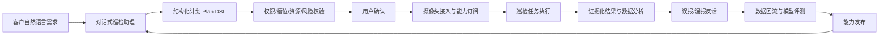
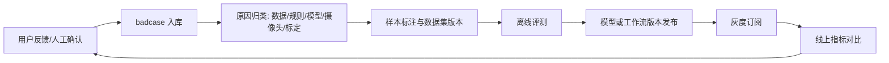
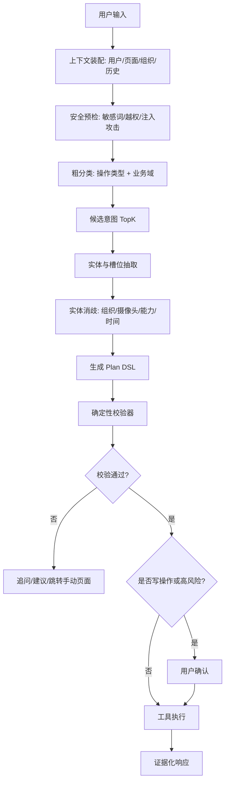
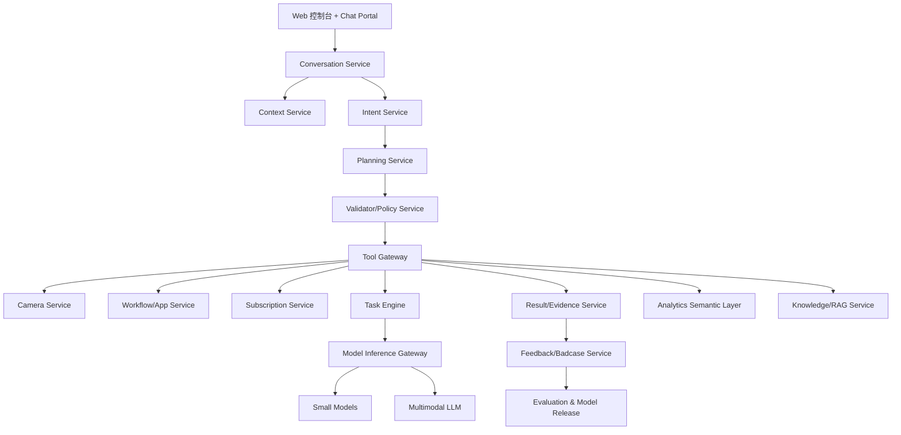
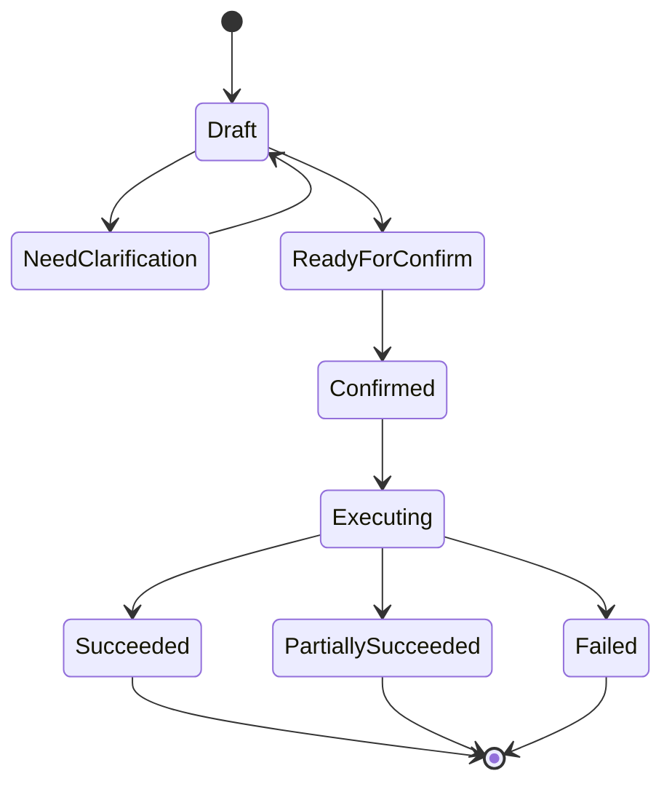
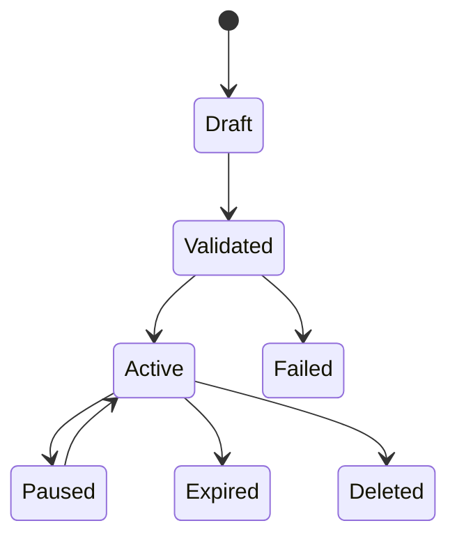

# AGI巡检对话式产品落地方案

> 基于《自进化飞轮》蓝图、`AGI巡检助理.pdf`、`万象AGI巡检`原型包整理。  
> 目标：将当前以工作流画布为核心的 AI 巡检能力，升级为客户可直接使用的对话式 AI 巡检产品，支持摄像头接入、功能订阅、任务下发、结果查看、数据统计、能力反馈和模型自进化。

## 1. 总体判断

### 1.1 方向判断

当前产品方向是成立的，而且有明显的产品化机会：

1. **蓝图正确**：从“客户需求触发 -> 云端身份注入 -> 模型/工作流编排 -> 效果验证 -> API 接入计量 -> 本地部署 -> 边缘运行 -> 数据回流 -> 模型进化 -> 能力发布”的 10 段旅程，已经覆盖了一个 AI 巡检产品从需求、交付、运行到自进化的完整闭环。
2. **现有原型正确**：`万象AGI巡检`已经把“应用广场、应用编排、节点规则、数据源、小模型、大模型、工具库、功能订阅、摄像头关联、布防时间、标定状态”等关键后台能力表达出来了，适合作为“能力工厂”和“可解释编排画布”。
3. **PDF 思路正确**：把巡检助理拆成视频处理、事件分析、数据查询、泛化扩展四类场景，并以 Chat-bot/Chatflow/Tool-use/RAG 的方式实现，是可落地的路线。

但当前材料也有几个必须补齐的点：

1. **对话不能直接等于执行**：用户说一句话后，系统不能直接创建订阅或任务，必须先生成结构化计划，经过槽位、权限、摄像头状态、能力可用性、成本和风险校验，再让用户确认。
2. **不要把 COT 思维链作为产品能力**：可以展示“计划拆解、依据、缺失信息、风险提示”，但不要向用户暴露模型内部推理链。产品上应叫“执行计划”或“推理依据”，不是“COT”。
3. **V1 不能只靠小参数模型做意图识别**：真实客户表达会非常发散，需要“规则/词典 + 语义分类 + 实体消歧 + 计划校验 + 低置信澄清”的组合。
4. **大模型不能直接给业务结论**：所有巡检结论必须绑定证据，包括摄像头、时间、截图、视频片段、检测框、算法版本、SQL 查询编号或事件 ID。
5. **Text2SQL 不能直接打数据库**：必须通过指标语义层和只读查询沙箱，防止跨租户数据泄漏、误查、慢查询和幻觉解释。
6. **自动选点/标定不能一步到位**：LLM 可以生成候选摄像头和候选标定区域，但必须展示证据，支持人工审核、批量确认和回滚。

### 1.2 对 `AGI巡检助理.pdf` 的专业评审

| PDF 内容 | 判断 | 建议调整 |
|---|---|---|
| 背景目标：做一款改变当前零售、连锁门店巡检模式的 AI 产品 | 正确 | 目标要从“AI 产品”进一步收敛为“对话式巡检运营工作台”，避免只做聊天入口 |
| 能力泛化：SOP 标准、能力插件化、能力编排、能力发布 | 正确 | 每个能力都要有能力契约，包括输入、输出、槽位、适用摄像头、阈值、证据、评测指标 |
| 场景拆解：视频处理、事件分析、数据查询、泛化扩展 | 正确 | 建议补“结果证据与闭环处理”场景，这是客户高频使用且决定信任度的环节 |
| 对话输入 -> 任务创建流程 | 方向正确但缺安全层 | 在“任务解析模块”和“任务编排引擎”之间增加 Plan DSL、权限校验、资源校验、风险确认 |
| 任务执行 -> 视频获取流程 | 正确 | 补充摄像头健康状态、取流失败重试、任务幂等、局部失败返回 |
| 视频分析 -> 结果生成流程 | 正确 | 结果必须结构化入库，并绑定 evidence_id、模型版本、规则版本和原始任务 |
| 产品架构中的 RAG、Tool-use、查询改写 | 正确 | V1 就要做最小工具治理，不要等到 V3，否则早期会因幻觉和误执行影响客户信任 |
| “COT 思维链” | 需要调整 | 产品上不展示 COT，改为“计划拆解”“依据来源”“待确认信息”“执行日志” |
| V1 用小参数模型做特定意图识别 | 风险较高 | V1 应采用规则词典 + LLM 结构化抽取 + 校验器 + 低置信澄清的组合 |
| 自动化选点标定 Agent | 方向正确 | 不能直接保存生效，必须先生成候选点位/候选区域/证据截图，再人工确认 |
| 功能订阅组件是否需要标定 | 需要分能力定义 | 每个能力在能力契约中声明 `calibration_required`，订阅时自动提示。若未标定，可默认全画面但必须提示准确率风险 |

### 1.3 对 `万象AGI巡检` 原型的评审

当前设计稿已经覆盖“能力工厂”的基础闭环：

1. 应用广场：空状态、搜索、复制应用、新增应用编排。
2. 工作流画布：数据源、视频帧、视频流、小模型能力、大模型能力、工具库。
3. 节点规则：首节点类型、视频流后置能力、节点必填项、错误状态。
4. 功能订阅：选择应用、关联摄像头、布防时间、有效期、去重、标定状态。

主要缺口：

1. 缺少全局对话入口和对话会话管理。
2. 缺少自然语言到 Plan 的计划卡。
3. 缺少对话生成工作流草稿后的画布联动。
4. 缺少结果中心、证据卡、误报反馈和统计分析。
5. 缺少意图词典、槽位配置、工具 allowlist、风险确认策略。
6. 缺少对批量操作的影响范围预览和审计回放。

### 1.4 产品定位

建议将产品定位为：

**万象 AGI 巡检：面向连锁门店、园区、物业、校园和汽车展厅的对话式 AI 巡检运营工作台。**

一句话价值：

**客户用自然语言说清楚要巡检什么、在哪些门店巡检、什么时候巡检、如何看结果，系统自动完成摄像头匹配、能力订阅、任务编排、证据生成、统计分析和反馈进化。**

产品不是简单的聊天机器人，而是：

1. **对话入口**：降低客户配置、查询、分析的使用门槛。
2. **任务操作系统**：把自然语言转成可校验、可审计、可执行的巡检任务。
3. **能力工厂**：把小模型、大模型、工具库、SOP、Prompt、工作流变成可复用能力。
4. **自进化飞轮**：通过误报、漏报、badcase、标注、评测和发布，让模型和应用持续变好。

## 2. 蓝图到产品架构的映射

你的蓝图中有三个平台，我建议明确成三个产品层：

| 蓝图平台 | 产品层定位 | 核心用户 | 关键模块 |
|---|---|---|---|
| 星象开放平台 | 能力开放与开发者平台 | 内部算法、解决方案、集成伙伴 | 能力 API、模型注册、Token 计量、插件 SDK、调用日志 |
| 万象服务平台 | 客户侧 AI 巡检运营平台 | 客户管理员、区域运营、安保/物业/门店人员 | 对话助手、摄像头接入、功能订阅、任务中心、结果中心、数据分析 |
| 天工基础模型平台 | 模型工程与自进化平台 | 算法团队、数据标注、模型运维 | 数据回流、badcase、训练评测、模型版本、ONNX/PTH/RKNN、发布审批 |

产品主线应是：



## 3. 目标用户与权限

### 3.1 用户角色

| 角色 | 核心诉求 | 可用能力 |
|---|---|---|
| 租户管理员 | 管理组织、账号、摄像头、应用订阅、权限和审计 | 全租户配置、批量操作、导出、审批 |
| 区域/门店运营负责人 | 快速订阅巡检能力、查看门店执行效果、追踪异常 | 按权限范围订阅、查询、统计、处理结果 |
| 安保/物业一线人员 | 接收异常、查看证据、确认误报/真警、闭环处理 | 事件查看、证据回放、状态处理、反馈 |
| 内部解决方案/交付 | 帮客户完成首批配置、校验摄像头、调优能力 | 代配置、调试、标定、批量导入 |
| 算法/模型工程师 | 构建新巡检能力、处理 badcase、发布新版本 | 模型应用编排、评测、发布、回滚 |
| 审计/管理层 | 看整体运行、风险、准确率、ROI | 看板、报表、审计日志 |

### 3.2 权限原则

1. 对话助手必须继承当前登录用户权限，不允许越权查询摄像头、组织、人员轨迹、事件结果。
2. 读操作和写操作分级处理：查询类可低风险执行，创建/修改/删除/批量下发必须确认。
3. 高敏数据不直接暴露：原始流地址、设备密码、厂商密钥、内部 Token 只能显示脱敏状态。
4. 所有对话触发的操作都写审计日志：谁、在什么页面、说了什么、生成了什么计划、确认了什么、执行了哪些工具、结果如何。

## 4. 产品信息架构

建议将“万象 AGI 巡检”拆成八个主模块。

### 4.1 全局对话助手 Chat Portal

现有原型中可以在顶部或右侧增加一个全局助手入口，所有页面可唤起。

关键能力：

1. 当前页面感知：知道用户在应用广场、编排画布、订阅页、结果页还是摄像头页。
2. 当前组织感知：知道用户当前选中的租户、区域、门店、摄像头。
3. 对话生成计划：把自然语言转为结构化 Plan。
4. 计划卡片预览：展示将要操作的对象、时间、能力、摄像头、风险。
5. 缺槽追问：缺门店、缺时间、缺能力、缺摄像头时追问。
6. 二次确认：写操作必须确认，批量操作要显示影响范围。
7. 执行进度：展示工具调用状态、任务状态、失败原因。
8. 结果沉淀：对话记录、计划、工具调用和业务对象互相关联。

建议 UI 形态：

1. 右侧抽屉式聊天窗：不遮挡主操作区。
2. 聊天窗右侧或下方展示“计划卡片”。
3. 计划卡片可跳转到原页面，例如订阅页、编排画布、结果详情。
4. 对生成的工作流，提供“在画布中打开并编辑”。

### 4.2 摄像头接入中心

用户目标：

“帮我把杭州新开门店的摄像头接进来，先检查门口和收银台两个点位。”

能力范围：

1. 摄像头导入：Excel/API/厂商平台/手动录入。
2. 流地址测试：RTSP/RTMP/GB28181/厂商 SDK。
3. 在线状态检测：在线、离线、鉴权失败、画面黑屏、画面卡顿。
4. 快照获取：用于后续标定和能力推荐。
5. 点位命名：门口、收银台、消防通道、电梯、仓库、后厨等。
6. 安全存储：密钥和流地址脱敏保存。

对话场景：

1. “查看华东区所有离线摄像头。”
2. “把这批摄像头接入广州悦汇城，帮我检测哪些能正常取流。”
3. “帮我找出画面里可能是消防通道的摄像头。”

### 4.3 能力工厂：应用广场与工作流画布

这部分复用现有 `万象AGI巡检` 原型，是核心基础。

已覆盖能力：

1. 应用广场：空状态、搜索、新增应用编排、复制应用。
2. 工作流画布：数据源节点、视频帧/视频流、小模型能力、大模型能力、工具库节点。
3. 节点校验：首节点必须为数据源、视频流不能直接接大模型、必填项校验、错误提示。
4. 功能订阅：选择应用、关联摄像头、标定、布防时间、有效期、告警去重。

建议补充：

1. **AI 生成入口**：在画布顶部增加“用对话生成工作流”按钮。
2. **计划转画布**：对话生成的 Plan 自动转成节点草稿。
3. **语义字典**：把“迎宾、销售接待、店员接待、顾客进店无人接待”等词映射到能力或组合能力。
4. **能力模板**：沉淀高频模板，例如消防通道占用、离岗检测、客流热力、展厅接待、门店卫生。
5. **版本管理**：每次发布形成版本，订阅使用明确版本，支持灰度和回滚。
6. **评测入口**：工作流保存前可以用样例视频/图片跑一次离线验证。

### 4.4 功能订阅与任务中心

订阅解决“长期巡检”，任务解决“一次性巡检”。

订阅字段建议：

| 字段 | 说明 |
|---|---|
| subscription_id | 订阅 ID |
| tenant_id/org_id/store_id | 组织范围 |
| capability_id/app_id/app_version | 订阅能力 |
| camera_scope | 摄像头范围 |
| schedule | 布防时间、周期、有效期 |
| thresholds | 阈值、去重、告警等级 |
| calibration | 标定区域、标定状态、默认全画面 |
| status | 草稿、待确认、生效、暂停、过期、失败 |
| created_by/source | 手动创建或对话创建 |
| plan_id | 来源计划 |

任务字段建议：

| 字段 | 说明 |
|---|---|
| task_id | 巡检任务 ID |
| task_type | 即时任务、定时任务、批量任务 |
| input_source | 视频帧、视频流、录像、事件 |
| execution_status | 排队中、执行中、成功、部分失败、失败 |
| evidence_policy | 需要截图、视频片段、检测框、模型解释 |
| result_ids | 结果集合 |

### 4.5 结果与证据中心

这是当前原型明显缺失但客户会高频使用的模块。

结果详情必须包含：

1. 事件类型：离岗、占道、未戴安全帽、抽烟、消防通道占用等。
2. 摄像头和组织：租户、区域、门店、点位、摄像头 ID。
3. 时间：开始时间、结束时间、持续时长。
4. 证据：截图、视频片段、检测框、关键帧、模型输出。
5. 规则：触发阈值、去重策略、布防时间。
6. 可信度：模型置信度、规则判定、人工确认状态。
7. 操作：确认、误报、忽略、派单、导出、反馈 badcase。

对话场景：

1. “把昨天广州所有消防通道占用超过 30 分钟的事件列出来。”
2. “为什么这个告警被判定为离岗？”
3. “把近 7 天误报最多的摄像头列出来。”

### 4.6 数据统计分析中心

支持自然语言问数，但必须通过指标语义层。

高频分析：

1. 按门店、区域、时间、能力类型统计异常数量。
2. 告警趋势、峰值时段、Top 门店、Top 摄像头。
3. 误报率、漏报反馈、人工确认率。
4. 设备在线率、取流成功率、任务成功率。
5. 巡检覆盖率：应巡检摄像头、实巡检摄像头、漏巡原因。
6. 订阅有效性：订阅数、生效数、过期数、失败数。

回答要求：

1. 每个统计结论都显示数据口径。
2. 每个图表都绑定查询 ID。
3. 支持追问和下钻。
4. 支持导出 Excel/PDF。

### 4.7 知识库与 SOP 中心

用途：

1. 导入客户 SOP、巡检制度、门店规范。
2. 把业务语言映射为能力、规则和阈值。
3. 为 RAG 提供可信来源。
4. 为自动生成工作流提供业务约束。

知识类型：

| 类型 | 示例 |
|---|---|
| SOP | “闭店后消防通道不得有物品占用超过 10 分钟” |
| 能力说明 | “离岗检测需要人员检测和区域标定” |
| 组织词典 | “华东一区、杭州大悦城、A 门” |
| 摄像头点位词典 | “门口、收银台、电梯、消防通道” |
| 巡检规则 | 时间、阈值、去重、通知对象 |
| 客户问法 | “迎宾、接待、没人招呼、空岗” |

### 4.8 反馈与自进化中心

让自进化飞轮真正闭环。

反馈入口：

1. 告警详情：真警、误报、漏报、原因标签。
2. 对话：用户说“这个是误报，原因是顾客遮挡”。
3. 任务失败：取流失败、模型失败、配置错误。
4. 人工标注：标定区域调整、补充样本。

反馈流：



## 5. 核心对话旅程

### 5.1 摄像头接入

用户说：

> “帮我把杭州新店的摄像头接进来，先检查门口、收银台和消防通道。”

系统流程：

1. 识别意图：`CAMERA_CONNECT`。
2. 抽取槽位：组织=杭州新店，点位=门口/收银台/消防通道。
3. 查询组织和摄像头列表：如组织不存在，追问或引导创建。
4. 获取接入方式：Excel/API/厂商平台/手动。
5. 测试流：在线、鉴权、帧率、分辨率、截图。
6. 生成接入结果：成功、失败、失败原因。
7. 用户确认保存。
8. 写入审计日志。

交付验收：

1. 能识别指定组织和点位。
2. 能展示每路摄像头的在线和截图。
3. 失败原因可解释。
4. 不泄漏原始流地址和密码。

### 5.2 功能订阅

用户说：

> “下周开始关注华东区所有门店，店时销售有没有迎宾，没有迎宾的告诉我。”

系统流程：

1. 识别意图：`SUBSCRIPTION_CREATE`。
2. 业务词映射：迎宾 -> 销售接待/进店无人接待/人员在岗与顾客进店组合能力。
3. 抽取槽位：范围=华东区所有门店，时间=下周，能力=迎宾巡检。
4. 查询上下文：华东区门店、可用摄像头、可用能力、订阅组件。
5. 发现缺槽：布防时段、告警接收人、无迎宾判定阈值。
6. 追问：  
   “是否按门店营业时间布防？无销售接待超过多少秒算异常？通知哪些人？”
7. 生成计划卡片：门店数、摄像头数、能力、时间、阈值、预计任务量。
8. 用户确认。
9. 创建订阅并返回订阅页链接。

推荐计划卡片字段：

```json
{
  "intent": "SUBSCRIPTION_CREATE",
  "risk_level": "HIGH_WRITE",
  "summary": "为华东区所有门店创建迎宾巡检订阅",
  "scope": {
    "org_query": "华东区所有门店",
    "resolved_store_count": 36,
    "resolved_camera_count": 108
  },
  "capability": {
    "name": "进店无人接待检测",
    "app_id": "app_reception_001",
    "version": "v1.3.2"
  },
  "schedule": {
    "start": "2026-06-29",
    "mode": "business_hours"
  },
  "thresholds": {
    "no_reception_seconds": 60,
    "dedupe_minutes": 10
  },
  "missing_slots": [],
  "confirm_required": true
}
```

### 5.3 即时巡检

用户说：

> “现在帮我看一下 A 店门口有没有人员聚集。”

系统流程：

1. 识别意图：`INSPECTION_RUN_NOW`。
2. 解析门店和点位。
3. 获取摄像头快照或短视频片段。
4. 调用小模型或多模态大模型分析。
5. 返回证据卡：截图、框选区域、置信度、判断依据。
6. 可继续追问：“是否要创建长期订阅？”

### 5.4 结果查看

用户说：

> “给我看昨天广州悦汇城所有离岗超过 5 分钟的事件。”

系统流程：

1. 识别意图：`RESULT_QUERY`。
2. 抽取槽位：时间=昨天，组织=广州悦汇城，事件=离岗，阈值>5分钟。
3. 查询事件库。
4. 返回列表和统计摘要。
5. 支持点击查看证据。
6. 支持继续追问：“按摄像头排序”“导出 Excel”“只看误报未处理”。

### 5.5 数据统计

用户说：

> “上周华东区消防通道占用最多的 10 家门店是哪些？和客流峰值有没有关系？”

系统流程：

1. 识别意图：`DATA_STATS`。
2. 转为语义查询：事件类型、区域、时间、TopN。
3. 通过指标语义层生成 SQL。
4. 查询事件表和客流指标表。
5. 生成图表和结论。
6. 说明数据口径和置信限制。

### 5.6 能力创建

用户说：

> “帮我创建一个检测消防通道长期被物品占用的巡检应用。”

系统流程：

1. 识别意图：`WORKFLOW_CREATE`。
2. RAG 检索 SOP 和能力库。
3. 推荐工作流：视频帧 -> 物体检测/区域检测 -> 多模态判断 -> 事件输出。
4. 要求用户选择区域或自动标定。
5. 在画布生成草稿。
6. 用样例数据跑测试。
7. 用户确认发布到应用广场。

## 6. 意图识别体系

### 6.1 意图分层

建议做三级意图体系。

**L1：操作类型**

| 类型 | 说明 |
|---|---|
| QUERY | 查询数据、状态、结果 |
| CREATE | 创建订阅、任务、应用、摄像头 |
| UPDATE | 修改配置、阈值、时间、标定 |
| DELETE | 删除或解绑 |
| EXECUTE | 立即执行巡检、测试流、跑样例 |
| ANALYZE | 统计分析、趋势、归因 |
| HELP | 帮助、解释、引导 |
| FEEDBACK | 误报、漏报、badcase、评价 |

**L2：业务域**

| 业务域 | 示例意图 |
|---|---|
| Camera | 接入摄像头、测试流、看快照、修改参数、点位识别 |
| Capability | 查找能力、创建应用、编辑工作流、发布能力、复制应用 |
| Subscription | 新增订阅、修改订阅、上下线、删除、查看订阅 |
| Task | 即时巡检、定时任务、任务状态、取消任务 |
| Result | 查看告警、证据、确认误报、导出 |
| Analytics | 问数、统计、趋势、排行、归因 |
| Knowledge | SOP 检索、知识导入、术语解释 |
| Feedback | badcase、标注、模型评测 |

**L3：具体意图**

| intent_code | 示例 |
|---|---|
| CAMERA_CONNECT | “把这批摄像头接进来” |
| CAMERA_TEST_STREAM | “测一下这些摄像头能不能取流” |
| CAMERA_FIND_BY_SCENE | “找出消防通道摄像头” |
| WORKFLOW_CREATE | “创建一个检测占道的应用” |
| WORKFLOW_GENERATE_FROM_SOP | “按这个 SOP 生成巡检流程” |
| SUBSCRIPTION_CREATE | “下周开始订阅门店卫生巡检” |
| SUBSCRIPTION_UPDATE | “把离岗阈值改成 3 分钟” |
| INSPECTION_RUN_NOW | “现在检查 A 店入口” |
| RESULT_QUERY | “看昨天所有抽烟告警” |
| EVIDENCE_VIEW | “打开这条告警的视频片段” |
| DATA_STATS | “统计上周各区域异常数” |
| BADCASE_FEEDBACK | “这个是误报” |

### 6.2 槽位设计

所有意图都必须落到槽位。槽位不完整就追问，不允许猜。

| 槽位 | 说明 | 示例 |
|---|---|---|
| tenant_id | 租户 | 极狐汽车 |
| org_scope | 组织范围 | 华东区、广州悦汇城、全部门店 |
| camera_scope | 摄像头范围 | 门口、消防通道、CAM-001 |
| capability | 巡检能力 | 离岗、迎宾、消防通道占用 |
| schedule | 时间计划 | 下周、每天 9:00-22:00、营业时间 |
| threshold | 阈值 | 超过 5 分钟、置信度 80% |
| receiver | 通知对象 | 店长、区域经理、安全负责人 |
| output_format | 输出格式 | 列表、图表、Excel、日报 |
| evidence_need | 证据要求 | 截图、视频、检测框 |
| risk_level | 风险等级 | 读、低风险写、高风险写 |

### 6.3 识别链路

建议链路：



### 6.4 解决意图识别不准

1. **业务词典先行**：把客户高频说法、内部能力名、算法模型名统一映射。例：迎宾=销售接待=进店无人接待=顾客进入后无人服务。
2. **页面上下文加权**：用户在订阅页说“新增这个”，优先解释为订阅；在画布页说“加一个大模型”，优先解释为工作流节点。
3. **TopK 候选展示**：置信度不够时展示候选：“你是要创建订阅、立即巡检，还是查看结果？”
4. **槽位缺失追问**：缺时间、缺范围、缺摄像头、缺能力时必须问。
5. **实体消歧**：同名门店、同名摄像头必须让用户确认。
6. **低置信不执行**：低于阈值只给建议，不触发写操作。
7. **负样本训练**：把误识别、用户取消、用户纠正沉淀为训练集。
8. **人工兜底**：对企业客户上线初期，支持“转交交付/管理员确认”。

建议阈值：

| 条件 | 行为 |
|---|---|
| intent_confidence >= 0.85 且槽位完整 | 生成计划 |
| 0.60 <= intent_confidence < 0.85 | 展示候选并追问 |
| intent_confidence < 0.60 | 不执行，仅给引导 |
| 写操作 | 无论置信度多高都需要确认 |
| 批量/删除/改参数 | 需要强确认，可要求输入确认词 |

## 7. 大模型推理与反幻觉设计

### 7.1 基本原则

1. **大模型只做理解、规划、总结，不直接改业务数据。**
2. **所有业务事实来自工具、数据库、知识库或视频分析结果。**
3. **没有证据就回答“不确定”，并说明还缺什么。**
4. **对客户可见的是计划和依据，不是模型内部思维链。**
5. **所有写操作可审计、可追踪、可回滚。**

### 7.2 反幻觉机制

| 风险 | 机制 |
|---|---|
| 编造摄像头/门店 | 所有组织、门店、摄像头必须通过资源检索工具解析为真实 ID |
| 编造能力 | 能力必须来自能力注册表，未注册能力只能生成“能力创建草稿” |
| 编造结果 | 事件结论必须绑定 result_id、camera_id、time、evidence_id |
| 错误 SQL | 走指标语义层，只读沙箱，SQL 预检，限制表和字段 |
| 越权查询 | 工具网关统一做租户、组织、角色权限校验 |
| 错误执行 | Plan DSL 校验、风险分级、用户确认、幂等键 |
| Prompt 注入 | 系统指令隔离、知识库内容当数据处理、工具 allowlist |
| 视频误判 | 小模型先检测，大模型只对关键帧/候选事件做解释，人工反馈闭环 |

### 7.3 证据化响应格式

对查询和分析类回答，建议固定结构：

1. **结论**：简短说明。
2. **数据范围**：组织、时间、能力、筛选条件。
3. **证据**：事件 ID、截图、视频片段、查询 ID。
4. **可信度**：模型置信、人工确认状态、数据缺口。
5. **下一步**：查看详情、导出、创建订阅、反馈误报。

示例：

> 昨天广州悦汇城共有 6 条离岗超过 5 分钟的事件，其中 4 条已人工确认为真警，2 条待确认。数据范围为 2026-06-23 00:00:00 至 23:59:59，能力为离岗检测，组织为广州悦汇城。证据见事件 EV-10231 至 EV-10236，可打开视频片段或导出 Excel。

### 7.4 Plan DSL

建议所有对话执行都先生成 Plan。

```json
{
  "plan_id": "plan_20260624_001",
  "source": "chat",
  "user_id": "u_001",
  "tenant_id": "tenant_jihu",
  "intent": "SUBSCRIPTION_CREATE",
  "risk_level": "HIGH_WRITE",
  "status": "DRAFT",
  "slots": {
    "org_scope": {
      "raw": "华东区所有门店",
      "resolved_ids": ["org_hz_001", "org_sh_002"]
    },
    "capability": {
      "raw": "迎宾",
      "resolved_capability_id": "cap_reception"
    },
    "schedule": {
      "raw": "下周",
      "start_at": "2026-06-29T00:00:00+08:00",
      "end_at": "2026-07-05T23:59:59+08:00"
    }
  },
  "actions": [
    {
      "action_id": "a1",
      "tool": "subscription.create",
      "params": {
        "app_id": "app_reception_001",
        "org_ids": ["org_hz_001", "org_sh_002"],
        "schedule_mode": "business_hours",
        "dedupe_minutes": 10
      },
      "idempotency_key": "sub_create_plan_20260624_001"
    }
  ],
  "validators": [
    "permission.check",
    "camera.online_check",
    "capability.compatibility_check",
    "quota.cost_check"
  ],
  "confirm_required": true
}
```

## 8. 技术架构

### 8.1 服务架构



### 8.2 核心服务职责

| 服务 | 职责 |
|---|---|
| Conversation Service | 会话、消息、计划卡、上下文绑定 |
| Context Service | 用户、租户、页面、组织、选中对象、历史摘要 |
| Intent Service | 意图分类、槽位抽取、实体消歧 |
| Planning Service | 生成 Plan DSL、拆解 Action、生成用户可读计划 |
| Validator/Policy Service | 权限、槽位、资源、风险、成本、幂等校验 |
| Tool Gateway | 统一工具调用、超时、重试、审计、脱敏 |
| Camera Service | 摄像头接入、取流、快照、健康检查 |
| Workflow/App Service | 工作流画布、能力注册、版本、发布 |
| Subscription Service | 功能订阅、布防、阈值、状态机 |
| Task Engine | 即时任务、定时任务、队列、重试 |
| Model Inference Gateway | 小模型、多模态大模型、版本路由 |
| Result/Evidence Service | 事件、证据、视频片段、人工确认 |
| Analytics Semantic Layer | 指标、维度、只读 SQL、图表 |
| Knowledge/RAG Service | SOP、能力说明、客户词典、检索 |
| Feedback/Badcase Service | 误报、漏报、标注、数据回流 |

### 8.3 工具清单

第一批工具建议：

| 工具 | 读/写 | 风险 | 说明 |
|---|---|---|---|
| org.search | 读 | 低 | 解析组织、门店 |
| camera.search | 读 | 低 | 查摄像头 |
| camera.snapshot | 读 | 中 | 获取快照，需权限 |
| camera.test_stream | 读 | 中 | 测试取流 |
| capability.search | 读 | 低 | 查能力 |
| workflow.generate | 写草稿 | 中 | 生成工作流草稿 |
| workflow.publish | 写 | 高 | 发布能力 |
| subscription.create | 写 | 高 | 创建订阅 |
| subscription.update | 写 | 高 | 修改订阅 |
| task.run_now | 写 | 中 | 即时巡检 |
| result.query | 读 | 中 | 查事件 |
| evidence.get | 读 | 中 | 查证据 |
| analytics.query | 读 | 中 | 指标查询 |
| feedback.create | 写 | 中 | 反馈误报/漏报 |

### 8.4 状态机

**Plan 状态**



**订阅状态**



## 9. 对现有原型的修改建议

### 9.1 应用广场

保留现有设计，补充：

1. 增加“对话创建应用”入口。
2. 应用卡片增加能力标签：数据源类型、小模型、大模型、工具库、适用场景。
3. 复制应用时支持“复制到多门店并生成订阅草稿”。
4. 应用详情增加版本、评测指标、适用摄像头要求、最近 badcase。

### 9.2 工作流画布

补充：

1. 增加“AI 生成草稿”模式，右侧显示生成依据。
2. 增加节点来源：手动拖拽、对话生成、模板生成、复制生成。
3. 增加运行测试：上传样例图/视频或选择摄像头快照测试。
4. 增加校验报告：节点完整性、兼容性、性能成本、是否可发布。
5. 增加版本差异：和上一版比较节点、参数、Prompt 的变化。

### 9.3 应用订阅

补充：

1. 新增“由对话生成”的订阅来源标识。
2. 新增计划卡回溯：可以打开当时的对话和确认记录。
3. 摄像头关联支持“AI 推荐点位”。
4. 标定流程支持候选区域、置信度和批量确认。
5. 订阅提交前展示影响范围：门店数、摄像头数、任务量、预计费用。

### 9.4 新增结果中心

当前必须补的页面：

1. 告警/事件列表。
2. 事件详情证据页。
3. 视频片段回放。
4. 人工确认和误报反馈。
5. 统计看板。
6. 导出记录。

### 9.5 新增 AI 配置中心

建议放在“Prompt 管理”或新增“AI 助手配置”。

能力：

1. 业务词典和同义词。
2. 意图配置和槽位配置。
3. 工具 allowlist。
4. 追问话术模板。
5. 风险等级和确认策略。
6. RAG 知识库绑定。
7. 离线评测集。

## 10. MVP 实施路线

### 10.1 P0：8 周可交付版本

目标：让客户能通过对话完成“查询结果、创建订阅草稿、确认后生效、查看证据”的闭环。

范围：

1. 全局 Chat Portal。
2. 意图：`SUBSCRIPTION_CREATE`、`RESULT_QUERY`、`DATA_STATS`、`CAMERA_SEARCH`、`HELP`。
3. Plan DSL 和校验器。
4. 功能订阅创建，复用现有订阅页。
5. 结果中心基础版。
6. 组织、摄像头、能力、订阅、事件的工具接口。
7. 审计日志。

不做：

1. 不做完全自动发布新模型。
2. 不做任意 Tool-use。
3. 不做跨互联网开放搜索。
4. 不做无审核的自动标定生效。

P0 验收场景：

1. “下周开始给广州悦汇城订阅离岗检测，每天 9 点到 22 点。”
2. “昨天广州悦汇城有哪些离岗超过 5 分钟？”
3. “上周华东区抽烟告警最多的门店 Top10。”
4. “这个告警是误报，原因是遮挡。”

### 10.2 P1：12 到 16 周增强版

新增：

1. 摄像头接入助手。
2. 自动选点和标定候选。
3. 工作流 AI 生成草稿。
4. SOP 知识库导入与 RAG。
5. 更多意图：即时巡检、订阅修改、任务状态、导出。
6. 评测集和误识别反馈闭环。

### 10.3 P2：半年级产品化

新增：

1. 多租户行业模板：汽车展厅、连锁零售、物业园区、校园。
2. 多模型评测和自动灰度。
3. Agent SDK 与第三方工具生态。
4. 客户自助能力创建和发布审批。
5. 计量计费和套餐化。
6. 自进化运营看板。

## 11. 研发工作包

### 11.1 后端

P0 工作包：

1. Conversation Service：会话、消息、计划卡。
2. Plan DSL：Schema、状态机、持久化。
3. Intent Service：规则词典、LLM 结构化抽取、置信度。
4. Validator：权限、槽位、资源、风险。
5. Tool Gateway：统一工具调用、审计、脱敏。
6. Subscription API：创建草稿、确认、上线。
7. Result API：事件查询、证据获取。
8. Analytics API：语义指标查询。
9. Audit Log。

### 11.2 前端

P0 工作包：

1. 全局助手入口和右侧聊天窗。
2. 计划卡片组件。
3. 缺槽追问组件。
4. 高风险确认弹窗。
5. 执行进度组件。
6. 结果证据卡。
7. 订阅页接收 Plan 草稿。
8. 对话历史入口。

### 11.3 算法/模型

P0 工作包：

1. 意图分类评测集。
2. 槽位抽取评测集。
3. 业务词典和同义词库。
4. Prompt 模板和结构化输出 Schema。
5. 结果总结模板。
6. 幻觉测试集。

### 11.4 数据与平台

P0 工作包：

1. 组织/摄像头/能力/订阅/事件统一 ID。
2. 指标语义层。
3. 事件证据存储。
4. badcase 数据结构。
5. 租户隔离和权限策略。

## 12. 验收指标

### 12.1 产品指标

| 指标 | P0 目标 |
|---|---|
| 创建订阅平均耗时 | 从 5 到 10 分钟降到 1 分钟内生成草稿 |
| 查询结果平均耗时 | 30 秒内返回首屏结果 |
| 对话完成率 | 高频场景 >= 80% |
| 缺槽追问成功率 | >= 90% |
| 用户取消率 | 持续跟踪，超过 20% 需分析意图或计划质量 |

### 12.2 AI 指标

| 指标 | P0 目标 |
|---|---|
| 高频意图 Top1 准确率 | >= 90% |
| 高频意图 Top3 召回率 | >= 97% |
| 关键槽位准确率 | >= 92% |
| 低置信澄清召回率 | >= 95% |
| 越权/高风险误执行 | 0 |
| 证据绑定率 | 结果类回答 100% |
| Unsupported 正确拒答率 | >= 98% |

### 12.3 工程指标

| 指标 | P0 目标 |
|---|---|
| Plan 校验覆盖率 | 100% 写操作 |
| 工具调用审计覆盖率 | 100% |
| 订阅创建幂等 | 100% |
| 跨租户数据泄漏 | 0 |
| 工具失败可解释率 | >= 95% |

## 13. 关键风险与应对

| 风险 | 表现 | 应对 |
|---|---|---|
| 客户表达不标准 | “帮我看一下有没有人管”难以识别 | 业务词典、候选意图、追问 |
| LLM 编造业务对象 | 编出不存在门店或摄像头 | 所有实体必须 resolve 为真实 ID |
| 批量操作误触发 | 错给大量门店创建订阅 | 风险分级、影响范围、强确认 |
| 结果无证据 | 用户不信任结论 | 证据卡、视频片段、检测框、模型版本 |
| Text2SQL 误查 | 指标口径不一致 | 指标语义层、查询 ID、口径说明 |
| 标定错误 | 错把非目标区域加入检测 | 候选证据、人工审核、回滚 |
| 模型效果波动 | 新版本导致误报升高 | 离线评测、灰度、回滚、badcase |
| 交付复杂 | 每个客户场景不同 | 行业模板、能力模板、SOP 知识库 |

## 14. CEO 决策建议

### 14.1 产品战略

建议不要把“对话式 AI 巡检”做成单独聊天机器人，而要做成现有万象平台的统一操作入口。客户感知是“我能用一句话完成巡检运营”，内部实现是“对话 + 工作流 + 工具 + 证据 + 自进化”。

### 14.2 组织分工

建议设四条并行线：

1. **产品线**：定义意图、槽位、页面、计划卡、结果证据和行业模板。
2. **工程线**：建设 Conversation、Plan、Tool Gateway、订阅和结果 API。
3. **算法线**：建设意图识别、RAG、视频分析、评测和反幻觉机制。
4. **交付线**：沉淀客户 SOP、摄像头点位、行业词典和首批模板。

### 14.3 首个商业化样板

优先选择一个摄像头和巡检场景都相对清晰的客户做样板，例如汽车展厅或连锁门店。

首批能力建议：

1. 离岗检测。
2. 消防通道占用。
3. 抽烟/烟火。
4. 迎宾/无人接待。
5. 门店卫生或展厅摆设。

首批对话场景建议：

1. 创建订阅。
2. 查询异常。
3. 查看证据。
4. 数据统计。
5. 反馈误报。

## 15. 下一步落地清单

### 本周可以开始

1. 确定 P0 的 5 个意图和对应槽位。
2. 梳理组织、摄像头、能力、订阅、事件五类对象的 API。
3. 在现有原型上补 Chat Portal 和计划卡交互稿。
4. 建立 200 条真实客户说法的意图测试集。
5. 定义 Plan DSL v0.1。

### 两周内完成

1. 跑通“对话创建订阅草稿”的端到端 demo。
2. 跑通“对话查询结果 + 证据卡”的端到端 demo。
3. 建立工具调用审计日志。
4. 定义结果中心页面。
5. 完成 P0 研发排期。

### 一个月内完成

1. 接入真实摄像头和真实事件数据。
2. 完成高风险确认和幂等执行。
3. 完成指标语义层第一版。
4. 完成意图评测和反幻觉评测。
5. 选定一个客户做试点。
