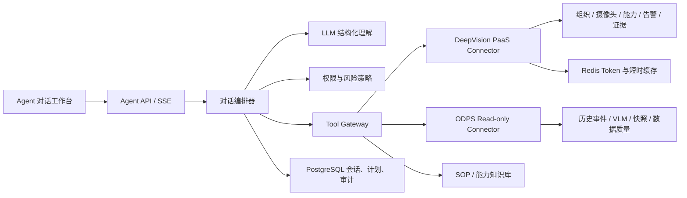

# OPPO 在线 Agent 对话系统改造方案

| 项目 | 内容 |
|---|---|
| 文档版本 | v0.1 |
| 日期 | 2026-06-29 |
| 目标 | 将当前本地 Demo 改造成使用深象线上数据、由模型自动理解意图的可用 Agent 系统 |
| 首期租户 | OPPO |
| 输入依据 | 深象泛安防 PaaS 接口文档、DeepVision 数据域解析、深象 LLM Wiki、当前代码与 UX 回归报告 |

## 1. 结论

当前前端可以保留为 Agent 交互壳，但后端尚不是可用 Agent：数据来自 SQLite 演示数据，意图由关键词规则判断，组织、摄像头、能力、告警和订阅都未接深象线上系统。

建议按“在线只读 Agent -> 运维分析闭环 -> 受控写操作 -> 数据飞轮”推进。第一版先把 OPPO 真实组织、设备、能力、告警和证据接入，让用户直接提问并获得可追溯结果；任何会改变线上状态的动作继续使用计划确认卡，并在现行写接口契约确认后才执行。

## 2. 已完成的线上只读核验

2026-06-29 使用 OPPO 租户授权进行只读检查，未创建任务、未拉取视频、未修改配置：

| 检查项 | 结果 |
|---|---|
| 客户端认证 | 成功，Token 有效期 7200 秒 |
| 组织树 | 3 个节点，其中 2 个 `FieldPOI` 门店节点 |
| 摄像头抽样 | 首个门店 7 路，接口返回全部在线 |
| 已配置能力 | 离岗、工服、玩手机、抽烟、违规占道、人群聚集、跨线、睡岗 |
| 历史告警抽样 | 首个门店近 7 天 2069 条，已存在多种真实告警类型 |
| LLM 任务列表 | 文档中的单斜杠、双斜杠路径均返回 404 |

由此可确认：在线查询链路可用，数据量足以支撑真实问答和分析；LLM 任务管理接口不能按旧文档直接开发，需要接口负责人提供当前契约。

## 3. 当前实现差距

| 当前实现 | 生产改造 |
|---|---|
| `server.py` 单体标准库服务 | Agent API、编排器、工具网关、连接器分层 |
| SQLite 内置极狐演示数据 | PaaS 在线数据为主，ODPS 历史分析为辅 |
| 关键词 `classify_intent` | LLM 结构化意图与槽位抽取，规则只做安全校验 |
| 前端传 `X-User-Id` 模拟身份 | 接企业 SSO/JWT，服务端计算租户和组织权限 |
| 本地订阅写入即代表执行 | 线上写接口 + 计划确认 + 幂等 + 审计 + 回执 |
| 本地 SVG 作为证据 | 告警快照/视频签名 URL，过期刷新且访问留痕 |
| 同步请求直接完成任务 | SSE 流式进度，长任务进入队列并可恢复 |

## 4. 首版产品能力

### 4.1 P0：真实在线只读 Agent

1. 自动识别用户意图，不展示意图选择器。
2. 查询 OPPO 组织、门店、摄像头数量和在线状态。
3. 查询门店已配置的巡检能力。
4. 查询指定时间、门店、摄像头、告警类型的真实告警。
5. 展示告警证据、发生时间、摄像头、检测框和来源编号。
6. 汇总告警数量、类型分布、高发点位和待确认事件。
7. 自动发现缺失条件并多轮追问，例如门店歧义或时间范围缺失。
8. 每个回答展示数据范围、查询时间和证据来源，不能用模型臆测补齐。

### 4.2 P1：运维与数据质量闭环

1. 设备离线、长时间无数据、告警突增/跌零和能力配置缺失诊断。
2. 告警聚合去噪：同摄像头、同类型、时间窗口内合并，避免高频告警淹没对话。
3. 接入实时告警 WebSocket；缺少 `consumerGroup` 时先用增量轮询。
4. 形成“异常 -> 原因候选 -> 证据 -> 责任人 -> 处理记录 -> 恢复确认”链路。
5. 低风险工具可自动执行查询；重启、配置、订阅等动作必须人工确认。

### 4.3 P2：受控写操作与数据飞轮

1. 在现行接口契约确认后支持创建/修改巡检任务和能力订阅。
2. 写操作执行前展示影响门店、摄像头、能力、时间和风险，确认后再调用。
3. 真警、误报、忽略和漏报反馈进入 badcase，关联原告警和证据。
4. 对接天工/验收回放，形成样本、评测、灰度发布和效果回归闭环。

## 5. Agent 架构



### 5.1 数据源职责

| 数据源 | 主要用途 | 约束 |
|---|---|---|
| PaaS API | 当前组织、摄像头状态、已配置能力、近期告警、证据 | 在线事实优先，统一超时、重试和脱敏 |
| ODPS | 跨日统计、VLM 工作流、快照关联、数据质量分析 | 只读、显式分区、默认 `LIMIT 100`、60 秒取消 |
| 知识库 | SOP、能力说明、告警处置规则 | 只提供解释和流程，不作为线上状态事实 |
| Agent 数据库 | 会话、消息、计划、工具调用、确认、审计 | 不复制设备密码、RTSP、人员隐私等敏感字段 |

### 5.2 结构化理解协议

模型只输出结构化决策，不直接访问 API 或拼 SQL：

```json
{
  "intent": "QUERY_ALARMS",
  "confidence": 0.96,
  "slots": {
    "tenant_code": "oppo",
    "poi_ids": [],
    "camera_ids": [],
    "alarm_types": ["off_duty"],
    "time_range": {"kind": "relative", "value": "last_7_days"}
  },
  "missing_slots": ["poi_ids"],
  "risk": "READ_ONLY",
  "suggested_tool": "paas.alarm.query"
}
```

编排规则：

1. 高置信只读查询自动执行。
2. 槽位缺失或实体歧义时自然追问，不让用户选择“意图”。
3. 低置信时先解释当前理解并补问，不执行工具。
4. 写操作只生成计划，必须经过权限校验和用户确认。
5. 工具返回空数据、过期链接或超时时，明确说明，不允许模型虚构结果。

### 5.3 首批工具

| 工具 | 作用 | 风险 |
|---|---|---|
| `paas.org.tree` | 解析区域和门店 | 只读 |
| `paas.camera.page` | 查询摄像头与在线状态 | 只读、字段脱敏 |
| `paas.capability.configured` | 查询门店已配置能力 | 只读 |
| `paas.alarm.query` | 分页查询告警 | 只读 |
| `paas.alarm.detail` | 查询告警和证据 | 只读、访问审计 |
| `paas.media.signed_url` | 刷新过期证据链接 | 只读、短时授权 |
| `odps.event.aggregate` | 历史聚合分析 | 只读、限分区 |
| `odps.data_quality.check` | 数据完整性与异常诊断 | 只读、限分区 |

严禁暴露或注册为模型工具：摄像头密码、原始流地址、设备 IP/MAC、人员姓名/电话/证件号等敏感字段。

## 6. 后端模块建议

```text
app/
  agent/          # 对话状态、LLM 路由、计划与执行状态机
  tools/          # 工具定义、参数校验、超时、重试、审计
  connectors/
    paas/         # 签名认证、Token 缓存、在线 API 适配
    odps/         # 只读查询模板与分区保护
  domain/         # Tenant、POI、Camera、Alarm、Evidence、Task
  security/       # SSO、RBAC、组织范围、脱敏、密钥读取
  api/            # REST + SSE
  persistence/    # PostgreSQL / Redis
```

建议接口：

| 方法 | 接口 | 说明 |
|---|---|---|
| `POST` | `/api/agent/runs` | 提交消息并自动识别意图 |
| `GET` | `/api/agent/runs/{id}/stream` | SSE 返回理解、取数、分析和结果进度 |
| `POST` | `/api/agent/plans/{id}/confirm` | 确认受控写操作 |
| `GET` | `/api/conversations` | 可恢复历史会话 |
| `GET` | `/api/evidence/{id}` | 经权限校验获取证据 |

## 7. 前端整改范围

1. 保留当前“轻侧栏 + 单一对话区 + 详情抽屉”的 Agent 形态。
2. 组织树、摄像头、能力和告警全部改成在线接口返回，删除极狐演示数据。
3. 快捷入口只能作为示例问题，点击后直接发送或填入输入框，不能作为意图选择器。
4. 新增流式阶段：理解问题、定位范围、查询在线数据、分析、生成回答。
5. 结果卡展示真实门店、摄像头、时间范围、告警编号和证据；技术 Trace 默认折叠。
6. 在线数据失败时显示“数据源不可用/部分返回”，不回退到演示数据。
7. 写操作继续用对话内确认卡；未获得线上回执时不能显示“已生效”。

## 8. 安全与生产约束

1. AppKey/AppSecret 进入密钥管理或部署环境变量，禁止写入代码、数据库、前端和日志。
2. 本次授权已通过对话传递，生产上线前建议轮换一次 Secret。
3. Token 统一缓存约 90 分钟并提前刷新，不能由浏览器持有。
4. 所有工具调用带 `request_id`、用户、租户、组织范围、耗时和结果摘要。
5. 摄像头详情原始响应必须经过 DTO 白名单；禁止透出 `userName`、`password`、`ipAddress`、`camera_config`。
6. 证据链接短时有效，访问需鉴权和审计；默认只返回引用，不自动下载 OSS 文件。
7. ODPS 仅允许预定义只读模板，不允许模型生成任意可执行 SQL。

## 9. 实施节奏

| 阶段 | 预计 | 交付与验收门槛 |
|---|---:|---|
| 0. 契约冻结 | 1-2 天 | 在线接口清单、字段白名单、错误码、写权限、WebSocket `consumerGroup`、LLM 服务选型确认 |
| 1. 在线只读 Agent | 4-6 天 | OPPO 组织/设备/能力/告警/证据全链路；模型自动意图；不再出现演示数据 |
| 2. 分析与运维闭环 | 4-6 天 | 聚合去噪、数据质量诊断、SSE、超时降级、处理记录 |
| 3. 受控写操作 | 5-8 天 | 现行写接口、确认卡、幂等、回执、审计、失败补偿 |
| 4. ODPS 与数据飞轮 | 5-8 天 | 历史分析、VLM/快照关联、badcase、评测与回归 |

首个可验收版本建议只承诺阶段 0-1。它已经能让 OPPO 用户真正查询线上门店、设备和告警，同时避免在接口未确认时制造“任务已创建”的假象。

## 10. 功能级验收重点

1. 授权成功、Token 缓存与过期刷新。
2. 组织树和摄像头仅返回 OPPO 授权范围。
3. “查一下最近离岗情况”等自然语言无需选择意图即可正确执行。
4. 同名门店、缺少时间、模糊告警类型能多轮澄清。
5. 查询结果与 PaaS 同条件结果一致，分页汇总不漏不重。
6. 告警详情绑定真实证据，链接过期可刷新。
7. 2069 条级别的高频告警不会一次塞入模型，上游先分页、聚合和裁剪。
8. PaaS 超时、限流、部分门店失败时返回部分成功和明确错误。
9. 页面、接口、日志、模型上下文均不出现 AppSecret、Token、摄像头密码、RTSP 或私网地址。
10. 写操作未确认不执行，接口 404/无回执时不得展示成功。

## 11. 开发前待确认项

1. 生产使用的 LLM 提供方、模型、调用地址和预算上限。
2. 当前有效的 LLM 巡检任务查询/创建/修改接口；旧文档接口线上为 404。
3. OPPO 租户允许开放的写操作范围和审批责任人。
4. 实时告警订阅所需 `consumerGroup`。
5. 用户身份、角色和组织权限来自哪个 SSO/IAM。
6. ODPS 项目、网络、表权限和数据时效 SLA。

