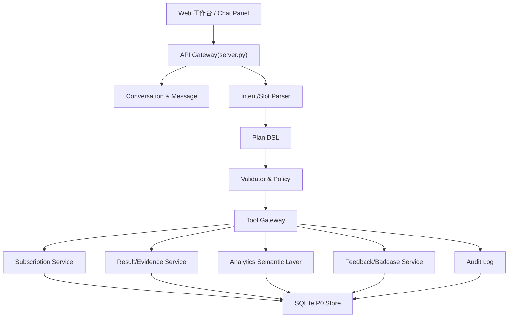
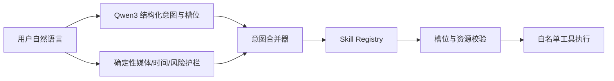
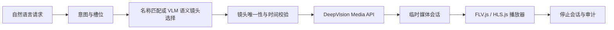
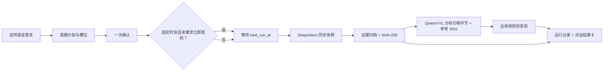
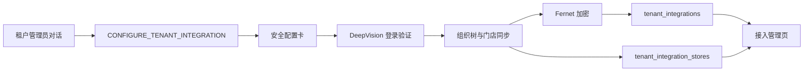

# 万象 AGI 巡检 P0 技术架构文档

| 项目 | 内容 |
|---|---|
| 文档版本 | v1.6 |
| 日期 | 2026-07-31 |
| 关联 PRD | `docs/AGI巡检对话式产品PRD.md` |
| 当前实现 | `server.py` + `static/` + SQLite |
| 目标范围 | P0 MVP：对话创建订阅、确认执行、结果证据、统计问数、误报反馈、审计 |

## 1. 技术可行性结论

P0 技术实现可行，建议按“对话理解层 + Plan DSL + 工具网关 + 业务服务 + 证据化响应”的架构落地。PRD 中的核心安全约束可以在工程上闭环：写操作不直接执行、实体必须解析为真实 ID、权限在后端二次校验、结果必须绑定证据、统计必须经过语义指标层、所有高风险动作留审计。

当前仓库没有已有应用代码，因此本次交付采用轻量全栈 MVP 验证核心链路：

1. Python 标准库 HTTP 服务承载 API 与静态页面。
2. SQLite 保存会话、消息、Plan、订阅、事件、证据、反馈、审计。
3. 前端原生 HTML/CSS/JS 实现独立工作台、计划卡、结果中心、统计和审计。
4. `smoke_test.py` 覆盖业务主链路与高风险边界。

生产化时可替换为 FastAPI/Spring Boot + PostgreSQL/MySQL + Redis + 队列 + 对象存储 + 模型网关；Plan DSL、状态机、权限、幂等、审计和 API 契约保持不变。

## 2. P0 架构总览

P0 当前实现将多个服务合并在 `server.py` 中，模块边界通过函数和数据表保持清晰，便于后续拆分服务。

## 3. 模块边界

| 模块 | 当前实现 | 生产化职责 | 数据所有权 |
|---|---|---|---|
| Web 工作台 | `static/index.html`、`static/app.js`、`static/styles.css` | 独立入口、嵌入抽屉、计划卡、证据详情、统计视图 | 前端不持久化敏感数据 |
| Conversation Service | `conversations`、`messages` 表 | 会话、消息、上下文、历史摘要 | Conversation、Message |
| Intent Service | `classify_intent`、槽位解析函数 | 意图分类、槽位抽取、实体消歧、低置信澄清 | 无业务写入 |
| Planning Service | `create_plan`、`build_subscription_plan` | Plan DSL、计划卡、动作拆解、状态机 | Plan |
| Validator/Policy | `assert_org_access`、角色策略、资源校验 | 权限、组织范围、摄像头状态、能力兼容、风险分级 | 策略配置 |
| Tool Gateway | `execute_plan`、幂等表、审计 | 工具 allowlist、超时、重试、脱敏、审计 | ToolCall、Audit |
| Subscription Service | `execute_subscription_plan` | 订阅创建、上线、暂停、过期、幂等 | Subscription |
| Result/Evidence Service | `query_events`、事件详情接口 | 事件查询、证据查看、证据缺失处理 | InspectionEvent、Evidence |
| Analytics Semantic Layer | `analytics_query` | 指标、维度、只读查询、口径说明 | AnalyticsQuery |
| Feedback Service | `create_feedback` | 真警、误报、忽略、badcase 入库 | Feedback、Badcase |

## 4. 关键业务流

### 4.1 对话创建订阅

1. 用户发送自然语言。
2. 后端读取登录用户、租户、组织、页面上下文。
3. Intent Service 识别 `SUBSCRIPTION_CREATE`。
4. 槽位解析组织、能力、时间、布防时段、阈值。
5. 实体解析为真实 `org_id`、`capability_id`、`camera_id`。
6. Validator 校验角色、组织范围、摄像头在线、能力可用、标定风险。
7. Planning Service 写入 `READY_FOR_CONFIRM` Plan。
8. 前端展示计划卡，未确认前不创建订阅。
9. 用户确认后 Tool Gateway 执行 `subscription.create`。
10. Subscription Service 创建订阅，写入幂等键和审计。

### 4.2 查询结果与证据

1. 用户输入结果查询。
2. 后端解析时间、组织、事件类型和阈值。
3. 后端按用户授权组织过滤事件。
4. 返回事件列表，事件必须包含 `evidence_ids`。
5. 用户打开事件详情时记录 `evidence.view` 审计。
6. 前端以证据图为主展示事件、规则、模型版本和处理状态。

### 4.3 数据统计问数

1. 用户输入统计问题。
2. 后端解析指标、时间、组织、事件类型。
3. Analytics Semantic Layer 聚合事件表，不允许模型编造数字。
4. 返回 `query_id`、排行、指标、口径和时间范围。
5. 后端写入 `analytics.query` 审计。

### 4.4 误报反馈

1. 用户在事件详情或对话中发起反馈。
2. 后端校验用户是否可反馈该事件。
3. 写入 `feedback`，同步更新事件状态。
4. 误报类反馈生成 `badcase_id`。
5. 写入 `event.feedback.create` 审计。

## 5. 状态机

### 5.1 Plan 状态

| 当前状态 | 事件 | 下一状态 | 后端约束 |
|---|---|---|---|
| `NEED_CLARIFICATION` | 用户补槽 | `READY_FOR_CONFIRM` | 关键槽位完整、实体可解析 |
| `READY_FOR_CONFIRM` | confirm | `SUCCEEDED` | 权限通过、幂等未冲突、工具成功 |
| `READY_FOR_CONFIRM` | cancel | `CANCELLED` | 仅计划创建人可取消 |
| `READY_FOR_CONFIRM` | 工具失败 | `FAILED` | 记录失败原因，可重试 |
| `SUCCEEDED` | 重复 confirm | `SUCCEEDED` | 返回幂等结果，不重复创建 |

### 5.2 订阅状态

| 状态 | 说明 | P0 行为 |
|---|---|---|
| `DRAFT` | 草稿 | 当前 MVP 预留 |
| `ACTIVE` | 生效 | 计划确认后创建 |
| `PAUSED` | 暂停 | P1 |
| `EXPIRED` | 到期 | P1 定时任务处理 |
| `FAILED` | 生效失败 | P1 |
| `DELETED` | 删除 | P1，历史事件保留 |

### 5.3 事件状态

| 状态 | 入口 | 可转状态 |
|---|---|---|
| `PENDING_CONFIRM` | 模型生成 | `TRUE_POSITIVE`、`FALSE_POSITIVE`、`IGNORED` |
| `TRUE_POSITIVE` | 人工确认 | `CLOSED` P1 |
| `FALSE_POSITIVE` | 误报反馈 | 进入 badcase |
| `IGNORED` | 人工忽略 | P1 可关闭 |

## 6. 数据模型与约束

| 表 | 关键字段 | 约束 |
|---|---|---|
| `users` | `user_id`、`role`、`tenant_id`、`allowed_org_ids` | 后端以此计算组织范围 |
| `orgs` | `org_id`、`tenant_id`、`parent_id`、`org_type` | 组织树用于权限继承 |
| `cameras` | `camera_id`、`org_id`、`stream_status`、`calibration_status` | API 不返回原始流地址和凭证引用 |
| `capabilities` | `capability_id`、`app_id`、`event_type`、`thresholds_default` | 订阅必须绑定已发布能力版本 |
| `conversations` | `conversation_id`、`user_id`、`page_code`、`org_id` | 会话绑定上下文 |
| `messages` | `message_id`、`linked_plan_id`、`linked_object` | 消息可追溯计划和业务对象 |
| `plans` | `intent`、`slots`、`actions`、`validators`、`idempotency_key` | 写操作必须有 Plan 和幂等键 |
| `subscriptions` | `app_version_id`、`camera_ids`、`schedule`、`plan_id` | 来源计划可追溯 |
| `events` | `event_id`、`evidence_ids`、`model_version`、`rule_snapshot` | 结果必须绑定证据 |
| `evidence` | `storage_url`、`bbox`、`metadata` | 证据查看需审计 |
| `feedback` | `event_id`、`feedback_type`、`reason`、`badcase_id` | 误报反馈不删除原事件 |
| `audit_logs` | `action`、`object_type`、`before_json`、`after_json` | 写操作和证据查看留痕 |
| `idempotency_keys` | `idempotency_key`、`response_json` | 重试不重复创建 |

## 7. API 契约

### 7.1 对话与计划

| 方法 | 路由 | 说明 | 权限 |
|---|---|---|---|
| `POST` | `/api/conversations` | 创建会话 | 登录用户 |
| `GET` | `/api/conversations` | 会话列表 | 本人 |
| `GET` | `/api/conversations/{id}` | 会话详情、消息和脱敏展示元数据 | 本人 |
| `DELETE` | `/api/conversations/{id}` | 将会话状态软关闭为 `CLOSED` 并写审计 | 本人 |
| `POST` | `/api/conversations/{id}/messages` | 发送消息并生成计划或查询结果 | 本人 |
| `GET` | `/api/media/sessions/{id}/stream` | 使用临时令牌同源代理 HTTP-FLV，不暴露上游地址 | 临时媒体令牌 |
| `GET` | `/api/plans/{id}` | 查看计划 | 计划创建人/管理员 |
| `POST` | `/api/plans/{id}/confirm` | 确认执行计划 | 计划创建人且状态可确认 |
| `POST` | `/api/plans/{id}/cancel` | 取消计划 | 计划创建人 |

约定：

1. 写操作只有 `confirm` 后才执行。
2. `confirm` 使用 Plan 内的 `idempotency_key`，重复调用返回同一结果。
3. 低置信或缺槽不会执行工具。

### 7.2 业务 API

| 方法 | 路由 | 说明 | P0 约束 |
|---|---|---|---|
| `GET` | `/api/bootstrap` | 获取当前用户上下文、组织、摄像头、能力、事件 | 摄像头字段脱敏 |
| `GET` | `/api/subscriptions` | 订阅列表 | 按授权组织过滤 |
| `GET` | `/api/events` | 事件查询 | 按租户和组织过滤 |
| `GET` | `/api/events/{id}` | 事件详情 | 记录证据查看审计 |
| `GET` | `/api/events/{id}/evidence` | 事件证据 | 记录证据查看审计 |
| `POST` | `/api/events/{id}/feedback` | 页面快速反馈 | 更新事件状态并写审计 |
| `POST` | `/api/analytics/query` | 统计查询 | 返回 `query_id` 和口径 |
| `GET` | `/api/audit-logs` | 审计列表 | 仅管理员 |

### 7.3 错误码

| 错误码 | 场景 |
|---|---|
| `PERMISSION_DENIED` | 角色不可执行操作 |
| `TENANT_SCOPE_DENIED` | 组织范围越权 |
| `SLOT_MISSING` | 缺少关键槽位 |
| `ENTITY_AMBIGUOUS` | 门店/组织歧义 |
| `PLAN_NOT_CONFIRMABLE` | Plan 状态不允许确认 |
| `VALIDATION_FAILED` | 摄像头、能力或标定校验失败 |
| `RESOURCE_NOT_FOUND` | 资源不存在 |

## 8. 前端状态管理规则

1. 角色切换后清空当前 UI 状态，并重新拉取该用户有权访问的会话列表和业务数据。
2. 组织切换后创建新上下文会话；原会话仍可从历史列表恢复。
3. 当前计划仅作为 UI 展示，执行状态以 `/api/plans/{id}` 返回为准。
4. 结果列表来自后端查询，不复用旧组织事件。
5. 证据详情必须通过事件详情接口打开，触发后端审计。
6. 快速反馈后重新拉取事件详情和审计日志。
7. 前端隐藏入口不是权限边界，所有权限以后端返回为准。
8. 页面初始化恢复最近一条有消息会话；切换历史会话时清空事件、分析和详情等瞬态状态。
9. 历史列表不在前端截断，完整消费服务端最近 50 条结果；关闭当前会话后自动恢复最近的有效会话。
9. 消息可持久化文本、Plan、Agent 元数据和脱敏结果卡；直播/回放 URL、Token、Stream ID 不得持久化。

## 9. 后端事务、幂等与审计

| 场景 | 事务边界 | 幂等策略 | 审计 |
|---|---|---|---|
| 创建会话 | 单表写入 | 不需要 | 可选 |
| 生成 Plan | 消息 + Plan | 不执行业务写入 | 可选 |
| 确认订阅计划 | 订阅 + 幂等键 + Plan 状态 + 审计 | `plans.idempotency_key` | `subscription.create` |
| 查询事件 | 只读 | 不需要 | 打开详情时审计 |
| 统计查询 | 查询记录 + 审计 | `query_id` 可追溯 | `analytics.query` |
| 事件反馈 | Feedback + Event 状态 + 审计 | P1 可增加请求幂等键 | `event.feedback.create` |
| 证据查看 | 只读 + 审计 | 不需要 | `evidence.view` |

## 10. 测试优先级

P0 自动化优先覆盖：

1. 写操作未确认前不得落库。
2. 计划确认后创建订阅并关联 `plan_id`。
3. 重复确认不重复创建。
4. 一线人员不能创建订阅。
5. 门店负责人不能查询其他门店事件。
6. 事件查询必须返回证据入口。
7. 统计结果必须包含 `query_id` 和口径。
8. 摄像头 API 不返回 `stream_url`、凭证或内部 secret 引用。
9. 误报反馈更新事件状态并创建 badcase。
10. 订阅创建、统计查询、反馈进入审计。

当前已在 `smoke_test.py` 中自动执行上述核心断言。

## 11. P0 到生产化演进

| 当前 MVP | 生产化建议 |
|---|---|
| Python 标准库 HTTP | FastAPI/Spring Boot/NestJS |
| SQLite | PostgreSQL/MySQL，事件大表可分区 |
| 规则关键词识别 | 规则词典 + LLM 结构化抽取 + 评测集 |
| 内存式工具边界 | 独立 Tool Gateway + allowlist + 超时重试 |
| 本地 SVG 证据 | 对象存储 + 视频切片 + CDN/签名 URL |
| 同步执行 | 队列 + 任务状态 + 重试/死信 |
| 单进程审计 | 统一审计服务 + WORM/归档策略 |
| 简单指标聚合 | 指标语义层 + 只读 SQL 沙箱 + 缓存 |

## 12. QA 前交付清单

| 检查项 | 状态 |
|---|---|
| PRD P0 核心流程映射到模块和 API | 已完成 |
| 计划卡确认机制 | 已实现 |
| 后端权限校验 | 已实现 |
| 组织范围隔离 | 已实现 |
| 订阅确认幂等 | 已实现 |
| 事件证据绑定 | 已实现 |
| 统计查询口径 | 已实现 |
| 敏感字段脱敏 | 已实现 |
| 审计日志 | 已实现 |
| 自动化烟测 | 已通过 |

## 13. OPPO 在线 Agent 实现增量

### 文档目标

本增量将详细 PRD 的 OPPO 在线只读目标映射到当前代码模块、工具契约与测试门槛。

### 总体架构

浏览器通过 `server.py` 调用 `OnlineInspectionAgent`；编排器使用 `IntentAnalyzer` 解析意图，经白名单工具访问 `DeepVisionPaaSClient`，会话与审计保留在本地持久层。

### 推荐开发顺序

先完成在线只读事实链路，再配置模型网关与评测，之后接 SSO/RBAC，最后在现行写接口确认后开放受控写操作。

### 核心业务数据流

用户消息 -> 结构化意图 -> 组织/时间/能力校验 -> PaaS 查询 -> DTO 脱敏 -> 聚合/裁剪 -> 对话与证据卡 -> 审计。

## 14. Agent Skill 与视频 Pipeline 增量

### 模块边界

| 模块 | 实现 | 职责 |
|---|---|---|
| Skill Registry | `agent_skills.py` | 意图、风险、工具、必填槽位统一注册 |
| Slot Manager | `agent_skills.py` | 生效区间、镜头、阈值、ROI 多轮合并 |
| Pipeline Composer | `agent_skills.py` | 新能力原子节点、边和验收门禁 |
| Media Connector | `DeepVisionPaaSClient` | 直播、回放、停止、同步快照 |
| Media Session Manager | `OnlineInspectionAgent` | 短时会话、流地址白名单、Token 隔离 |
| Browser Media Decoder | `static/vendor/flv.min.js`、`static/vendor/hls.min.js` | HTTP-FLV/HLS 解封装与播放，不处理 RTSP/设备凭证 |

### 意图决策分层

`IntentAnalyzer` 优先使用 `AGENT_LLM_*`，未单独配置时复用 `AGENT_VLM_*` 的 OpenAI-compatible 文本能力。模型返回值必须经过 Schema 校验；当“视频/画面/录像/视觉判断”等确定性媒体语义与模型输出冲突时，以护栏结果为准。规则不得直接执行工具，只能修正白名单意图。

媒体边界如下：无历史时间的“监控视频”默认直播；“录像/回放/历史视频”进入回放；“画面/图像/快照/截图”且不含视觉谓词时进入抓图；“有没有/是否/判断/识别”以及“找/寻找/查找/搜寻/定位/检测/计数/属性询问”与画面组合后进入画面分析。谓词类别是通用查询形态，目标名词由模型实时理解，不维护沙发、背包等物体白名单。`QUERY_CAMERAS` 只查询设备清单，不能承接任何画面或视频请求。

`Intent Guard` 在结构化模型之后再执行一次视觉谓词校验；当模型返回 `CAPTURE_SNAPSHOT/VIEW_LIVE_STREAM/QUERY_CAMERAS/HELP` 而查询明确需要对画面内容做判断时，强制升级为 `ANALYZE_VISUAL`，并在 Trace 中记录 `VISUAL_PREDICATE_REQUIRES_REASONING`。模型抽取的 `camera_names` 只作候选；必须先对当前用户 utterance 做字面归一化 grounding，再与当前范围摄像头台账唯一匹配，两者都成立才可收窄到单镜头。这会同时拦截“东莞店当前镜头”等伪设备词，以及模型从近期历史复制的、虽然真实存在但本轮未提及的“展厅3”等镜头名。明确的同镜头续问仍由 `conversation_context` 中受控的 evidence reference 恢复，不依赖历史文本重新抽槽。

未指定具体摄像头、楼层或点位的视觉查找使用 `Camera Coverage Planner`：`paas.camera.page -> 全部在线镜头抓图 -> 按 max_images 分批 vlm.image.inspect -> 确定性 merge`。采集覆盖与模型单批容量分离；`eligible_camera_count/captured_camera_count/coverage_status` 写入 `visual_scope`。部分抓图失败时，肯定命中可以依据已见证据成立，否定合并必须降级为 `UNCERTAIN`。
前端对 `visual_scope.type=CAMERA_COVERAGE` 单独渲染覆盖摘要，使用 `eligible_camera_count/captured_camera_count`，不读取仅局部点位才存在的 `matched_camera_count`。上下文决策的 `evidence_mode=NONE` 表示“不复用历史证据”，不得在视觉任务中展示为“无需视觉证据”。

`visual_context` 保留最近展示镜头的组织、镜头和快照上下文。直播上下文标记为 `LIVE_CONTEXT`；后续视觉判断通过其 `camera_id` 重新调用快照接口，再进入 `vlm.image.inspect`。历史窗口使用最近 20 条消息并按时间正序提供给 Agent。

开放视觉存在性查询（`有没有/有无/是否有/是否存在/是否出现/是否看到`）使用动态 `query_spec`：它只描述“存在性”和是否需要先枚举人员，不维护颜色、服饰、包款等对象词表；原始用户 query 作为开放词汇谓词传给模型。逐帧候选模型需返回 `target_evidence[]` 或 `absence_evidence`。当初始输出为否定、`target_observed` 与 `evidence_type` 冲突，或肯定却没有可定位证据时，执行第二次“逐人/逐对象”独立视觉复核。该复核与候选选择分离，避免汇总模型的自然语言摘要覆盖单帧命中。

证据聚合是确定性的：任一路相关镜头存在 `matches_query=true` 的定位证据即命中；仅当所有相关且成功分析的镜头均有 `coverage=FULL` 的排除证据时才允许 `target_observed=false`；其余情况统一为 `UNCERTAIN`。`target_evidence` 保存对象、属性/关系、方位、可选归一化框与镜头名，`absence_evidence` 保存覆盖范围、核验对象数与理由。

已配置的 EAS OVD 作为实时问答的可选“开放词汇候选先验”：当 `query_spec.requires_ovd_candidate_detection=true` 时，VisualReasoner 从受控 HTTPS 快照下载不超过 8 MB 的图片。人员问题确定性加入 `person`；非人员对象由独立的文本规划器输出最多 3 个最小英文通用名词，服务端只接受 1–6 个 ASCII 单词、最多 4 个总提示词，并拒绝 URL、角色词、指令词和超长内容。原始 query 不进入 EAS。下载地址须为 443 端口、公网 DNS 且不含用户信息。EAS 适配器严格校验 `errorCode=0`、`requestID`、`outputInfo[]`、标签属于本轮受控 prompt、置信度及以原图尺寸为边界的 `[x,y,w,h]` 框，并转换为内部 `xyxy`/`bbox_1000`。

每帧的候选框会按 10% 外扩裁剪，并与完整画面合成为单图证据板，以兼容当前仅接受单图的 VLM 网关；候选顺序、类别、框和分数写入 VLM 提示，VLM 必须根据完整原始 query 复核属性、关系及画面外目标。候选框仅作为定位提示，不参与否定证据聚合；0 个框、检测失败、规划失败或协议异常均只记录红码诊断，VLM 继续执行，最终最多得到 `UNCERTAIN` 而不是“目标不存在”。证据板、原始框和图片字节在 `VisualReasoner.analyze` 返回前清除，不进入对话、媒体画廊或持久化 `visual_context`；`ovd_assist` 仅保留 provider、候选 prompt、规划状态、每帧可用状态、模型版本和数量。

EAS 选择由环境变量 `OVD_EAS_TOKEN` 触发，端点由 `OVD_EAS_ACCOUNT_ID`、`OVD_EAS_REGION`、`OVD_EAS_MODEL` 构造或由 `OVD_EAS_ENDPOINT` 显式提供。允许主机必须匹配 `OVD_ALLOWED_HOSTS`（未设置时仅推导出的 EAS 主机），只允许 HTTPS 443 和公网解析。凭证只存在于服务进程环境；`ovd_assist` 仅留存 provider、固定 prompt 策略、每帧可用状态、模型版本和数量，绝不留存 Token、供应方错误详情、原始请求或签名 URL。

视觉结果采用双层语义：`target_observed` 表示目标事实是否出现，`business_policy` 表示 `PROHIBITED_CONDITION` 或 `REQUIRED_BEHAVIOR`，`status` 才是最终业务异常状态。禁止目标出现时为 `POSITIVE`；必须行为缺失时同样为 `POSITIVE`。前端只根据业务 `status` 展示异常标签，并展示 `business_reason`，不能把模型原始肯定/否定直接映射为正常/异常。

`REQUIRED_BEHAVIOR` 额外返回 `subject_present` 和 `applicability`。`subject_present=true && target_observed=false` 为 `POSITIVE`；`subject_present=false` 为 `NEGATIVE/NOT_APPLICABLE`；`subject_present=null && target_observed=false` 为 `UNCERTAIN/UNKNOWN`。VLM 负责分别识别服务对象和目标行为，Agent 负责执行该确定性状态机。

瞬时服务动作增加 `evidence_type`：`DIRECT_ACTION` 为直接动作证据，`SERVICE_OUTCOME` 为与顾客存在明确空间归属的水杯/饮品等结果证据。两者均可令 `target_observed=true`；员工区、陈列区或归属不明的容器只能进入 `INSUFFICIENT`，不能直接判定服务完成。

### 媒体数据流

只允许 `http`、`https`、`webrtc`、`artc` 且不带 URL 用户名/密码的播放地址进入 DTO。`videoToken`、`streamId`、原始 RTSP、摄像头账号、密码和 IP 只保留在服务端内存；助手消息和审计不持久化播放地址。

同一 DeepVision 会话返回多种拉流协议时，当前线上环境优先 HTTP-FLV，其 HLS playlist 可能长时间 pending。供应商 FLV URL 只保留在 `OnlineInspectionAgent` 内存，前端只获得带随机临时令牌的本地代理路径；访问日志对令牌脱敏。前端必须以 `playing`、`waiting`和播放器错误事件更新状态，未收到首帧前不得显示“播放中”。

### 订阅计划状态

| 状态 | 含义 | 可执行性 |
|---|---|---|
| `NEED_CLARIFICATION` | 生效区间、镜头、阈值或 ROI 缺失 | 不执行 |
| `NEED_CALIBRATION` | 命名区域缺少多边形坐标 | 不执行 |
| `NEED_INTEGRATION` | 槽位完整但线上创建接口缺失 | 不执行 |
| `READY_FOR_CONFIRM` | 写接口、校验和幂等均就绪 | 用户确认后执行 |

### 新能力编排边界

`pipeline.compose` 当前只生成 `DRAFT`：`SOURCE -> DECODE -> PREPROCESS -> SMALL_MODEL -> RULE -> LARGE_MODEL -> DECISION -> OUTPUT`。解码服务、模型资产解析、1:1 回放、Pipeline 发布、设备回执和回滚接口未闭环前，`execution_ready` 必须为 `false`。

### 模块职责

### 13.1 运行模式

服务通过环境变量自动选择数据源：

| 模式 | 触发条件 | 行为 |
|---|---|---|
| 本地 Demo | 未配置 `DEEPVISION_APP_KEY/SECRET` | 保留 SQLite fixture 与原有回归链路 |
| DeepVision Online | 配置完整 PaaS 授权 | 组织、设备、能力、告警、证据和统计均来自线上 |

在线模式固定为只读，`integration.write_enabled=false`。任务创建、订阅修改和告警反馈不得回退到本地写入，也不得展示成功状态。

### 13.2 模块边界

| 模块 | 职责 |
|---|---|
| `DeepVisionPaaSClient` | MD5 签名、Token 缓存、统一 POST、超时、错误净化、短时缓存 |
| `IntentAnalyzer` | OpenAI-compatible JSON 意图输出、Schema 校验、显式本地降级 |
| `OnlineInspectionAgent` | 组织范围解析、只读工具路由、分页裁剪、告警聚合、证据映射 |
| `server.py` 在线分支 | 会话持久化、审计、API 兼容层、只读写操作阻断 |
| `static/app.js` | 在线状态、真实结果、工具轨迹、不可用指标和只读 UI |

### 13.3 工具和安全边界

首批允许工具为 `paas.camera.page`、`paas.capability.configured`、`paas.alarm.query`、`paas.alarm.aggregate` 和告警详情查询。模型只能输出结构化意图和槽位，不能直接访问 PaaS 或生成任意请求。

摄像头 DTO 仅返回 `sensorId`、名称、门店、在线状态和短时快照；禁止透出 `userName`、`password`、`ipAddress`、RTSP、`camera_config`、AppSecret 和 Token。告警 `extend` 不透传，只抽取允许的置信度与 LLM 判定值。

### 13.4 当前限制

1. 当前 Qwen3 同时承担结构化意图和视觉推理；生产部署需将意图模型与视觉模型配置、限流和评测指标拆分管理。
2. 旧文档 LLM 任务接口在线返回 404，写操作保持关闭。
3. 处理数、误报率当前 PaaS 查询接口未提供，统计页展示“暂未提供”。
4. SSO/RBAC 和 ODPS 历史分析仍待后续接入。

### 13.5 告警分页契约

`GET /api/events` 支持 `page`、`page_size`、`org_id/org_ids`、`begin_time`、`end_time` 和 `alarm_type`。`page_size` 仅允许 10、20、50、100，服务端返回 `total`、`total_pages`、`range_start/end` 和前后页状态。

单门店分页直接透传 DeepVision `pageIndex/pageSize`。多门店分页从每个门店按时间倒序读取足够覆盖当前页的前 N 条，合并排序后切片；总数为各成功门店 `totalCount` 之和。任一门店失败时返回 `partial_errors`，不得把部分结果表示为全量成功。

前端持久化本次查询的门店、绝对起止时间和告警类型，翻页不重新调用意图识别。切换组织、新查询或改变每页数量时页码重置为 1。

### 交付检查清单

- 在线认证、组织、设备、能力、告警和证据已验证。
- 敏感字段白名单与只读阻断已自动化覆盖。
- 桌面、移动端和控制台错误已回归。
- LLM 凭证、SSO 和写接口明确列为发布前依赖。

## 15. 周期快照 AI 巡检架构

| 模块 | 职责 |
|---|---|
| 周期意图与槽位 | 解析间隔、有效期、每日窗口、门店、镜头和巡检目标；缺槽跨轮合并 |
| `scheduled_inspections` | 持久化任务定义、下一执行时间、状态和统计计数 |
| `inspection_runs` | 保存 `scheduled_at`、实际 `started_at`、VLM 结论、可信度、`anomaly_evidence_ids`、`sku_matches_json` 和失败原因 |
| `scheduled_evidence` | 保存模型输入文件路径、镜头、拍摄时间、访问令牌、字节数和 SHA-256 |
| `ScheduledInspectionWorker` | 轮询到期任务、幂等抢占、执行、15 分钟中断恢复和下一周期计算 |
| `OnlineInspectionAgent` | 调用授权门店摄像头快照接口，并调用 Qwen3-VL |
| 对话与订阅 UI | 轮询运行结果、展示计划/实际/首帧时间、同一归档证据、SKU 右上角标签、图片大图预览和任务控制 |

任务采用 `(task_id, scheduled_at)` 唯一约束防止重复批次。确认计划使用幂等键防止重复创建。固定时刻任务以第一个不早于任务生效时间的固定时点计算 `next_run_at`；只有 `force_first_run=true`（由明确“立即/先巡检”表达生成）才允许绕过此规则。任务执行先归档供应商临时快照，再将归档文件编码为 `data:` URL 交给 VLM；前端证据 URL 指向同一文件，因此模型输入与用户所见一致。

历史记录的聚合键固定为 `inspection_runs.run_id`，与 `scheduled_evidence.run_id` 构成一对多关系。列表 API `GET /api/inspection-runs` 按运行批次分页，绝不按证据行分页；详情 API `GET /api/inspection-runs/{run_id}` 再展开该批次全部证据。运行记录由任务持有，不依赖会话 ACTIVE 状态，因此会话软关闭不会级联删除任务、批次或证据。

VLM 候选镜头分析保留每路业务状态，当汇总结果为 `POSITIVE` 时，将命中镜头映射为 `inspection_runs.anomaly_evidence_ids`。序列化证据时返回 `is_anomalous` 和 `anomaly_reason`；对话历史会按 `run_id` 动态水合最新批次，保证对话、历史列表和详情的标记一致。消息 `created_at` 作为系统时间真值，异步巡检消息在分析完成回写时同步更新该时间。

前端“告警与证据”保留 DeepVision 告警分页契约，同时新增独立的 AI 巡检记录数据源和分段模式，避免把本地巡检批次混入供应商告警分页造成总数、排序或翻页错乱。两种记录复用分页控件，但分别维护请求状态、页码、页大小和详情对象。

单镜头抓图或归档失败不终止其他镜头；归档请求重试一次，VLM 请求重试一次。只要存在成功证据即可形成 `PARTIAL` 结果并披露失败镜头；没有可用证据时为 `FAILED/UNCERTAIN`。访问令牌仅用于单张归档证据，不写入访问日志，供应商快照 URL 和设备凭证不持久化。

当前执行器为单进程内嵌线程，适合本地验收和单实例部署。生产多实例应迁移到队列/分布式锁，并将文件归档替换为对象存储、短期签名 URL 和生命周期策略。

## 18. 固定时刻对齐与 SKU 标签安全契约

运行时间的权威来源是 `inspection_runs.scheduled_at`、`started_at` 和 `scheduled_evidence.captured_at`。序列化时计算开始偏差和首帧偏差；水印仅作为人工辅助，不参与调度判定。偏差超过 60 秒标记为 `DELAYED`，但不改变计划时间或证据原图。

知识库表 `agent_knowledge_items` 增加可选 `sku`；输入只接受 1–64 位的字母、数字、点、下划线、斜杠和连字符。参考图片进入 VLM 时携带 SKU；模型返回的 SKU 先与当轮参考图白名单相交，再与已归档证据镜头相交，才写入 `inspection_runs.sku_matches_json`。返回 DTO 按镜头生成 `sku_labels`，浏览器用绝对定位覆盖右上角；不重写归档文件，故 `sha256`、对象存储内容和可审计性保持不变。

## 16. 租户接入与凭证安全

| 对象 | 关键字段 | 安全约束 |
|---|---|---|
| `tenant_integrations` | `tenant_code`、`app_key_masked`、`encrypted_credentials`、`credential_fingerprint`、`status` | API 只许返回脱敏字段，密文和指纹均不返回 |
| `tenant_integration_stores` | `integration_id`、`org_id`、`name`、`camera_count`、`synced_at` | 只保存组织元数据，不保存设备密码或流地址 |
| `data/.credential_master_key` | Fernet 主密钥 | 本地开发权限 `0600`；生产改用 `AGI_CREDENTIAL_MASTER_KEY` 由 KMS 注入 |

`POST /api/integrations` 按“校验 -> 外部连接测试 -> 组织树同步 -> 加密 -> 事务入库 -> 审计”执行。任何外部错误均在入库前终止。对话入口在 LLM/巡检路由之前运行确定性安全预路由：完整凭证束直接在当前请求内调用同一接入服务，缺字段才生成安全配置卡。凭证只存活于当次请求内存，浏览器乐观消息与服务端消息均独立脱敏，日志和审计不携带原值。`GET /api/integrations` 通过显式 DTO 白名单返回租户和门店，不序列化数据库原始行。

环境变量接入作为 `ENVIRONMENT` 来源动态注入列表，其 AppSecret 永不入库。通过 Agent 新增的接入为 `CHAT_SECURE_FORM` 来源。前端通过 `X-Tenant-Code` 显式传递当前租户，后端校验租户已接入且连接状态有效后，从凭证库解密并取得该租户独立的 `OnlineInspectionAgent`。Agent 按凭证指纹缓存，凭证更新后自动失效；会话、计划、订阅、定时任务、巡检记录和审计查询均以 `tenant_id` 二次过滤。

新接入租户的 Bootstrap 优先使用已同步门店索引，不在切换时遍历所有门店查询摄像头、能力和告警；当用户选中门店并执行查询时才按需调用 PaaS。订阅列表也按当前门店裁剪，避免 45 家门店切换时引发大量上游请求。直播代理 URL 携带租户编码，服务端在对应租户 Agent 中查找会话，防止媒体会话串租户。

## 17. 楼层点位解析与所见即所得视觉证据

楼层视觉查询先由确定性解析器将 `B1/B01/B001/B1F/负一层/地下一层` 归一为 `floor_code=B1`，再使用摄像头 `name + point_label` 做边界匹配。部分租户设备名称使用独立 `BF` 标签表示负一层，该标签也映射为 B1；F1、B2 等其他楼层不会混入。筛选发生在快照和 VLM 调用之前；零匹配返回 `FLOOR_CAMERA_NOT_FOUND`，禁止回退到全门店候选。

匹配镜头逐路调用同步快照接口。实际抓取成功的 `images` 是唯一模型输入集合；超过 VLM 单批上限时按 `max_images` 分批分析，再按 `POSITIVE > UNCERTAIN > NEGATIVE` 汇总业务状态。`visual_scope` 保存楼层、匹配点位、成功抓图点位和匹配依据，`media_gallery` 保存全部模型输入及逐图 `is_anomalous`。

`conversation_artifact` 通过白名单持久化 `mediaGallery`，不保存摄像头凭证、流地址或供应商 Token。前端发现 `mediaGallery` 时不再重复渲染单张 `media`，而是展示完整证据网格；异常图片由 `anomaly_camera_names` 映射，刷新历史消息后仍保持红框和异常标签。门店选择器继续以隐藏 `orgSelect` 兼容原状态逻辑，视觉层改为固定高度的可搜索 listbox。

组织解析前增加楼层槽位纠偏：仅由 `B1/B01/B001/负一层/地下一层` 构成的 `poi_names` 会被移出组织条件，当前 `X-Tenant-Code -> user.tenant_id -> OnlineInspectionAgent.tenant_code -> context.org_id` 链路保持不变。Agent 结果附带 `tenant_code`，工具轨迹保留 `camera.floor.resolve`，便于审计租户、门店和楼层是否一致。包含明确 `floor_scope` 的请求不读取 `conversation.visual_context`，始终重新查询当前租户当前门店的摄像头并抓取最新画面。

视觉意图在组织解析前执行点位槽位纠偏：未匹配组织、但能匹配当前门店摄像头 `name + point_label` 的 `poi_names/camera_names` 转为 `camera_location_terms`。执行链路为 `paas.camera.page -> camera.location.resolve -> paas.media.snapshot -> vlm.image.inspect`，只向 VLM 发送匹配点位快照。对于“售后区域/服务区/维修区”等功能区，若台账仅有“展厅1”等通用镜头名，则先抓取受限数量的当前门店候选快照，以 `vlm.camera.select` 做位置语义确认；仅当相关度达到阈值才将选中快照交给 `vlm.image.inspect`，否则返回 `NOT_COVERED`（当前请求区域无可用于巡检的摄像头覆盖），不再进行目标、人员或异常分析。门口类位置在继续追问中也优先抽取为独立点位，避免“再帮我看店门口”被错误归入“展厅”默认镜头。省略追问从最近一条含明确视觉目标的用户消息生成 `effective_visual_question`；地面污渍/垃圾场景只保留目标语义，系统提示负责排除地贴、瓷砖纹理、阴影和反光，并禁止根据镜头名称推断人员、接待或服务事实。

## 19. 单图样板元数据与受控 SKU 传递

`agent_knowledge_items.asset_metadata_json` 以 `asset_url` 为键保存每张图片的 `sku`、`view_tag` 与 `description`，并保留 `asset_urls_json` 和顶层 `sku` 作为兼容字段。读取时为每个 `asset_url` 生成唯一 `reference_assets` DTO；历史记录没有元数据时回退到顶层 SKU。

浏览器将本次上传图以 `upload_index` 关联元数据，服务端仅在图片入库后解析为稳定 `asset_url`，拒绝越界下标、重复图片、无效 SKU 和未保留图片的元数据。检索上下文、定时任务阈值快照、`inspection_reference_images`、视觉提示和 SKU 白名单均使用同一 `reference_assets` 序列，从而避免多图知识发生 SKU 串标。

## 20. 租户能力开关配置中心

`agent_feature_flags` 继续作为唯一持久化表，`policy_registry.py` 增加开关定义、依赖关系和 P0 固定关闭策略。`apply_feature_updates()` 在服务端计算完整有效配置：开启子能力时校验父能力；关闭父能力时同事务级联关闭子能力；P0 固定关闭项返回 `FEATURE_FLAG_LOCKED_P0`。缺失行沿用 `DEFAULT_FEATURE_FLAGS=false`，保证新增租户默认 fail-closed。

`GET /api/agent/feature-flags` 仅向租户管理员/系统管理员返回非敏感元数据、当前状态、每项最后更新时间及本租户最近 12 条开关变更；`POST` 在同一事务内更新、写入 `agent.feature_flags.update` 审计并返回实际变更/联动关闭项。API 不返回凭证、模型配置、原始检索 Query 或文档内容。前端的“租户能力”页只渲染该 API 数据，二次确认仅是用户体验，权限、依赖和锁定策略必须由后端重复执行。

## 21. 开放检索事实核验与回答链路

`open_research/planner.py` 以 `FactAssessment` 将请求划分为 `EVENT_DATE`、`LIVE_STATUS`、`PRICE_WEATHER_FLIGHT`、`POLICY_APPOINTMENT` 与 `EVERGREEN_FACT`。`EVENT_DATE` 覆盖“什么时间/啥时候/几时”等自然表达，并从未加《》的问句提取检索主体；生成“主体 + 目标地区 + 上映日期”“主体 + 定档/正式上映”“主体 + 地区 + 媒体报道”最多三条 Tavily Query，统一使用 `general`。来源白名单不得转化为 `include_domains` 限制，调用方仍不能传入该参数。

`research_source_policies` 是平台全局的来源信誉白名单，记录域名、子域匹配、显示等级、`reputation_weight`、复核人与有效期。证据标准化时完全忽略搜索供应商自报的 `source_tier`；命中活动白名单仅附加受管信誉权重，未命中使用中性权重，不产生拒绝。系统管理员仅能创建 `DRAFT`，且另一位系统管理员才能调用审核启用接口；租户管理员仅可读取活动策略。`open_research_evidence` 持久化 `relevance_score / freshness_score / semantic_score / source_reputation / evidence_confidence` 与结构化 Claim 的证据 ID，不保存正文；`open_research_runs` 持久化事实类型、质量状态与默认地区。

`evidence.py` 在安全 URL、提示注入、去重之后为每条结果计算相关性、按事实类型的时效性、语义直接性与来源信誉，并输出可审计的综合置信度。`claims.py` 仅从受限标题/摘要抽取日期、地区和事件谓词；日期与上映/定档等谓词必须出现在同一标题或同一摘要的同一句/分句，标题与摘要不能互借谓词；首映礼、票房、页面推荐/更新时间不构成日期事实。缺少年份时仅可使用来源发布时间、来源 URL 年份或同次证据的共同年份，抓取时间不得被当作事件年份。G6 优先校验“实体 + 值 + 谓词 + 时效 + 语义”，再按独立 host 合成来源信誉；单一中低置信度可返回 `PARTIALLY_VERIFIED`，而不是被未登记域名丢弃。同一**显式地区**不同日期返回 `CONFLICTING`；目标地区缺失返回 `PARTIALLY_VERIFIED`；无相关/时效/语义合格证据才返回 `NO_AUTHORITATIVE_SOURCE`。回答 DTO 中 `answer.claims[]` 是页面结论唯一来源，引用由 `evidence_ids` 关联。通过 G6 的 Claim 由知识生命周期策略归档：`PERMANENT_FACT` 长期保留、`SLOW_60D` 保留 60 天、`NO_MEMORY` 不入知识索引；未来/实时事实及 `force_refresh` 绕过直接复用。`NO_MEMORY` 的用户问题、回答、引用和已采用的限长净化证据窗口按 `Message` 正常持久化以供会话回看，但 `Message` 是展示域而非知识域：实时路由必须剔除旧事实值、旧引用和旧 Claim，仅可继承实体等非事实槽位，随后强制创建新 Run 并实时检索。

2026-08-24 起，事件日期 Claim 增加 `date_role`：`ACTUAL_RELEASE`、`SCHEDULED_RELEASE`、`ANNOUNCEMENT_DATE`、`SUPERSEDED_SCHEDULE`、`PREMIERE_DATE`、`PROGRAM_AIR_DATE`、`PAGE_METADATA_DATE` 与 `UNRELATED_DATE`。2026-08-25 起，日期角色降为检索提示和模型不可用时的本地降级能力；主路径由通用 `EvidenceReasoner` 将同一 Run 中最多 24 条、每条最多 600 字的公开 Evidence 包发送给既有 OpenAI-compatible 模型，覆盖全部事实类型并要求模型仅输出 `status / summary / claims[]` JSON。模型可综合互补来源，但服务端将引用限制为本 Run 中相关性、时效性、语义均合格的 evidence ID，并把模型置信度封顶为引用证据按独立 host 合成的分数。事件日期 `VERIFIED` 仍要求目标地区和较高合成置信度；其他直接、时效合格的事实按较低通用阈值交付。模型不得接收租户上下文、会话历史、密钥或网页全文；提示词将网页内容标记为不可信数据，禁止执行其中指令；只保留 240 字公开摘要，不保存模型思维链或原始网页内容。模型不可用时才调用确定性规则安全降级。G2R 的三页预算按综合置信度排序，而非按来源等级硬切分。冲突态 Claim 仅保留给后端审计/来源分组，前端不得渲染为核验结论；非 `VERIFIED/PARTIALLY_VERIFIED` Run 使用 `NO_MEMORY`，仅地区明确的 `ACTUAL_RELEASE` 可归档为 `PERMANENT_FACT`。

运行指标增加 Claim 提取率、确定答案率、无权威来源率、日期错误反馈率和来源层级分布。GATE-OR-201 至 209 覆盖改写、事件计划、可信来源、地区并列、冲突、隐私、HTTP/浏览器交付、巡检零出网，以及混合摘要的页面日期防误绑定。

P0.5 在此链路内新增 `G2R-Detail` 子门、`ResearchKnowledge` 私有事实索引和独立的 `ResearchHistoryRecord` 查询投影：详情读取仅限当前 Tavily Run 返回的公共 HTTPS URL，必须完成 SSRF/重定向/MIME/大小/注入校验，页面全文只在内存中解析为事实窗口后即丢弃。Claim 抽取升级为声明级范围匹配，实体、谓词、值和地区必须同段成立；`SECONDARY` 内容只作为交叉核验线索。记忆召回先于 Tavily，精确有效的稳定事实可直接复用，相似或过期命中只辅助计划；高时效会话历史不参与该召回。完整数据契约、预算、门禁和 GATE-OR-210..229 见《开放检索二次取证与私有知识复用方案 v3》。

`ResearchHistoryRecord` 不是新的事实存储：其列表投影以 `open_research_runs` 为主表，并关联创建人、会话消息、最终 Claim 和已采用 Evidence；禁止把网页正文、原始 HTML、Tavily 原始响应或未采用候选复制到该投影。最低索引为 `(tenant_id, user_id, completed_at DESC, run_id)`，筛选字段为 `fact_type / quality_status / feedback_status / retention_class`；关键字检索仅允许在已授权用户自己的原问题和改写实体上执行。服务端先把 tenant/user 条件固定到查询，再解析 cursor、过滤器和关键词，禁止用前端传入的 owner 参数决定数据范围。

新增只读接口 `GET /api/open-research/records` 与 `GET /api/open-research/records/{run_id}`。列表 DTO 只返回卡片字段和游标；详情 DTO 只返回最终回答、截至时间、引用、最终采用的单来源最多 300 字净化证据窗口、改写/质量状态及原会话 ID。详情和“重新检索”操作均再次执行 G0/G1：`NO_MEMORY` 的重新检索从历史 `Message` 生成只含实体/地区/产品/时间范围的 `ContextCarryover`，删除旧的 Claim/value/citation，再以 `force_fresh=true` 创建新 Run。租户切换、登出、403、404 时前端 reducer 必须清空记录列表、当前详情、游标、搜索词和 `ContextCarryover`，防止跨租户短暂闪现。

## 同租户跨门店上下文架构（2026-08-27）

对话入口新增 `ConversationContextStore -> ContinuationResolver -> ScopeResolver -> DomainRouter -> EvidenceResolver`。`ConversationContextStore` 以不可变 revision 持久化领域、有效问题、页面范围快照、实际任务范围、证据 ID 和过期时间；并发提交仅能 supersede 自己读取的活动 revision，过期提交不得覆盖新状态。

`ScopeResolver` 是单店与多店路径的共同门禁。它只在当前认证租户组织树内解析自然语言范围，随后与服务端实时 `allowed_org_ids` 求交/拒绝；`OnlineInspectionAgent` 接收已授权的 ID 集合并再次 fail closed。模型可输出门店名称、范围操作和继承维度，但不能生成或信任组织、镜头、证据 ID。

证据复用依据 `evidence_id + tenant_id + org_id + camera_id + sha256`，服务端读取归档文件并生成仅供内部模型调用的 `data:` URL。`REUSE_SAME_FRAME` 只响应明确同帧指代；`REFRESH_SAME_SCOPE` 和 `RECAPTURE_RESOLVED_SCOPE` 重新调用摄像头与快照接口。跨门店、楼层、点位、镜头和当前时刻查询禁止使用旧图片。

`ConversationContextStore` 在无 ACTIVE revision 时增加懒恢复：先按 conversation + tenant + user 读取最近过期视觉 revision，再兼容 context 上线前的 `deepvision_online + ANALYZE_VISUAL` 助手消息。历史消息只可提取 `visualResult.question`、任务门店和可回查 `evidence_id`；不采信助手自然语言结论、签名 URL 或模型生成 ID。只有当前输入被 `ContinuationResolver` 高置信判为视觉续问时才使用恢复值；超过证据 TTL 强制 `RECAPTURE_RESOLVED_SCOPE`，新的 Office/开放检索/OpenQA 问题不激活懒迁移。新 revision 使用历史最大版本 + 1，避免过期后版本重置。

Agent Trace 新增 `conversation.context.recover`、`conversation.context.resolve`、`permission.scope.check`、`scope.resolve`、`evidence.resolve` 节点。前端 artifact 只展示页面门店、本轮实际范围、范围来源、证据模式和 context version，不展示授权集合、内部文件路径、Base64 或供应商 URL。
