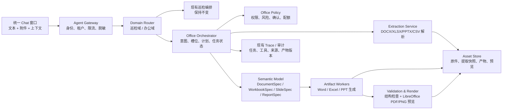
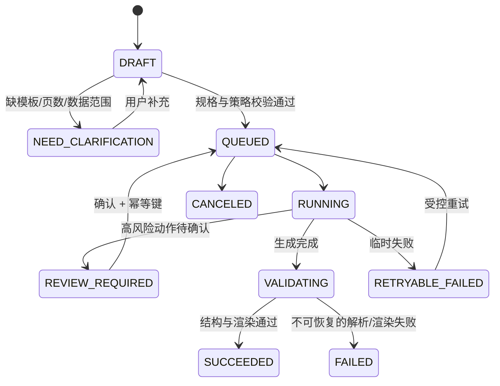

# 个人办公助理 Agent：技术评估与落地方案

| 项目 | 内容 |
|---|---|
| 版本 | v0.1（方案设计） |
| 日期 | 2026-08-12 |
| 接入位置 | 现有“巡检个人助理”统一 Chat 窗口 |
| 本轮边界 | 只做技术评估与方案设计；不改动既有巡检功能、接口或前端行为 |

> 2026-08-17 整合说明：本文保留 Office 域的技术可行性和实现细节；与开放检索的入口、数据交接、共享门禁及统一验收，以《开放检索与 Office 协同统一落地蓝图 v1.0》为准。

## 1. 结论

需求可落地，且当前工程已经具备较好的承载基础：统一会话、Agent Core 的意图/Skill/Tool/执行轨迹分层、租户隔离、权限、审计和已有 PDF 生成能力均可复用。

推荐采用**“统一对话入口 + 巡检域与办公域双域编排 + 异步文档工作流”**。办公能力不是把 Word、Excel、PPT 的复杂处理逻辑直接插入现有巡检分支，而是作为独立 `Office Domain` 注册进 Agent Core，由总路由在显式办公意图或附件存在时转入该域。现有巡检 `Skill`、PaaS Connector、会话 API 和页面行为保持原状。

首期应以“受控生成、提取、转换”为主：生成新文件、从用户上传的 Excel/Word 提炼内容后生成 PPT、把结构化数据生成图表和 BI 报表。不要承诺首期对任意复杂存量 Office 文件进行无损编辑或像桌面 Office 一样实时协同编辑；这两类能力的工程复杂度和格式风险明显更高。

## 2. 现状评估

### 2.1 可复用基础

| 现有能力 | 可复用方式 | 对办公 Agent 的价值 |
|---|---|---|
| 统一 Chat、会话历史、消息关联对象 | 办公任务继续使用 Conversation / Message | 用户无需切换产品入口；历史可追溯 |
| Agent Core：Intent、Skill、Tool、Route、Trace | 新增办公域目录与执行器，不修改巡检目录语义 | 可解释路由、工具白名单和步骤级 Trace |
| Plan、确认、幂等、RBAC、审计 | 复用高风险操作控制模型 | 避免覆盖、外发、共享等误操作 |
| 多租户/用户数据范围 | 办公资产按 tenant、user、conversation 隔离 | 文档与业务数据不串租户 |
| PDF 生成与下载受控访问 | 作为导出与预览的先行范式 | 文档产物可下载、可审计 |
| LibreOffice 命令行运行入口 | 用于 Office 转 PDF/图片并做最终可视化验收 | 降低“文件能生成但打不开/排版错误”的风险 |

### 2.2 当前缺口

1. 聊天输入区尚未提供通用 Office 文件附件上传、文件选择、任务进度和产物预览能力；现有上传主要服务于知识库图片。
2. 现有 `requirements.txt` 仅声明 `cryptography`、`Pillow`、`reportlab`，没有声明 Excel/Word/PPT 的结构化处理依赖；默认 Python 环境也未发现 `openpyxl`、`python-docx`、`python-pptx`、`pandas` 等包。因此办公运行时、版本锁定和部署镜像需要单独定义。
3. 当前 Agent 目录支持扩展登记，但第三方/新增能力默认是 `registry_only`；缺少面向长任务的通用 Job、产物、版本、预览与失败重试模型。
4. 当前 PDF 能力面向开放问答结果，尚不具备“输入文件 -> 结构化内容模型 -> Office 产物 -> 渲染质检”的通用资产管道。

### 2.3 可行性与边界判断

| 能力 | 可行性 | 首期建议 | 关键约束 |
|---|---|---|---|
| 按模板生成 Excel / Word / PPT | 高 | P0 | 使用平台维护模板，先生成新文件 |
| Excel/CSV 生成图表、BI 报表 | 高 | P0 | 采用受控 `ReportSpec`，不让模型直接生成任意脚本或 SQL |
| Excel/Word 提取内容后生成 PPT | 高 | P0 | 先抽取为带来源定位的中间模型，再生成演示文稿 |
| 图表在 Excel、PPT、Word 间转换 | 高 | P0 | P0 以静态图、数据表和可编辑图表三种明确产物为准 |
| 读取、摘要、转换已有 Office 文件 | 高 | P0 | 限制格式、大小、页数和宏/外链 |
| 局部修改已有 Word/Excel/PPT | 中 | P1 | 需版本化、差异预览与用户确认；复杂格式可能降级 |
| 接入外部 BI 数据库、企业指标库 | 中 | P1 | 只读语义层、参数化查询、数据权限与口径治理 |
| Microsoft 365 / WPS 在线实时协同、原位编辑 | 中低 | P2 | 需要 OAuth、Graph/WPS 契约、冲突处理和管理员审批 |
| 任意复杂 PPT/Word 无损转换或编辑 | 低 | 非首期承诺 | SmartArt、宏、嵌入对象、字体、批注、动画等无法通用保真 |

## 3. 目标产品范围

### 3.1 P0 能力矩阵

| 用户表达 | 意图 / Skill | 输入 | 输出 | 风险 |
|---|---|---|---|---|
| “根据这份周报做一个 8 页汇报 PPT” | `OFFICE_CREATE_PRESENTATION` | 文本、Word、Excel、CSV | `.pptx`、PDF 预览、页级缩略图 | `TRANSIENT_SESSION` |
| “把这份数据做成销售 BI 报表” | `OFFICE_CREATE_BI_REPORT` | Excel、CSV、受控数据集 | `.xlsx`、`.pptx`/`.pdf`、图表数据 | `TRANSIENT_SESSION` |
| “生成费用预算 Excel，含公式和图表” | `OFFICE_CREATE_WORKBOOK` | 自然语言、结构化数据 | `.xlsx` | `TRANSIENT_SESSION` |
| “生成项目周报 Word” | `OFFICE_CREATE_DOCUMENT` | 自然语言、提取结果、模板 | `.docx`、PDF 预览 | `TRANSIENT_SESSION` |
| “提取这份 Excel 和 Word，整理成管理层 PPT” | `OFFICE_EXTRACT_AND_COMPOSE` | `.xlsx`、`.csv`、`.docx` | 来源清单、PPT、预览 | `READ_ONLY` + 生成阶段 `TRANSIENT_SESSION` |
| “把这个柱状图改成折线图，并放到 PPT” | `OFFICE_CONVERT_CHART` | 工作簿/图表数据/图片 | 新图表、PPT/Word/Excel 目标文件 | `TRANSIENT_SESSION` |
| “把这张图表导出为图片/PDF” | `OFFICE_EXPORT_ARTIFACT` | 已生成产物 | PNG/SVG/PDF 或副本 | `READ_ONLY` |

说明：P0 的“生成”只创建新的受控产物，不修改用户原始文件。覆盖已有文件、删除资产、外发邮件、创建外部共享链接、写回在线文档或执行外部数据写入，均不属于 P0。

### 3.2 首期非范围

- 不在 Chat 中直接打开或操控用户本机安装的 Office/WPS 桌面应用。
- 不处理带宏的 `.xlsm`、`.docm`、`.pptm`，也不执行嵌入脚本、OLE 对象或外部链接。
- 不承诺任意源文件的像素级无损编辑、复杂动画迁移、修订痕迹保留或批注合并。
- 不让模型直接访问任意数据库、任意文件路径、任意 URL 或执行 Python/VBA。
- 不将上传文档自动纳入巡检知识库或长期记忆；用户必须显式授权并选择目标范围。

## 4. 总体架构



### 4.1 核心设计原则

1. **域隔离**：现有巡检路由、`online_agent.py` 分支、DeepVision 工具与办公执行器不互相调用；只共享 Agent Core、会话、身份、审计和下载授权等横向能力。
2. **中间规格优先**：模型输出 `DocumentSpec`、`WorkbookSpec`、`SlideSpec`、`ReportSpec` 等 JSON Schema，而不是输出二进制 Office 文件、VBA 或任意代码。规格经校验后才可调用生成器。
3. **原件不可变**：上传文件为不可变版本。每次生成、转换和编辑产生新 `artifact_version`，通过父子关系回溯来源，避免覆盖和丢失。
4. **先预览后交付**：每个产物完成结构校验后，统一经 LibreOffice 渲染为 PDF/PNG；页面只向用户展示经过验收的下载入口和预览。
5. **可信来源**：从 Excel/Word 生成 PPT 时，关键事实保留 `source_file_id + sheet/row/cell` 或 `paragraph/table` 定位；模型摘要不能替代数据来源。
6. **显式副作用**：读取、提取、生成副本可自动执行；覆盖、共享、外发、同步到第三方、写回企业数据源必须先展示计划卡并由用户确认。

### 4.2 建议模块边界

目标代码结构应为新增模块，而不是在现有 `server.py` 的巡检分支继续堆叠逻辑：

```text
office_agent/
  catalog.py              # 办公意图、Skill、Tool 定义
  router.py               # 办公域命中判定，不改变巡检分类器
  policy.py               # MIME、风险、配额、确认与数据防护策略
  assets.py               # 上传、哈希、对象存储、权限下载、生命周期
  extraction/
    xlsx.py docx.py pptx.py csv.py
  specs/
    document.py workbook.py presentation.py report.py
  generators/
    word.py excel.py powerpoint.py charts.py
  rendering.py             # LibreOffice 转 PDF/PNG、缩略图
  validation.py            # Schema、公式、渲染、质量门禁
  jobs.py                  # 状态机、幂等、重试、取消
  api.py                   # /api/office/*，由现有服务路由挂载
  tests/
```

在当前单体阶段可以由 `server.py` 仅做 API 装配和身份注入；后续服务化时 `office_agent` 可独立部署为文档工作服务。这样可以将办公依赖（LibreOffice、字体、解析库、任务队列）与线上巡检查询运行时隔离。

## 5. Agent、Skill 与工具设计

### 5.1 目录与路由

办公域维护自己的 `OfficeAgentCatalog`，然后以只读合并视图加入现有 Agent 能力目录。建议新意图使用 `OFFICE_` 前缀，避免与巡检意图冲突。

总路由顺序：

1. 安全预处理：附件类型、文件哈希、敏感内容和恶意载荷检查。
2. 若用户明确提及“PPT / PowerPoint / Excel / Word / BI / 报表 / 图表 / 文档转换”，或本轮含受支持的办公附件，则尝试办公域路由。
3. 若办公域低置信或未命中，保持现有巡检/开放问答路由，不将“报告”一词强行解释为办公任务。
4. 办公域先输出结构化意图、输入资产、目标格式、模板、数据范围、是否需要用户澄清；再进入对应 Skill。

办公域不得重写现有 `classify_intent()` 或巡检 `IntentAnalyzer` 的语义。实现时通过独立 `office_router.can_handle(envelope)` 进行前置、可回退的判断，并以特性开关控制。

### 5.2 建议工具清单

| 工具 | 权限/风险 | 输入摘要 | 输出摘要 |
|---|---|---|---|
| `office.asset.upload` | `READ_ONLY` | 文件流、文件名、声明 MIME | `asset_id`、SHA-256、已检测 MIME |
| `office.asset.inspect` | `READ_ONLY` | `asset_id` | 页/表/图表/段落统计、风险告警 |
| `office.extract.structured` | `READ_ONLY` | `asset_id`、提取选项 | 结构化内容与来源定位 |
| `office.plan.compose` | `TRANSIENT_SESSION` | 用户目标、提取快照、模板 | 已校验的规格草案 |
| `office.workbook.generate` | `TRANSIENT_SESSION` | `WorkbookSpec` | 新工作簿版本 |
| `office.document.generate` | `TRANSIENT_SESSION` | `DocumentSpec` | 新 Word 文档版本 |
| `office.presentation.generate` | `TRANSIENT_SESSION` | `SlideSpec` | 新 PPT 版本 |
| `office.report.generate` | `TRANSIENT_SESSION` | `ReportSpec`、受控数据集 | BI 报表包 |
| `office.chart.transform` | `TRANSIENT_SESSION` | `ChartSpec`、目标类型 | 图表图片/可编辑图表 |
| `office.render.validate` | `READ_ONLY` | `artifact_version_id` | PDF、缩略图、检查结果 |
| `office.asset.share` | `HIGH_WRITE` | 资产、接收者、有效期 | 外部共享回执 |
| `office.asset.replace_source` | `HIGH_WRITE` | 原件、目标版本、确认键 | 新版本或失败回执 |

工具只接收 `asset_id`、`artifact_version_id` 与经过 Schema 校验的规格，不能接收本机绝对路径、任意 shell 命令、任意 SQL、裸 URL 或原始云存储凭证。

### 5.3 办公任务状态机



每个 Job 使用 `tenant_id + user_id + source_asset_hashes + normalized_spec_hash + action` 计算幂等键。相同请求在有效窗口内返回同一任务/产物，不重复消耗模型和渲染资源。

## 6. 文件、数据与安全方案

### 6.1 资产模型

| 对象 | 关键字段 | 说明 |
|---|---|---|
| `office_assets` | `asset_id`、tenant/user/conversation、原文件名、检测 MIME、大小、SHA-256、状态、保留期 | 原件不可变，保存对象存储而非数据库 BLOB |
| `office_extractions` | `extraction_id`、asset_id、parser_version、content_json、source_index、warnings | 将 Office 内容转换为可引用的中间快照 |
| `office_jobs` | `job_id`、intent、status、risk、spec_json、idempotency_key、trace_id、错误码 | 异步编排和重试主体 |
| `office_artifact_versions` | `version_id`、root_asset_id、parent_version_id、格式、产物路径、preview_id、quality_result | 支持源文件、草稿、修订稿、导出稿间关系 |
| `office_templates` | `template_id`、类型、版本、品牌、权限、校验哈希 | 平台维护、可审计的 Word/Excel/PPT 模板 |
| `office_audit_events` | 用户、动作、输入/输出 ID、数据范围、时间、结果 | 可复用现有审计表或通过统一事件映射入库 |

资产下载使用应用侧临时授权地址，先校验 `tenant_id`、会话归属和角色，再生成下载流；前端不接触对象存储凭证。

### 6.2 上传与解析安全

1. 首期仅允许 `.xlsx`、`.xls`（可选、只读转换）、`.csv`、`.docx`、`.pptx`、`.pdf`、`.png/.jpg/.webp`；文件扩展名、魔数和解析器结果必须一致。
2. 宏文件 `.xlsm/.docm/.pptm`、加密文件、损坏 ZIP、外部链接、OLE 对象、公式 DDE、嵌入脚本默认拒绝或隔离，不执行其中内容。
3. 已确认上传硬门：单文件不超过 **40MB**、一次最多 3 个文件（传输层总量不超过 120MB）。同时必须限制解压后总量（≤250MB）、压缩比（≤10:1）、Excel/CSV 行数（≤100,000）与非空单元格（≤1,000,000）、Word 页数（≤200）、PPT 页数（≤100）和图片数（≤100），防止 ZIP bomb 与资源耗尽。文件大小不是唯一性能指标，超复杂文件返回可理解的超限错误。
4. CSV 以文本导入时，导出到 Excel 的以 `= + - @` 开头值必须转义，防止公式注入。
5. 上传、提取内容、模型提示词、日志和下载 URL 都做敏感字段扫描；默认不把文档全文写入普通应用日志或 Agent 长期记忆。
6. 资产必须具备保留期、用户删除/过期清理策略和审计；生产环境接入病毒扫描/内容安全服务后才允许外部文件长期保存。

### 6.3 模型使用边界

- 模型负责理解任务、生成大纲、挑选已允许的图表类型、编写说明文字、将提取内容映射到规格；不直接执行文件解析或写文件。
- 数值、合计、同比/环比、百分比等由确定性计算模块完成；生成前后都进行数字核验。
- 从源文件转 PPT 时，每页要保留来源引用；当数据不完整、指标口径冲突或结论无法从来源支持时，任务进入 `NEED_CLARIFICATION` 或显示“待用户确认”。
- 任何外部数据连接采用已备案 Connector + 只读语义层 + 参数化查询；模型不拥有数据库账号，也不能生成原生 SQL 直接执行。

## 7. 文档生成与质量验证

### 7.1 格式处理技术选型

| 文件类型 | 结构化读写 | 质量/兼容性策略 |
|---|---|---|
| Excel | `openpyxl`（读写）、`XlsxWriter`（新文件高质量写入）、`pandas`（表格计算） | 检查工作表、公式、冻结窗格、图表引用；LibreOffice 无头渲染复核 |
| Word | `python-docx` | 模板占位符填充、标题层级、表格、图片；转 PDF 后页级检查 |
| PowerPoint | `python-pptx` | 模板母版/版式优先、图表/图片/文字；转 PDF/PNG 后检查空白、溢出、重叠 |
| 图表 | `matplotlib` 或受控图表生成器 | `ChartSpec` 驱动；明确输出 PNG/SVG、Excel 原生图表或 PPT 图形 |
| 格式转换 | LibreOffice headless | 用于 PDF、缩略图和兼容性验证，不作为业务语义提取唯一来源 |

所有依赖需写入独立办公运行时锁定文件或容器镜像；不要仅依赖开发机上偶然存在的 Python 包或字体。中文字体、企业字体和 LibreOffice 版本也必须固定，并作为部署自检项。

### 7.2 规格驱动示例

`SlideSpec` 的最小结构可包含：目标页数、主题模板、每页标题、事实/来源、图表规格、图片、讲稿、布局槽位、是否允许模型补充说明。`ReportSpec` 包含指标、维度、过滤条件、图表、口径、表格、导出格式。生成器只识别这些白名单字段。

例如“把销售 Excel 和经营周报生成管理层 PPT”的安全链路为：

```text
上传文件 -> 文件检查 -> 表格/段落/图表提取 -> 指标与来源校验
-> 生成 SlideSpec 草案 -> 用户确认主题/页数（如有必要）
-> PPT 生成 -> PPTX 结构检查 -> LibreOffice 渲染 -> 缩略图/预览
-> 结果卡下载 + 来源引用 + Trace + 审计
```

### 7.3 质量门禁

1. **结构门禁**：文件可被对应库重新打开；PPT 页数、Word 段落、Excel 工作表/单元格/图表与规格一致。
2. **数据门禁**：所有公式、汇总和图表数据源能回溯到输入数据或确定性计算结果；禁止模型杜撰数据。
3. **渲染门禁**：Office 文件通过 LibreOffice 转 PDF，生成页面 PNG；检测空白页、文本截断、元素越界、图片缺失和明显重叠。
4. **语义门禁**：重要页的标题、数值、指标口径和来源引用与 `Spec` 一致；无法验证则标为待复核，而不是伪造成功。
5. **交付门禁**：仅 `SUCCEEDED` 的版本向用户展示正式下载；`PARTIAL_SUCCESS` 需要明确说明缺失页或降级项。

## 8. 前端与交互方案

在保留现有 Chat 主视图的基础上新增、默认关闭的办公入口能力：

1. 输入框增加“附件”按钮，支持拖拽/选择、多文件列表、格式/大小提示和上传进度；不影响没有附件的巡检问答。
2. 办公任务消息显示可折叠阶段：文件检查、内容提取、生成大纲、创建文件、渲染校验、已交付。
3. 生成前的规格卡展示：目标格式、文件名、模板、页数/工作表、数据来源、图表清单、风险和是否会修改原件。
4. 产物卡展示缩略图、版本、下载、预览、来源、质量状态和“基于此继续修改”。P0 的“继续修改”生成新版本，不覆盖旧版本。
5. 失败态区分：不支持格式、文件受保护、内容过大、提取失败、数据口径不清、模板缺失、渲染失败、权限不足、任务可重试。
6. Agent Trace 复用现有展示机制，新增 `asset.inspect`、`extract`、`spec.validate`、`generate`、`render.validate`、`artifact.deliver` 节点；敏感文档正文默认不在 Trace 中展开。

## 9. 接口契约建议

以下为新增命名空间，避免改变当前巡检 API 的请求/响应：

| 方法 | 路径 | 用途 |
|---|---|---|
| `POST` | `/api/office/assets` | 上传并安全登记资产；返回 `asset_id` |
| `GET` | `/api/office/assets/{asset_id}` | 查询资产元数据、权限、提取状态 |
| `POST` | `/api/office/assets/{asset_id}/extract` | 创建提取任务或返回幂等结果 |
| `POST` | `/api/office/jobs` | 从对话意图/资产/目标创建任务 |
| `GET` | `/api/office/jobs/{job_id}` | 查询阶段、进度、澄清问题、失败原因 |
| `GET` | `/api/office/jobs/{job_id}/stream` | SSE 推送任务阶段；P0 可先轮询 |
| `POST` | `/api/office/jobs/{job_id}/confirm` | 仅确认高风险写/共享操作；带幂等键 |
| `POST` | `/api/office/jobs/{job_id}/cancel` | 取消尚未交付的任务 |
| `GET` | `/api/office/artifacts/{version_id}/download` | 经过服务端 ACL 校验后下载 |
| `GET` | `/api/office/artifacts/{version_id}/preview` | 返回受控 PDF/缩略图预览 |
| `POST` | `/api/office/templates` | 管理员上传/发布模板；首期可仅内置 |

`POST /api/conversations/{id}/messages` 保持兼容：可在其请求体中增设可选 `attachment_ids`；未携带该字段时完全走既有流程。服务端以特性开关与附件 MIME 判断是否调用办公路由。

## 10. 分期实施计划

### 阶段 0：契约与运行时冻结

目标是先降低后续返工，不向最终用户开放。

- 确认支持格式、文件上限、保留期、企业模板、中文字体、部署环境的 LibreOffice 版本。
- 确定对象存储、病毒扫描、任务队列、模型网关与数据分级要求。
- 冻结 `OfficeAsset`、`OfficeJob`、四类 `Spec`、错误码、审计事件和数据脱敏契约。
- 将办公 Python 依赖、系统字体与 LibreOffice 写入可复现镜像；增加启动自检。
- 建立与现有 `smoke_test.py` 隔离的 `office_agent_smoke_test.py`，先跑历史回归基线。

验收门槛：办公特性开关关闭时，既有巡检 API、路由、前端 DOM 和烟测结果不发生变化。

### 阶段 1：P0-A 资产与提取闭环

- Chat 附件上传、资产登记、MIME/宏/外链/大小校验、租户权限与临时下载。
- 实现 CSV/XLSX/DOCX 的结构化提取，输出带位置的内容快照和提取摘要。
- 新增 `OFFICE_EXTRACT_AND_COMPOSE` 等目录项，但仅在显式开关与受支持附件下可执行。
- 新增 Job 状态、幂等、审计、失败码和任务进度 UI。

验收门槛：用户上传 Excel/Word 后可得到可验证的表、段落、图表提取摘要；原件未被修改；其他租户和无权限用户无法读取资产。

### 阶段 2：P0-B 模板化 Word / Excel / PPT 生成

- 维护最少一套 Word 周报、Excel 预算、PPT 管理层汇报模板。
- 实现 `DocumentSpec`、`WorkbookSpec`、`SlideSpec` Schema 与生成器。
- 支持“文本生成三类 Office 文件”和“Excel + Word -> PPT”两条完整链路。
- 增加 PDF/PNG 渲染、结构检查、预览与下载卡。

验收门槛：三类文件能用 Microsoft Office 与 LibreOffice 打开；PPT 可预览、Excel 公式与图表可编辑；生成结果可追溯到输入/来源。

### 阶段 3：P0-C BI 报表与图表转换

- 引入 `ReportSpec`、受控指标和图表类型白名单。
- 支持 CSV/XLSX 生成 KPI 卡、明细表、柱/线/饼/散点图和管理摘要。
- 支持图表导出 PNG/SVG/PDF，嵌入 PPT/Word，或写回新 Excel 版本。
- 补充数值核验、公式注入防护、样本数据与版式回归。

验收门槛：同一输入数据在 Excel、PPT、PDF 展示的关键指标一致；图表的数值、筛选条件和口径可见。

### 阶段 4：P1 受控编辑与企业数据接入

- 对已有文档提供“提取 -> 生成修订副本 -> 差异预览 -> 确认替换”的流程。
- 引入企业模板、品牌资产库、常用报告组件、用户偏好记忆（明确授权后）。
- 接入只读 BI 语义层和审批过的数据 Connector；支持日报/周报定时生成。
- 引入队列、SSE、并发控制、失败重试、监控与成本计量。

### 阶段 5：P2 协作与生态

- Microsoft 365 / WPS / 企业网盘授权接入，保留原位文件版本与同步回执。
- Office Add-in/侧边栏、多人审批、评论与版本对比。
- 模板市场、部门级权限、资产生命周期、效果评测与运营分析。

## 11. 测试与验收重点

| 类别 | P0 必测场景 |
|---|---|
| 兼容回归 | 特性开关关闭/未带附件时，现有巡检问答、计划确认、PDF、租户切换、审计烟测全部通过 |
| 文件安全 | 篡改扩展名、加密/宏文件、ZIP bomb、超限文件、公式注入、外部链接、跨租户下载均被正确拦截 |
| 提取准确性 | Excel 单元格/公式/图表、Word 标题/段落/表格的来源定位正确；解析失败不臆造内容 |
| 生成正确性 | Word、Excel、PPT 均可打开；工作表和幻灯片数量、文字、图片、图表与 Spec 一致 |
| 数据一致性 | KPI、汇总、同比/环比、图表源数据在输入、生成 Excel、PPT、PDF 间一致 |
| 渲染质量 | 每份交付物通过 LibreOffice 渲染；无空白页、图片丢失、明显文本溢出或元素越界 |
| 状态与幂等 | 相同请求不重复生成；取消、重试、临时失败、渲染失败均有确定状态和可追踪错误码 |
| 权限审计 | 上传、提取、生成、下载、外发确认均记录审计；审计和 Trace 不泄露文档原文或密钥 |

## 12. 主要风险与应对

| 风险 | 影响 | 应对 |
|---|---|---|
| Office 格式保真难 | 生成结果在不同客户端排版不一致 | 模板优先；固定 LibreOffice/字体；以渲染预览作为交付门禁；复杂源文件降级为重建副本 |
| 模型编造数值或结论 | BI/PPT 出现错误经营结论 | 所有数值来自确定性数据层；来源定位、Spec 校验和数值对账 |
| 大文件和并发渲染拖垮主服务 | 影响巡检在线查询 | 办公 Worker/队列与巡检请求隔离；限额、超时、缓存、任务优先级 |
| 文档包含敏感信息 | 数据泄露与合规风险 | 租户隔离、对象存储加密、短期授权下载、日志脱敏、保留期和显式记忆授权 |
| 模板需求无限扩张 | 首期交付失焦 | P0 固定 3 类基础模板和少量图表；模板发布治理放入 P1 |
| 外部 BI 数据口径不一致 | 报表难以被业务接受 | P0 仅文件数据；P1 以批准的指标语义层和口径版本接入 |

## 13. 需要客户确认的产品决策

以下选择不会阻碍方案设计，但会决定 P0 的实际工期与验收口径：

1. **已确认**：首个验收闭环为“Excel/Word 提取 → 管理层 PPT + PDF/PNG 预览”。
2. **已确认**：暂无公司统一模板/样稿，默认采用阿里巴巴普惠体和平台通用 16:9 管理汇报模板；验收不以企业品牌还原为标准。
3. 文件来源是否仅限用户上传，还是 P0 就要对接企业网盘/微软 365/WPS；建议 P0 仅上传，外部网盘放 P2。
4. **已确认**：单文件上限 40MB、一次最多 3 个文件；原件、提取快照、预览和产物默认保留 30 天；普通内部文档可处理，密钥/Token/证件/银行卡等强敏感内容直接阻断。生产灰度前仍须接入病毒扫描服务。
5. BI 报表首期是基于 Excel/CSV，还是必须连接某个指标平台；建议先以文件数据闭环，再接受控语义层。
6. 是否需要企业内共享、邮件/IM 外发或审批；若需要，应作为 `HIGH_WRITE` 的独立后续能力。

## 14. 本次设计结论与下一步

本方案选择“增量办公域”而非改造现有巡检主链路。首个开发切片建议是：**文件上传与安全检查 -> Excel/Word 提取 -> 模板化 PPT 生成 -> 渲染预览与下载**。它直接覆盖客户最有价值的“从办公材料生成汇报”的闭环，同时验证附件、资产、异步任务、追溯和质量门禁等后续能力的共同底座。

在客户确认模板、P0 优先能力、数据来源和文件治理规则前，不建议开始编码或引入外部 Office/BI 连接器。
