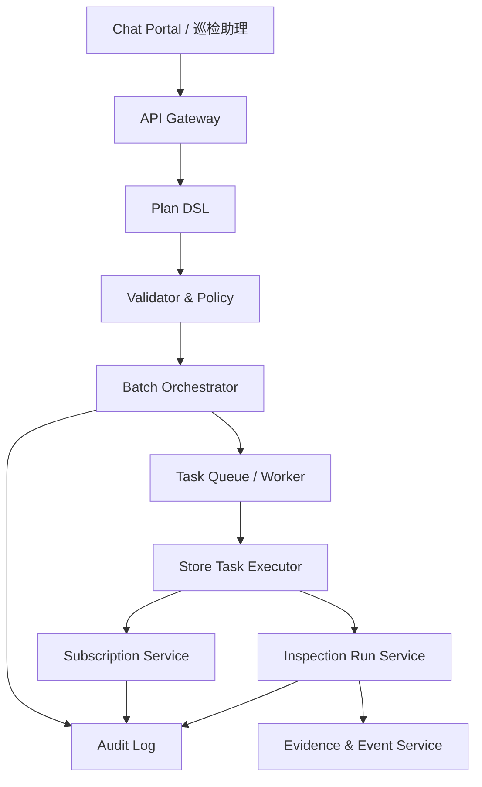

# 多门店对话式巡检任务产品方案

| 项目 | 内容 |
|---|---|
| 文档版本 | v1.0 |
| 日期 | 2026-07-21 |
| 适用产品 | 深象万象巡检助手 / AGI 巡检对话式工作台 |
| 需求来源 | 用户希望通过对话一次性为租户下多家门店创建并执行巡检任务 |
| 设计原则 | 复用现有对话、Plan DSL、订阅、任务、证据、审计链路；新增批量编排能力，不破坏单门店体验 |

## 1. 背景与目标

当前产品已经支持在当前租户、当前门店上下文下，通过对话创建巡检订阅、执行周期快照巡检、查看告警证据和统计分析。截图中的左侧上下文仍以单个门店为主，适合门店负责人或单点运营。

新需求要求租户管理员或区域运营可以直接说：

1. “帮我给 OPPO 租户下广州区域所有门店创建每天 12 点的门店快照巡检，并立即执行首轮。”
2. “把华南区 20 家门店都跑一遍竞品 Logo 巡检，失败的门店重试一次。”
3. “给除深圳前海店外的所有在线门店创建离岗巡检，明天开始每天 9 点到 22 点执行。”

产品目标：

1. 用户通过一次对话完成多门店范围识别、巡检配置、风险确认、任务创建和执行。
2. 保持现有单门店巡检、订阅、证据、历史对话、当前门店选择器功能不变。
3. 对批量写操作提供强确认、幂等、权限隔离、审计、部分成功和可恢复失败。
4. 让多门店结果可以按租户、区域、门店、摄像头、执行状态、异常类型聚合查看。

## 2. 产品定位

本需求不应做成一个独立的“批量巡检页面”，而应定义为现有对话式巡检的范围能力升级：

**多门店对话式巡检 = 对话助手将自然语言中的租户级或区域级巡检意图，解析为一个批量计划，并编排多个门店级巡检子任务或订阅子项执行。**

核心抽象：

```text
对话请求
  -> 多门店 Plan
  -> 批量任务 Batch
  -> 门店子任务 Store Task
  -> 摄像头执行 Run
  -> 证据/事件/统计
```

## 3. 范围定义

### 3.1 P0 必做

1. 支持通过对话选择多门店范围：全部门店、区域门店、城市门店、门店名单、排除门店、仅在线门店。
2. 支持两类执行模式：
   - 一次性即时巡检：创建批量任务并立即执行。
   - 周期巡检订阅：创建批量订阅，并默认执行首轮校验。
3. 计划卡展示影响范围：门店数、在线摄像头数、离线摄像头数、预计执行次数、预计耗时、额度风险。
4. 用户确认后创建一个批量父任务，并生成多个门店子任务。
5. 支持部分成功：成功门店继续展示结果，失败门店可重试、跳过或转人工。
6. 批量任务、子任务、订阅、证据和审计可追溯到同一个 `plan_id`。

### 3.2 P0 不做

1. 不把左侧“当前门店”选择器改成全局多选器。
2. 不允许低置信范围直接执行，例如“附近门店”“重点门店”未解析前必须追问。
3. 不支持无确认的大范围写操作。
4. 不支持跨租户批量执行。
5. 不支持删除或批量停用已有订阅的自动执行。

### 3.3 P1/P2

P1：

1. 按门店标签、营业状态、摄像头健康度、风险等级筛选。
2. 批量任务模板保存和复用。
3. 失败原因智能归因和推荐修复动作。
4. 导出批量任务报告。

P2：

1. 跨区域任务排程优化。
2. 多租户集团视角，但仍按租户隔离执行。
3. 额度、计费和并发策略可视化。

## 4. 用户与权限

| 角色 | 能力 |
|---|---|
| 租户管理员 | 可对授权租户下全部或部分门店创建和执行批量任务 |
| 区域运营 | 可对授权区域内门店创建和执行批量任务 |
| 门店负责人 | 默认只能对本门店执行，不能发起多门店批量写操作 |
| 内部交付 | 可代客户在授权租户范围内配置，所有动作留审计 |
| 审计/管理层 | 查看批量任务结果和审计，不默认具备写权限 |

权限规则：

1. 所有批量范围必须落到当前 `tenant_id` 内的真实 `store_id` 列表。
2. 后端按用户授权组织树二次过滤，不能依赖前端隐藏入口。
3. 若自然语言范围大于授权范围，计划卡必须显示“已过滤无权限门店”，但不暴露无权限门店名称。
4. 超过阈值的批量写操作进入强确认，例如影响超过 10 家门店或 50 路摄像头。

## 5. 信息架构

保持现有导航不变，只增强三个区域：

1. **巡检助理**：支持多门店计划卡、批量执行进度和结果摘要。
2. **巡检订阅**：新增“批量订阅组”视图，原有单门店订阅继续展示。
3. **任务详情**：新增批量任务详情页，展示父任务进度、门店子任务和证据汇总。

左侧“当前门店”继续表示浏览上下文。用户发起多门店任务时，计划卡内部显示“执行范围”，不改变当前门店选择器语义，避免影响现有查询、历史会话恢复和门店负责人体验。

## 6. 核心交互流程

### 6.1 对话创建并执行即时批量巡检

1. 用户输入：“检查广州区域所有 OPPO 门店有没有竞品 Logo，立即执行。”
2. 助手识别意图为 `BATCH_INSPECTION_EXECUTE`。
3. 系统解析范围为广州区域下授权门店列表。
4. 系统推荐摄像头范围：门店全景、墙面、柜台、海报区，过滤离线摄像头。
5. 若能力、时间、对象包或摄像头范围缺失，先追问。
6. 槽位完整后生成计划卡。
7. 用户确认后创建批量父任务和门店子任务。
8. 执行器按并发策略抓图、分析、写入事件和证据。
9. 对话返回批量摘要：成功、失败、待确认、异常门店 Top。

### 6.2 对话创建周期巡检订阅并执行首轮

1. 用户输入：“给华南区所有门店创建周期快照 AI 巡检，每天 12 点检查地面是否有障碍物，持续 14 天。”
2. 助手生成 `BATCH_SCHEDULED_INSPECTION_CREATE` 计划。
3. 计划卡展示：门店数、摄像头数、预计执行次数、首轮执行时间、离线/未标定风险。
4. 用户确认。
5. 系统创建批量订阅组，并为每家门店创建子订阅或子任务。
6. 系统立即执行首轮健康校验或首轮巡检。
7. 后续由调度器按门店子任务独立执行，父任务聚合状态。

## 7. 计划卡设计

批量计划卡在现有计划卡基础上新增：

| 字段 | 说明 |
|---|---|
| 执行范围 | 组织表达、门店数、排除门店数、授权过滤说明 |
| 门店明细 | 可展开查看前 20 家，支持打开完整清单 |
| 摄像头统计 | 在线、离线、未标定、被过滤数量 |
| 执行模式 | 即时巡检、周期订阅、创建后首轮执行 |
| 失败策略 | 跳过离线摄像头、失败重试次数、部分成功是否生效 |
| 成本预估 | 预计任务数、预计模型调用次数、预计耗时 |
| 强确认 | 大范围写操作需用户明确确认 |

强确认建议：

1. 影响小于等于 10 家门店：点击“确认并执行”即可。
2. 影响大于 10 家门店：弹出二次确认，显示“将影响 N 家门店、M 路摄像头”。
3. 影响大于租户阈值或额度不足：只能保存草稿，需管理员审批。

## 8. 产品对象模型

在现有 `Conversation`、`Plan`、`Subscription`、`ScheduledInspection`、`Evidence`、`AuditLog` 基础上扩展，不替换原对象。

### 8.1 BatchInspection

批量父任务，负责聚合多门店任务状态。

| 字段 | 说明 |
|---|---|
| batch_id | 批量任务 ID |
| tenant_id | 租户 |
| plan_id | 来源计划 |
| conversation_id | 来源会话 |
| intent | 批量即时巡检、批量周期巡检、批量订阅创建 |
| scope_snapshot | 确认时的门店和摄像头快照 |
| execution_mode | immediate、scheduled、subscription |
| status | pending、running、partial_success、succeeded、failed、cancelled |
| total_store_count | 总门店数 |
| success_store_count | 成功门店数 |
| failed_store_count | 失败门店数 |
| skipped_store_count | 跳过门店数 |
| created_by | 创建人 |

### 8.2 BatchInspectionItem

门店级子任务，保证单个门店失败不影响其他门店。

| 字段 | 说明 |
|---|---|
| item_id | 子任务 ID |
| batch_id | 父任务 ID |
| store_id | 门店 ID |
| store_name | 门店名称快照 |
| camera_ids | 本门店纳入执行的摄像头 |
| status | pending、running、succeeded、failed、skipped |
| failure_code | 失败码 |
| retry_count | 重试次数 |
| subscription_id | 周期订阅时关联 |
| run_ids | 即时或首轮执行记录 |

### 8.3 兼容策略

1. 原有单门店订阅仍写入 `subscriptions`，不强制迁移。
2. 批量订阅推荐创建“父批量组 + 多个单门店订阅”，每个子订阅仍有唯一 `org_id`，兼容现有列表、权限和事件查询。
3. 原有 `plans.slots.org_scope` 继续保留，新增 `scope_type`、`resolved_store_ids`、`excluded_store_ids` 等可选字段。
4. 前端旧计划卡在没有批量字段时按原逻辑渲染。

## 9. Plan DSL 扩展

新增或扩展意图：

| 意图 | 说明 |
|---|---|
| `BATCH_INSPECTION_EXECUTE` | 多门店一次性即时巡检 |
| `BATCH_SCHEDULED_INSPECTION_CREATE` | 多门店周期巡检任务创建 |
| `BATCH_SUBSCRIPTION_CREATE` | 多门店能力订阅创建 |

计划关键字段：

```json
{
  "intent": "BATCH_SCHEDULED_INSPECTION_CREATE",
  "risk_level": "HIGH_WRITE",
  "confirm_required": true,
  "slots": {
    "tenant_id": "oppo",
    "scope": {
      "type": "multi_store",
      "raw": "广州区域所有门店，排除天河城店",
      "resolved_store_ids": ["store_1", "store_2"],
      "excluded_store_ids": ["store_9"],
      "store_count": 2
    },
    "capability": {
      "name": "门店视觉合规巡检",
      "resolved_capability_id": "cap_visual_compliance"
    },
    "camera_policy": {
      "mode": "recommended_by_point_label",
      "include_labels": ["全景", "墙面", "柜台", "海报区"],
      "only_online": true
    },
    "execution": {
      "mode": "scheduled_with_first_run",
      "interval_minutes": 1440,
      "daily_window": "12:00-13:00",
      "duration_days": 14
    },
    "failure_policy": {
      "skip_offline_camera": true,
      "max_retry": 1,
      "allow_partial_success": true
    }
  },
  "actions": [
    {
      "tool": "batch_inspection.create",
      "idempotency_key": "batch_create_xxx"
    }
  ],
  "validators": [
    "permission.scope_check",
    "entity.store_resolve",
    "camera.online_check",
    "capability.compatibility_check",
    "quota.concurrent_limit_check",
    "duplicate.subscription_check"
  ]
}
```

## 10. 服务架构

推荐在现有架构中增加“批量编排层”，而不是让对话层直接循环调用单门店接口。



模块职责：

| 模块 | 职责 |
|---|---|
| Intent/Slot Parser | 解析多门店范围、排除条件、能力、时间、失败策略 |
| Scope Resolver | 将自然语言范围解析为授权门店集合 |
| Plan Validator | 校验权限、摄像头、能力、额度、重复订阅 |
| Batch Orchestrator | 创建批量父任务、拆分门店子任务、控制状态聚合 |
| Worker | 按并发策略执行子任务，处理重试和超时 |
| Result Aggregator | 汇总门店、摄像头、异常、证据和失败原因 |

## 11. API 建议

在不破坏现有接口的前提下新增：

| 方法 | 路由 | 说明 |
|---|---|---|
| `POST` | `/api/plans/{id}/confirm` | 复用现有确认接口，批量计划确认后返回 `batch_id` |
| `GET` | `/api/inspection-batches` | 批量任务列表，按租户和授权范围过滤 |
| `GET` | `/api/inspection-batches/{id}` | 批量任务详情、聚合状态、门店子任务 |
| `POST` | `/api/inspection-batches/{id}/retry` | 重试失败子任务 |
| `POST` | `/api/inspection-batches/{id}/cancel` | 取消未开始子任务 |
| `GET` | `/api/inspection-batches/{id}/events` | 批量任务关联事件和证据 |

兼容规则：

1. 旧客户端继续只消费 `subscription_id` 或 `scheduled_task`。
2. 新客户端若响应包含 `batch_id`，展示批量任务详情入口。
3. `GET /api/subscriptions` 可新增可选字段 `batch_id`、`batch_name`，老客户端忽略即可。

## 12. 状态机

### 12.1 批量父任务

| 状态 | 说明 |
|---|---|
| `PENDING` | 已确认，待拆分或待入队 |
| `RUNNING` | 至少一个子任务执行中 |
| `PARTIAL_SUCCESS` | 部分门店成功，部分失败或跳过 |
| `SUCCEEDED` | 全部门店成功或按策略跳过非关键失败 |
| `FAILED` | 全部失败或关键校验失败 |
| `CANCELLED` | 用户取消未执行部分 |

### 12.2 门店子任务

| 状态 | 说明 |
|---|---|
| `PENDING` | 等待执行 |
| `RUNNING` | 正在抓图、分析或创建订阅 |
| `SUCCEEDED` | 门店执行成功 |
| `FAILED` | 门店执行失败，可重试 |
| `SKIPPED` | 因无在线摄像头、无权限或重复订阅被跳过 |

## 13. 前端方案

### 13.1 巡检助理

1. 输入框不变，支持自然语言提到“所有门店”“广州区域”“这 20 家门店”“排除某店”。
2. 计划卡增强为批量样式：
   - 顶部展示“将影响 N 家门店、M 路摄像头”。
   - 风险区展示离线、未标定、重复订阅、额度不足。
   - 明细区可展开门店列表。
3. 确认后消息区展示批量进度卡：
   - 总进度。
   - 成功/失败/跳过数量。
   - 最近完成门店。
   - “查看批量任务详情”按钮。

### 13.2 巡检订阅

1. 新增批量订阅组卡片：名称、范围、能力、计划、状态、子订阅数量。
2. 点击组卡进入详情，按门店查看子订阅。
3. 单门店订阅列表保持现有样式和字段。

### 13.3 任务详情

页面结构：

1. 顶部：批量任务名称、状态、创建人、创建时间、来源对话。
2. 概览：门店数、摄像头数、已完成、异常、待确认、失败。
3. 门店表格：门店、摄像头数、状态、异常数、失败原因、操作。
4. 证据汇总：按异常类型、门店、时间筛选。
5. 审计链路：计划确认、拆分、执行、重试、取消。

## 14. 安全与稳定性

### 14.1 幂等

1. 批量父任务幂等键：`plan_id + tenant_id + normalized_scope + capability + schedule`。
2. 子任务幂等键：`batch_id + store_id + execution_mode`。
3. 重复点击确认只返回同一个 `batch_id`。
4. 子任务重试不能重复创建同一门店订阅，需先检查唯一约束。

### 14.2 事务

1. 确认计划时，在一个事务中创建父任务、子任务、审计和幂等记录。
2. 实际巡检执行异步进行，避免确认接口超时。
3. 子任务独立提交，支持部分成功。

### 14.3 并发与限流

1. 按租户配置最大并发门店数和最大并发摄像头数。
2. 同一租户同一能力同一门店同一时间窗避免重复执行。
3. 上游服务异常时进入退避重试，不阻塞整个批量任务。

### 14.4 数据隔离

1. 所有批量列表、详情和事件查询必须带 `tenant_id`。
2. 门店子任务查询必须二次校验用户授权组织范围。
3. 审计、消息和结果卡不得写入原始流地址、密钥或上游凭证。

## 15. 兼容性保障

1. **不改现有单门店主路径**：当前门店选择器、单门店对话、单门店订阅、单门店证据展示保持原交互。
2. **新增字段全部可选**：旧数据没有 `batch_id` 时按单门店逻辑渲染。
3. **批量能力走新工具**：新增 `batch_inspection.create`，不让对话层直接循环调用旧工具。
4. **灰度开关**：按租户开启 `multi_store_batch_inspection_enabled`。
5. **只读回退**：若批量执行器不可用，助手只生成计划卡并提示等待接口，不创建任何配置。
6. **旧 API 不破坏**：`/api/plans/{id}/confirm` 保持响应兼容，仅新增 `batch_id` 和批量摘要。

## 16. 异常与边界

| 场景 | 产品处理 |
|---|---|
| 门店范围歧义 | 追问，展示候选区域或门店 |
| 范围超权限 | 过滤授权范围，并提示已过滤，不展示无权限详情 |
| 门店无在线摄像头 | 默认跳过并计入失败/跳过明细 |
| 摄像头未标定 | 能全画面执行则警告，不能执行则子任务失败 |
| 重复订阅 | 计划卡提示已存在，默认跳过或询问是否覆盖 |
| 执行超时 | 子任务失败，可重试，不影响已成功门店 |
| 上游取图失败 | 自动重试一次，仍失败则记录失败原因 |
| 用户关闭页面 | 批量任务继续执行，历史对话和任务详情可恢复 |

## 17. 验收标准

P0 验收：

1. 租户管理员输入“给所有门店创建巡检任务并立即执行”，系统能生成批量计划卡。
2. 计划卡必须显示门店数、摄像头数、离线数、风险和确认按钮。
3. 未确认前不得创建批量任务、订阅或子任务。
4. 确认后返回 `batch_id`，并能在任务详情看到门店子任务进度。
5. 10 家门店中 8 家成功、2 家失败时，父任务状态为 `PARTIAL_SUCCESS`，成功结果可查看，失败可重试。
6. 门店负责人请求多门店批量创建时返回权限不足。
7. 重复确认同一计划不会重复创建批量任务。
8. 批量任务产生的事件和证据可按门店过滤。
9. 所有写操作和证据查看均写审计。
10. 关闭批量功能开关后，现有单门店功能全部可用。

## 18. 研发拆解

### P0-1 范围解析与计划卡

1. 扩展意图识别和槽位：多门店范围、排除条件、失败策略。
2. 增强 Scope Resolver，输出授权门店集合和过滤摘要。
3. 扩展 Plan DSL 和计划卡渲染。

### P0-2 批量任务模型与确认

1. 新增批量父任务和门店子任务表。
2. 复用 `/api/plans/{id}/confirm`，确认后创建批量任务。
3. 增加幂等约束和审计。

### P0-3 执行器与结果聚合

1. 新增批量执行器，按门店拆分并异步执行。
2. 子任务失败重试和部分成功状态聚合。
3. 事件、证据、订阅关联 `batch_id`。

### P0-4 前端详情与回归

1. 批量进度卡。
2. 批量任务详情页。
3. 巡检订阅批量组展示。
4. 权限、幂等、部分成功、历史会话、当前门店切换回归测试。

## 19. 回归测试重点

1. 单门店创建订阅不受影响。
2. 单门店周期快照巡检不受影响。
3. 当前门店切换后不会污染批量计划范围。
4. 历史对话恢复后批量计划卡和结果卡仍能正确展示。
5. 多租户切换后批量任务列表不串租户。
6. 门店负责人不可创建多门店任务。
7. 重复确认、刷新页面、网络重试不会重复创建。
8. 部分失败后重试只重试失败子任务。
9. 证据和审计不暴露敏感流地址或凭证。
10. 功能开关关闭后，不出现批量入口和批量工具调用。

## 20. 结论

本方案推荐把“多门店对话式巡检”定义为现有对话式巡检的批量编排扩展：

1. 对用户表现为一次对话、一张计划卡、一个批量任务详情。
2. 对系统表现为一个父批量任务和多个门店子任务。
3. 对兼容性表现为旧单门店对象和 API 保持不变，批量字段和批量接口增量引入。
4. 对安全表现为权限、确认、幂等、审计、部分成功和灰度开关全链路闭环。

这样既满足租户级多门店批量创建和执行，也不会破坏当前产品的单门店上下文、订阅、证据、会话和审计体系。
