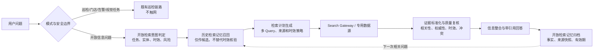

# 泛化开放性信息检索链路设计方案 v1.0

> 状态：设计评审稿，尚未开始业务代码开发  
> 目标：在不影响巡检链路的前提下，为深象万象提供可验证、可追溯、可治理的开放性信息检索能力。
>
> 2026-08-17 整合说明：本文保留 Open Research 域的检索、证据、记忆和效果评估细节；与 Office 的交接、共享门禁和总实施顺序，以《开放检索与 Office 协同统一落地蓝图 v1.0》为准。2026-08-20 起，原文“统一 60 天记忆”由《开放检索二次取证与私有知识复用方案 v3》中的“客观永久 / 缓慢变化 60 天 / 高时效不归档”策略取代；高时效答案仍保留在聊天中供回看，但不得作为知识或下一轮事实依据。

## 已确认的产品决策

| 决策项 | 已确认方案 |
|---|---|
| 首期检索引擎 | 本地版统一使用 Tavily；通过 `SearchGateway` 适配，不把供应商逻辑写入业务链路 |
| 开放检索知识 | 仅当前用户可见；客观永久、缓慢变化 60 天、高时效不归档；高时效的问答/引用/限长采用证据仅作会话回看，绝不进入知识索引；不保存网页全文，不跨用户/跨租户共享 |
| 效果评估 | 首期必须同时提供用户反馈交互和脱敏埋点，不能只统计调用次数或额度 |

## 1. 结论与设计原则

当前的开放问答已经有公网搜索入口，但它是“少量关键词命中后的一次搜索”，而不是完整的开放信息检索产品链路。因此它能覆盖天气、现任职位、旅行等少量已枚举场景，却无法稳定识别作品上映、活动状态、政策变更、人物履历、公共机构信息、新闻事件、商品与服务状态等大量动态问题。

推荐新增一个独立的 **Open Research（开放检索）域**，以如下闭环替代“模型直接回答或一次网页搜索”：



四条不可妥协的原则：

1. **检索取证先于动态事实生成**：模型不是实时数据库；凡是事实会随时间、事件、版本或地域变化，必须先有合格外部证据或专用数据源。
2. **检索与巡检双向隔离**：巡检链路不调用公网搜索；开放检索不读取门店、摄像头、告警、巡检知识库、凭证或企业业务上下文。
3. **历史记忆不是事实源**：高时效聊天记录可以回看，但不是可检索知识；天气、价格、职位、库存、突发事件等每次均必须重新查证。实时追问最多从会话继承实体等非事实槽位，旧值、旧引用和旧结论不得进入本轮事实输入。
4. **输出必须表达证据状态**：用“已核验 / 部分核验 / 来源冲突 / 暂无权威来源 / 服务不可用”区分问题，不以笼统“未知”掩盖路由、搜索或数据质量问题。

## 2. 现状核查与问题根因

### 2.1 当前已实现链路

当前代码的开放问答入口位于 `online_agent.py` 的 `OpenQuestionResponder`：

1. `OnlineInspectionAgent.handle_message()` 在 `AUTO` 或“开放问答”模式下，先尝试开放问答；巡检模式不进入该分支。
2. `OpenQuestionResponder.classify()` 对天气、公众现任职位、旅行、显式“最新/新闻/政策/股价”等少量关键词返回 `WEB_SEARCH_REQUIRED`；其余问题通常返回普通 `OPEN_QA`。
3. `WebSearchClient` 以 Tavily/Brave 适配器执行单次网页搜索，返回经过 URL 和敏感信息过滤的标题、摘要、链接、发布日期。
4. 模型只根据这一小组摘要与链接形成回答，前端展示来源卡和执行链路；服务端已经记录用量、检索时间与供应商请求标识。
5. 现有 `agent_memories` 和 `agent_knowledge_items` 主要服务于巡检。当前 `build_agent_trace()` 明确禁止在 `OPEN_QA` 中读取或展示它们，这一边界应保留。

### 2.2 截图 Case 的失败机理

截图中的用户原问是“《长安的离职》是什么时候上映的？”。它没有出现当前硬编码的天气、现任职位、新闻、政策等触发词，于是被识别为普通开放问答，未调用 `web.search`。该 Case 同时要求检索规划具备实体 Query Rewrite：将同音/错别字“离职”高置信识别为《长安的荔枝》，再以改写后的规范实体检索官方影视信息；不能依赖模型参数知识直接回答。

该问题至少暴露四项结构性缺口：

| 缺口 | 当前行为 | 造成的问题 | 新链路要求 |
|---|---|---|---|
| 动态性识别 | 依赖有限关键词 | 新类型动态事实落到裸模型 | 由任务类型、谓词、实体和时间语义共同判定 |
| 实体 Query Rewrite | 没有将“离职”识别为同音/错别字“荔枝”的受控改写 | 精确标题漏召回，或由模型在无证据下自行猜测 | 保留原问题，生成带置信度的规范实体候选；高置信候选自动进入 Query，低置信候选保留原 Query 并请求澄清 |
| 查询规划 | 原问题或少量天气改写，只查一次 | 标题、别名、作品形态和事件状态容易漏召回 | 多候选 Query、实体消歧、可控早停 |
| 证据质量 | 主要使用搜索摘要 | 不能判断“是否官方”“是否过期”“是否相互矛盾” | 来源分级、时效窗口、覆盖与冲突检查 |
| 检索记忆 | 无开放检索记忆 | 无法追溯既往答案，也不能在追问中复用已知实体与来源 | 独立事实记忆、有效期与二次查询策略 |

## 3. 产品边界与覆盖模型

### 3.1 MVP 范围

覆盖所有“需要公开外部事实支撑”的开放问题，而非为旅行、天气等单个场景不断增加 if/else。首期能力以任务抽象驱动：

| 检索任务 | 示例 | 首选数据能力 | 最低回答门槛 |
|---|---|---|---|
| 公共事实查询 | 某作品何时上映、某公司做什么、某政策何时生效 | 搜索 + 官方页面/公告 | 与目标实体匹配的来源；动态事实需合规时效 |
| 事件状态与进展 | 某发布会是否举行、赛事结果、航班是否取消 | 新闻/官方公告/垂直数据源 | 正式原文 1 条，或独立可靠来源 2 条 |
| 公众人物/组织动态 | 现任职位、任命、融资、机构公告 | 官方站点优先 | 至少 1 个权威一手来源 |
| 地点与本地服务 | 目的地交通、景点开放、餐厅信息 | 地图/旅游/交通专用 API 优先 | 供应商时间戳或官方来源 |
| 天气、行情、汇率等结构化实时数据 | 今日天气、汇率、股价 | 专用 API 优先 | 成功的带时间戳数据响应 |
| 推荐与比较 | 哪款设备适合、某地有哪些可选方案 | 搜索 + 多来源聚合 | 标注推荐依据、时间和不确定性 |
| 长文调研与追问 | 某技术路线对比、某事件来龙去脉 | 检索计划 + 证据包 + 综合 | 关键事实逐条可定位到来源 |

稳定的通识解释、写作、翻译和纯推理仍可以走普通开放问答；用户也可主动要求“联网核验”。医疗、法律、投资、未成年人、暴力自伤等高风险主题由独立内容策略控制，联网不代表可给出个性化结论。

### 3.2 明确不在首期范围

- 不做全网爬虫、通用搜索引擎索引或任意网址抓取器。
- 不把公网信息写入巡检知识库，也不让其参与视觉判定、订阅创建或告警结论。
- 不以缓存或历史问答替代实时数据源。
- 不在首期接入需要采购、跨境评审或未签约的供应商；所有数据源均通过适配器和开关接入。

## 4. 独立架构与模块职责

### 4.1 模块边界

新增目录建议为 `open_research/`，而不是继续向 `online_agent.py` 增加专题分支。

| 模块 | 责任 | 禁止依赖 |
|---|---|---|
| `contracts.py` | 输入、计划、证据、回答、记忆的稳定数据契约 | PaaS、巡检数据模型 |
| `boundary.py` | 检测业务对象、敏感字段和模式锁；决定 PASS/ALLOW/BLOCK | 摄像头、告警详情 |
| `intent.py` | 输出开放检索任务类型、实体、时间、地域、风险和置信度 | 巡检 Skill 路由 |
| `memory.py` | 检索/归档开放检索记忆、有效期和权限范围 | `agent_memories`、巡检知识库 |
| `planner.py` | 产出 Query 变体、数据源优先级、预算和早停条件 | 供应商 SDK |
| `gateway.py` | 供应商适配、限流、熔断、重试、脱敏、请求审计 | 模型提示词 |
| `evidence.py` | URL 安全、来源分级、去重、实体匹配、时效/冲突校验 | 业务规则引擎 |
| `synthesis.py` | 仅根据证据包生成带引用回答与结构化状态 | 工具选择、页面内容指令 |
| `orchestrator.py` | 编排上述阶段并输出可观测 Trace | DeepVision PaaS |

保留原有 `online_agent.py`、`agent_skills.py`、巡检 Plan 和 PaaS 调用的责任边界。聊天入口只新增一个窄路由：当判定为开放检索时调用 `OpenResearchOrchestrator`；其余请求原样交给现有路径。这样即使新模块故障，巡检能力也不会被降级或阻塞。

### 4.2 路由契约

输入先经不可绕过的边界门：

| 条件 | 路由结果 | 外部搜索 |
|---|---|---|
| 用户明确选择“巡检工作” | 现有巡检链路 | 永远禁止 |
| 含门店、摄像头、告警、巡检任务、租户凭证等业务语义 | 现有巡检链路或安全阻断 | 永远禁止 |
| 纯开放问题，稳定知识且无需外部事实 | 现有普通 `OPEN_QA` | 不调用 |
| 纯开放问题，事实依赖时效/版本/实体状态，或用户要求联网核验 | `OpenResearchOrchestrator` | 允许，且仅发送最小化 Query |
| 风险策略拒绝或含 PII/密钥 | 安全阻断/澄清 | 禁止 |

兼容策略：前端仍保留 `AUTO / 开放问答 / 巡检工作` 三种模式；开放检索的展示模式可仍标记为 `OPEN_QA`，但内部 `intent=OPEN_RESEARCH`、`execution_namespace=open_research.v1`、存储表和 Trace 与巡检完全独立。这既不破坏现有 UI 契约，也便于后续独立演进。

## 5. 核心执行链路

### 5.1 阶段一：开放检索意图判定

`SearchIntent` 不能只返回“是否搜”，至少包含：

```text
task_type: FACT_LOOKUP | EVENT_STATUS | ENTITY_PROFILE | RECOMMENDATION |
           COMPARISON | LOCATION_SERVICE | TREND | LONGFORM_RESEARCH | FOLLOW_UP
entities: [{name, aliases, type, confidence}]
time_requirement: LIVE | HOUR | DAY | EVENT | VERSION | STABLE
geo_scope: locale / region / unknown
evidence_required: true | false
source_policy: OFFICIAL_FIRST | MULTI_SOURCE | VERTICAL_API_FIRST | GENERAL_WEB
risk_level: LOW | RESTRICTED | BLOCKED
```

判定方式采用“模型结构化判断 + 保守规则兜底”：模型负责理解开放表达，规则负责拦截巡检语境、敏感外发、明确实时词、问句中“上映/发布/是否发生/现任/价格/状态/何时/最新”等状态谓词。若模型置信度不足且问题的答案可能随时间变化，宁可进入检索或提出一个最小澄清问题，不允许由裸模型给确定事实。

### 5.2 阶段二：历史检索记忆二次 Query

历史召回发生在外部查询规划之前，但有严格用途限制：

1. 先查当前用户的开放检索知识；会话消息不属于知识召回域。默认不跨用户共享。
2. 稳定/慢变知识命中可提供实体别名、已验证来源、历史事实、`valid_until` 与冲突线索；高时效会话仅可提供实体、地区、产品等非事实槽位以补全新 Query。
3. 仅当任务为 `STABLE` 或未过期的慢变事实、且实体和谓词均精确匹配时，才能直接复用历史结果；高时效追问必须强制重检，不能将上次的数值、引用或结论用作答案。
4. `LIVE/HOUR/DAY/EVENT/VERSION` 任务必须重查。历史结果只用来生成更准确的 Query、选择官方域名，或与最新结果做变更检测。
5. 历史与最新结果冲突时，以最新合格一手来源优先，标记 `CONFLICTING` 或 `UPDATED_SINCE_MEMORY`，绝不静默覆盖。

这满足“历史知识二次 query 命中”，同时避免“昨天的天气/旧职位/旧价格”被记忆错误复用。

### 5.3 阶段三：检索计划与开放搜索调用

一个请求可生成 1–3 条有明确目的的 Query，而非无限重试：

1. **实体规范化与精确 Query**：先保留原始实体，再生成别名、同音/错别字等候选。高置信候选可自动作为引号包裹的规范实体 Query；低置信候选不得静默替换原题，需并行保留原 Query 或请求澄清。
2. **任务谓词 Query**：将“上映/发布/任命/生效/价格”等谓词与实体组合；必要时加入年份、地域、语言和官方域名偏好。
3. **消歧或交叉验证 Query**：只在首轮不足、冲突或实体类型未知时执行。

每次调用都携带 `trace_id`、匿名化 Query、语言/地域、来源策略、时效窗口、最大结果数和预算。不得发送租户 ID、门店/摄像头名、告警、会话全文、巡检知识、图片、AppKey/AppSecret 或手机号。

数据源由策略选择而非场景写死：天气/行情/地图等优先专用 Adapter；新闻、公告、作品状态、公共背景走 Search Adapter；后续可添加官方开放数据 Adapter。**P0 本地版只启用 Tavily**；现有代码中的 Brave 分支不纳入首期发布，但适配器接口保留给后续受审批的灾备或扩展，不能成为业务逻辑的唯一实现。

### 5.4 阶段四：证据质量复核与信息整合

搜索返回值和网页内容一律是不可信外部输入。`EvidencePolicy` 对每条候选给出以下判定：

| 维度 | 校验规则 |
|---|---|
| URL 安全 | HTTPS、无凭证、拒绝本地/私网地址、受控重定向、MIME/大小限制 |
| 实体相关性 | 标题、摘要或受控正文必须命中目标实体或确认别名；无实体命中不得支撑结论 |
| 来源等级 | A：政府/监管/官方公告/专用 API；B：可靠媒体/行业机构；C：聚合/社区，仅作线索 |
| 时效性 | 依据任务类型计算 `valid_until`；发布日期、抓取时间或 API 时间缺失时降低等级 |
| 覆盖性 | 每个关键事实必须至少有一条直接支持的证据；推荐和争议事件要求多来源 |
| 冲突 | 相同事实对象的值不同则不由模型猜选，优先一手最新来源或明确呈现冲突 |
| 注入防护 | 只提取事实字段；网页中的“忽略指令/调用工具/泄露信息”等文本不得进入 Agent 控制面 |

模型只接收已标准化的 `EvidencePacket`，而非原始 HTML：

```text
evidence_id, claim_scope, title, canonical_url, publisher,
published_at, fetched_at, source_tier, snippet_or_extracted_fact,
content_hash, provider, provider_request_id, valid_until
```

回答生成器实行“逐条声明可追溯”：带时效的关键结论必须关联 `evidence_id`；证据不足时只能输出不足本身，不能用模型知识补齐。

### 5.5 阶段五：回答、归档与可解释性

统一 `ResearchAnswerEnvelope`：

```text
answer_status: VERIFIED | PARTIALLY_VERIFIED | CONFLICTING |
               NO_AUTHORITATIVE_SOURCE | SEARCH_UNAVAILABLE | BLOCKED |
               NEED_CLARIFICATION
answer: 面向用户的简洁回答
as_of: 本次信息截至时间
freshness: LIVE | HOUR | DAY | EVENT | VERSION | STABLE
claims: [{text, evidence_ids, confidence}]
citations: [{title, url, publisher, published_at, fetched_at, tier}]
memory: {retrieved_count, archived_record_id, reuse_mode}
degradation_reason: 可选、稳定错误码
```

前端回答区新增轻量状态卡：`已核验 N 条来源`、`部分核验`、`来源存在冲突`、`暂无可核验官方来源`、`搜索服务暂不可用`。展开后显示 Query、检索时间、来源、历史命中和本次是否刷新。执行 Trace 至少包含“开放检索意图”“记忆召回”“检索计划”“数据源调用”“证据复核”“回答整合”“记忆归档”七个节点。

## 6. 《长安的离职》Case 的目标行为

对于“《长安的离职》是什么时候上映的？”：

1. 判为 `EVENT_STATUS`，原始实体为《长安的离职》，作品类型未知，`evidence_required=true`。
2. 即使没有“最新”一词，也因“上映”是状态/时间谓词而进入检索。
3. Query Rewrite 将“离职”识别为高置信同音/错别字候选“荔枝”，并生成《长安的荔枝》+ 上映/影视化的规范 Query；Trace 同时保留原问题、改写 Query、改写类型和置信度。
4. 若候选对应官方影视信息，回答以《长安的荔枝》为检索实体的上映时间、作品形态、信息截至时间和来源，并在结果卡展示“已按标题纠错检索”。
5. 若改写置信度不足或存在多个同等候选，保留原 Query 并请求用户澄清；若只找到小说/音频等其他形态信息，回答“本次未检索到可证明影视上映时间的官方来源；已找到的内容属于 X 形态”，不下“并非电影”或“绝对没有影视化”的断言。
6. 若搜索服务故障，则返回 `SEARCH_UNAVAILABLE`；若没有合格来源，则返回 `NO_AUTHORITATIVE_SOURCE`。两者都不是模型“未知”。

## 7. 开放检索记忆模型与数据治理

### 7.1 独立数据对象

建议新增以下表，全部带 `tenant_id`、`user_id`、创建/更新时间、状态和审计字段；但逻辑上不与巡检记忆、知识库混用：

| 表 | 核心字段 | 用途 |
|---|---|---|
| `open_research_runs` | `run_id`、会话、原问题、意图、状态、耗时、预算 | 一次完整检索的可回放记录 |
| `open_research_queries` | `query_id`、run、规范化 Query、目的、Adapter、请求 ID、耗时 | 记录多 Query 计划与实际调用 |
| `open_research_evidence` | `evidence_id`、run、URL、来源等级、时间、摘要哈希、有效期 | 证据快照与质量判定 |
| `open_research_claims` | `claim_id`、run、实体、谓词、事实值、证据关联、置信度、有效期 | 可检索的已核验事实 |
| `open_research_memory_index` | 用户范围、规范问题、实体别名、任务、最新 run、过期时间 | 二次 Query 的快速召回索引 |
| `open_research_feedback` | run、结论类型、原因、纠正来源 | 评测集与策略迭代输入 |

不保存整页原始网页和搜索密钥；默认归档经脱敏的 Query 摘要、证据元信息、有限摘要哈希、可点击 URL、回答及有效期。若将来需要正文抽取，须另行启用受控对象存储、内容安全扫描、加密和更短保留期。

### 7.2 推荐默认保留策略

- 当前会话：保留用户问题、回答、引用与已采用的限长净化证据片段，随会话权限控制；不保留网页全文、原始 HTML 或未采用候选。
- 用户级开放检索知识：按客观永久、缓慢变化 60 天、高时效不归档分层，支持查看、删除、关闭归档。
- 租户共享记忆：首期关闭；仅管理员显式开启后，将**公开、已核验、无用户输入痕迹**的事实升格为共享条目。
- 高时效事实：不进入知识或检索计划索引；历史聊天可回看当时结果和截至时间，但任一后续提问均必须新建实时检索。
- 任何删除会软删除索引并记录审计；后续查询不可再召回。

### 7.3 独立开放检索记录页

在聊天历史之外提供“开放检索记录”一级入口，按当前用户和当前租户聚合已完成的 Open Research Run。它是会话留痕的只读查询投影，不是知识库，也不属于巡检“操作记录”：列表可按时间、事实类型、质量状态、反馈状态和本人问题/改写实体筛选；详情只展示最终回答、截至时间、引用、限长净化的已采用证据片段、改写和质量状态，并可回跳原会话。

`NO_MEMORY` 结果必须出现在该记录页以满足回看需求，但固定标识“实时查询；再次提问将重新检索”。从记录页发起重检或使用省略追问时，只继承实体、地区、产品和时间范围，强制创建新 Run；旧数值、旧日期、旧引用和旧 Claim 不能进入本轮答案。记录 API 后端先固定 `tenant_id + user_id`，普通租户管理员只能查看脱敏聚合指标；网页全文、原始 HTML、Tavily 原始响应、未采用候选和内部 Trace 一律不展示。

## 8. 安全、权限和可靠性

1. **出站最小化**：在 Gateway 之前执行敏感模式、PII、企业实体和模式锁检查；命中即不发外网。
2. **网络防护**：禁止调用用户提供的任意 URL；若未来引入正文读取，只能读取搜索结果中的公开 HTTPS URL，并执行 DNS/IP 复核、重定向上限、MIME、响应大小、超时和内容扫描。
3. **模型防护**：外部文本为 data，不是 instruction；不能改变工具权限、系统提示或历史选择。
4. **权限隔离**：用户只能访问自己会话和自己记忆；管理员配置数据源、共享策略和预算。后端强制 tenant/user 条件，UI 隐藏不是权限措施。
5. **可靠性**：每个 Adapter 有超时、一次受控重试、熔断和结构化错误码；结果不足时允许有限的 Query 扩展，不无限消耗额度。
6. **成本治理**：按租户、用户、任务类型设置次数、并发、单轮最大 Query 数和月预算；缓存命中、调用、失败与余额全部可观测。
7. **审计脱敏**：记录决策、状态、来源 ID、耗时、费用、来源哈希，不记录 API Key、完整敏感输入、原始网页正文或巡检上下文。

## 9. API、Trace 与前端契约建议

保留聊天 API，不要求用户改变输入方式；服务内部采用以下契约：

| 接口/事件 | 目的 |
|---|---|
| `POST /api/conversations/{id}/messages` | 原入口；内部可路由至 Open Research |
| `GET /api/open-research/runs/{run_id}` | 读取本次检索计划、证据、状态和 Trace |
| `GET /api/open-research/memories` | 当前用户查看自己的开放检索记忆 |
| `DELETE /api/open-research/memories/{id}` | 删除/失效一条记忆 |
| `POST /api/open-research/feedback` | 对“正确/过期/无关/错误”反馈 |
| `GET/PUT /api/agent/open-research/config` | 管理员配置 Adapter、地域、预算、来源策略与保留期 |

`agent.trace` 保持现有格式，以新增节点而不是改写巡检节点实现兼容。`web.search` 的现有来源卡可复用；新增的记忆、质量、冲突和有效期字段采用向后兼容的 `research` artifact 承载。

## 10. 用户反馈与搜索效果评估设计

Tavily 本地版的目标不是“接口调用成功”，而是验证用户实际能否更快获得可核验的信息。因此效果评估由用户显式反馈和自动埋点共同完成；两者均不保存网页全文或未经脱敏的用户输入。

### 10.1 回答后的用户反馈交互

每个经过开放检索的回答底部展示一次轻量反馈，不打断正常聊天：

```text
这次检索是否解决了你的问题？  [有帮助] [不准确] [信息已过期] [没有找到答案] [来源不可信]
```

- “有帮助”一键完成；“不准确/过期/未找到/来源不可信”要求选择原因，允许选填更正线索或官方链接。
- 用户点击“没有找到答案”后显示“换一种方式检索”按钮：沿用当前实体和时间约束，生成一轮受预算限制的补充 Query，而不是要求用户重新输入整句话。
- 发生 `NO_AUTHORITATIVE_SOURCE`、`CONFLICTING` 或 `SEARCH_UNAVAILABLE` 时，反馈卡直接显示对应原因，避免把系统问题误记为用户不满意。
- 反馈只作用于该次 `research_run`；用户可随时删除关联的开放检索记忆。不会把纠正内容直接当成事实写入共享知识库，必须经过后续检索/人工审核。

### 10.2 脱敏埋点事件

| 事件 | 关键字段（均脱敏/枚举化） | 用途 |
|---|---|---|
| `research.intent.decided` | 任务类型、时效级别、置信度、是否被巡检边界阻断 | 判断泛化意图是否漏检/误检 |
| `research.memory.retrieved` | 命中数、是否过期、复用方式 | 衡量记忆是否真正减少无效搜索 |
| `research.query.executed` | Query 哈希、Query 目的、Adapter、耗时、结果数、额度 | 衡量 Tavily 覆盖和成本，不记录原 Query 正文 |
| `research.evidence.reviewed` | 接纳/剔除数、剔除原因、来源等级、冲突数 | 定位“搜到了但不能用”的原因 |
| `research.answer.delivered` | 回答状态、引用数、端到端耗时、是否刷新历史结果 | 统计可靠交付率 |
| `research.source.opened` | `run_id`、来源等级、来源序号 | 判断引用是否具备用户可验证价值 |
| `research.feedback.submitted` | 反馈类型、可选原因、是否附纠正线索 | 形成 Badcase 优先级 |
| `research.retry.requested` | 触发原因、补充 Query 数、重试结果 | 衡量首次检索覆盖缺口 |

埋点的关联键使用 `run_id` 和经过哈希/截断处理的 Query 指纹。用户 ID、租户 ID 只在服务端访问控制和聚合统计中使用，不出现在第三方搜索请求或前端分析数据中。

### 10.3 本地版看板与上线判定

首期看板按“任务类型 × 时效级别 × Tavily 结果状态”拆分，重点观察：

| 指标 | 定义 | 用于判断 |
|---|---|---|
| 证据交付率 | `VERIFIED/PARTIALLY_VERIFIED` 占全部允许检索请求比例 | Tavily 是否覆盖目标问题 |
| 无证据确定性回答率 | 无合格来源却输出确定事实的比例 | 必须为 0，防止模型幻觉回归 |
| 用户有效满意率 | “有帮助” / 有反馈总量；同时单列系统不可用 | 用户实际感知，不把故障混入质量 |
| 首次检索解决率 | 未点“换一种方式检索”且未给负反馈的比例 | Query 规划是否有效 |
| 来源可验证率 | 至少一次来源点击或人工抽检可打开的比例 | 引用是否只是摆设 |
| 记忆安全复用率 | 合法复用次数、过期拦截次数、刷新后变化次数 | 60 天记忆是否带来价值而非陈旧事实 |
| P95 端到端耗时与每问 Credits | 从用户发送到回答、Tavily 实际消耗 | 本地版体验与成本边界 |
| 巡检隔离违规数 | 巡检触网或开放检索调用企业工具的次数 | 必须为 0 |

每周从“未找到答案、信息过期、不准确、重试两次仍失败”中抽取脱敏样本，人工标注为“意图漏检、实体消歧失败、Query 不佳、来源覆盖不足、证据策略过严、模型整合错误、供应商不可用”之一，进入版本化回归集。只有人工确认的样本才可用于调优策略，避免用户反馈自身污染事实库。

## 11. 实施分期与验收

### P0：可验证的泛化事实检索闭环

1. 新建 `open_research/` 模块和独立数据表，不改写巡检执行器。
2. 使用 Tavily 作为本地版唯一开放搜索 Adapter，通过 `SearchGateway` 适配；保留后续专用 API 或其他 Provider 的接口。
3. 实现开放检索意图、实体/时效结构化抽取、精确实体 + 谓词的多 Query 计划、证据去重与来源状态。
4. 实现用户级开放检索记忆、有效期、追问命中与高时效强制刷新。
5. 实现回答状态卡、完整 Trace、用量/审计、删除、用户反馈和脱敏埋点。
6. 建立离线 mock 测试，不依赖真实搜索额度；用小流量 Tavily 真实 Query 完成效果基线。

### P1：来源质量与 Auto 泛化

1. 在 `AUTO` 模式逐步开放高置信开放检索；保持巡检词/业务对象硬阻断。
2. 增加官方域名策略、实体消歧、冲突检测、变更检测与受控正文读取。
3. 接入第一个专用数据 Adapter（建议先天气或公开交通），并按主题配置新鲜度。
4. 加入用户反馈、评测集、灰度开关、租户限流和看板。

### P2：生态和运营扩展

1. 增加第二个搜索 Provider、地域路由与灾备。
2. 按审批策略启用租户共享公开事实记忆。
3. 丰富垂直数据源（地图、财经、公共政务等），每类都使用同一证据与有效期合同。
4. 基于线上 badcase 自动生成回归集，但必须人工审核标注和来源。

### P0 验收门槛

| 验收项 | 可执行标准 |
|---|---|
| 泛化动态识别 | 作品上映、公共任命、新闻进展、政策生效、活动状态等不依赖固定场景词，均产生 `evidence_required=true` |
| 无证据不臆断 | 动态事实没有合格证据时，确定性事实结论为 0 条 |
| 截图 Case | 产生至少一条精确标题 Query；无影视官方来源时返回“未核验到影视上映信息”，不得断言“不是电影” |
| 巡检隔离 | 全部巡检回归用例的公网请求数为 0；开放检索 Trace 中企业工具调用数为 0 |
| 时效正确性 | 已过期的天气、价格、职位等记忆不得直接回答，必须刷新或明确不可用 |
| 权限与删除 | 不同用户不能读取彼此的开放检索记忆；删除后不可再次召回 |
| 可追溯性 | 每个 `VERIFIED` 动态结论均能定位到来源 URL、抓取时间、来源等级和 Adapter 请求 ID |
| 失败降级 | 超时、429、空结果、冲突、敏感阻断都返回不同稳定状态与可理解提示 |
| 效果可观测 | 每次检索都可关联到脱敏埋点；前端可提交五类反馈；看板可区分质量问题与服务故障 |

## 12. “首期优先顺序”的详细说明

这里的“优先顺序”指**研发投入与验收的先后**，不是限制用户只能问哪类问题，也不是说天气、旅行等场景不能使用。推荐顺序是先把所有场景共用的检索骨架做完整，再接对数据精度要求更高、协议更不相同的专用数据源。

### 第一优先：泛化公共事实与事件状态

先完成“任意实体 + 任意动态谓词”的通用链路：意图识别、实体消歧、Tavily 多 Query、证据筛选、引用、分层私有知识、独立检索记录页、反馈与埋点。它直接解决本次截图的上映问题，也覆盖公告、人物任命、活动是否发生、产品发布、机构动态、新闻进展等最宽的一组问题。

例如，以下问题共用同一套能力，不需要再为每个主题写硬编码分支：

| 用户问题 | 通用任务抽象 | 预期结果 |
|---|---|---|
| 《长安的离职》何时上映？ | 实体状态 / 事件时间 | 精确标题检索；无影视证据则明确“未核验到”，不臆断 |
| 某市的新规什么时候生效？ | 公告 / 生效时间 | 官方原文优先，展示发布日期与生效日 |
| 某公司最近是否发布新品？ | 组织动态 | 官方发布或可靠媒体交叉核验 |
| 某比赛的最新结果？ | 事件状态 | 带信息截至时间与来源 |

这是 P0 的地基。没有它，先做一个天气 API 只能把“天气”做得更准，截图所代表的大量开放问题仍会失败；也无法用统一埋点判断 Tavily 对哪些主题有效。

### 第二优先：专用实时数据 Adapter

天气、行情、汇率、航班、地图交通等对“实时、精确数值、地域和单位”要求更高。普通网页搜索可以作为本地版的兼容方案，但不应长期被表述为结构化实时数据源。第二阶段为它们接入专用 API：

| 场景 | P0 本地版行为 | P1 升级后行为 | 为什么后置 |
|---|---|---|---|
| 天气 | Tavily 检索并带来源/时间，来源不足就不作实时断言 | 读取天气 API 的实况/预报时间戳、地理编码和单位 | 需选定数据供应商、地域、预报口径和成本 |
| 汇率/行情 | 公共网页取证，明确数据截至时间 | 读取受控金融/汇率 API，返回交易时间与市场 | 风险和准确性要求更高，需独立政策 |
| 航班/路况 | 网页和官方渠道核验 | 读取交通实时接口 | 接口许可、区域覆盖和时效策略不同 |

也就是说，P0 不会删除现有天气能力；它会先把天气纳入统一的证据、状态、记忆与反馈框架。P1 再把“网页检索到的天气信息”升级为“有标准字段和精确时间戳的天气数据服务”。

### 第三优先：地点与推荐型开放任务

地点、旅行、餐厅、商品推荐的难点不是“查到一条事实”，而是多约束排序：用户偏好、预算、日期、地理距离、营业状态、多个候选和推荐理由。它需要地图/地点数据、排序策略、更多交互和更严格的免责声明。

这类场景仍然复用 P0 的路由、搜索、证据、记忆、反馈和审计；只是额外增加专用数据与排序能力。后置能避免把旅行等专题逻辑再次写死在开放问答中。

### 推荐的执行结论

我建议按上述顺序推进：

1. **P0：泛化事实检索闭环 + Tavily 效果反馈/埋点**，先解决截图类问题并建立可量化基线；现有天气继续可用，但以网页证据状态呈现。
2. **P1：优先接天气专用 API**，把最高频、最敏感的实时体验从网页检索升级为结构化数据。
3. **P2：地点/旅行/推荐以及其他垂直数据源**，建立多候选排序和更丰富的用户交互。

若业务当前最急迫的需求其实是“天气必须精确到小时、且不能接受网页结果”，可以把天气 API 提到 P0；代价是需要先确认供应商、地域、调用额度和数据口径，同时截图所代表的泛化事实问题仍需在随后补齐。

## 13. 开发前待确认的最后一项决策

已确认采用第 12 节的顺序：**P0 先完成泛化事实检索与效果评估；P1 优先升级天气专用 API；P2 再扩展地点/推荐等垂直场景。**

进入开发时仍不会启用跨用户共享、网页全文归档或任何未审批的额外外部数据源。Office 与开放检索的统一衔接、共享门禁和实施依赖以《开放检索与 Office 协同统一落地蓝图 v1.0》为准。
