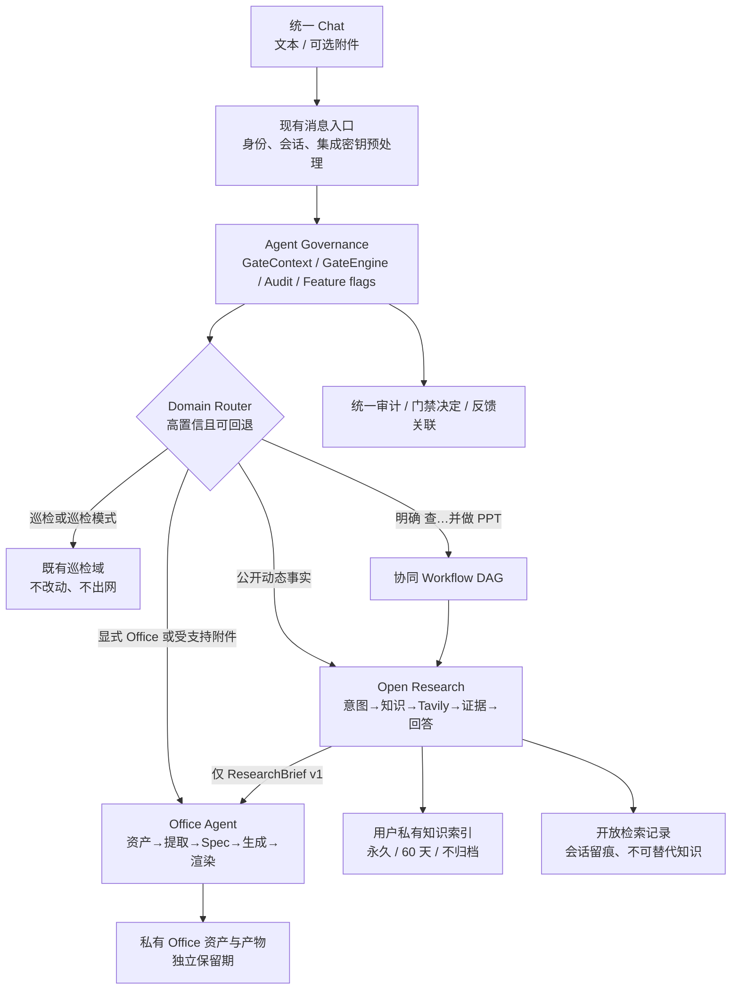

# 开放检索与 Office 协同统一落地蓝图 v1.0

| 项目 | 内容 |
|---|---|
| 状态 | 设计整合评审稿；尚未开始业务代码开发 |
| 日期 | 2026-08-17 |
| 目标 | 将开放性信息检索、个人办公助理和跨域门禁收敛为一套可实施的产品与工程蓝图 |
| 不变约束 | 不改写既有巡检意图、工具链路或数据边界；新能力全部可独立开关、回退和审计 |

> 开发前测试用例、G0–G7 门禁断言、夹具和发布测试门槛见《开放检索与 Office 协同 P0：开发前测试用例与门禁验证方案》。

## 1. 本文定位与判定优先级

本蓝图整合以下三份方案，并补齐它们在入口路由、跨域传输、运行时、数据留存、反馈和验收上的衔接：

| 原方案 | 保留的详细内容 | 在本蓝图中的定位 |
|---|---|---|
| 《泛化开放性信息检索链路设计方案 v1.0》 | 泛化检索、Tavily、证据、分层私有知识、独立查询记录、反馈与评估 | `Open Research` 域的详细设计 |
| 《个人办公助理 Agent：技术评估与落地方案》 | Office 资产、Spec、生成、渲染和质量校验 | `Office` 域的详细设计 |
| 《开放检索与 Office 协同门禁管控方案 v1.0》 | 七道门禁、风险、跨域隔离和权限 | 两域的安全与治理基线 |

若三份原方案与本文存在冲突，以本文的“已冻结决策”和“接口契约”为准；原方案继续作为各域实现细节的补充，不删除、不迁移巡检能力。

## 2. 已冻结决策、现状事实与待定边界

### 2.1 已冻结的产品决策

| 决策项 | 结论 |
|---|---|
| 开放检索首期 Provider | 本地版仅接入 Tavily，通过 `SearchGateway` 调用；不把 Provider 条件写入意图或业务逻辑 |
| 开放检索知识与记录 | 可复用知识按“客观永久 / 缓慢变化 60 天 / 高时效不归档”分层；独立“开放检索记录”页承载所有已完成查询的会话留痕。高时效回答可回看但绝不复用；不保存网页全文，不跨用户或跨租户共享 |
| 搜索效果治理 | P0 同时交付反馈卡、脱敏埋点、回归集和聚合看板，不能只看调用量/额度 |
| Office P0 写入边界 | 仅创建新的私有产物；不覆盖原件、不外发、不共享、不写回 M365/WPS/企业数据源 |
| 跨域默认值 | `Open Research → Office` 可在双方 P0 通过后灰度开放；`Office → Open Research` 默认关闭，必须逐条展示并确认脱敏 Query |
| 巡检隔离 | 用户处于“巡检工作”模式，或命中门店/摄像头/告警/巡检语义时，禁止 Tavily、禁止 Office 文件解析，继续走原链路 |

### 2.2 已核查的工程事实

1. 当前 `online_agent.py` 的 `OpenQuestionResponder` 以天气、旅行、实时词等规则触发 `WEB_SEARCH_REQUIRED`；作品上映等未被枚举的动态事实可能直接由模型回答。截图中的“《长安的离职》”还应经 Query Rewrite 识别为高置信候选《长安的荔枝》，再进入证据检索。
2. 当前 `server.py` 的 `AUTO` 入口会在既有在线 Agent 中尝试开放问答；`OPEN_QA` Trace 明确隔离 `agent_memories` 和巡检知识库。该隔离应保持，不应拿现有巡检记忆承载开放检索。
3. 当前 `web_search.py` 已有 Tavily 调用和用量记录，但还是单次、摘要级搜索；缺少多 Query 计划、证据分级、独立记忆和用户效果闭环。
4. 本条为方案评估时的历史基线。当前实现已新增独立的 `agent_governance/`、`open_research/` 与 `office_agent/` 目录，完成 Excel/Word 提取 → 管理层 PPT → PDF/PNG 私有交付的本地回归闭环；生产运行时与灰度放行仍以 F0–F4 为准，详见 `QA_OPEN_RESEARCH_OFFICE_P0_FUNCTIONAL_REPORT_2026-08-18.md`。
5. 桌面工作区的受控运行时已具备 Python 3.12、`openpyxl`、`python-docx`、`python-pptx`、`pandas`、`reportlab` 与 LibreOfficeDev 26.8；但生产镜像不能依赖这套开发运行时或 Alpha 版 LibreOffice，必须单独锁定稳定版本、字体和依赖。
6. 当前工作区与可用 Skill 清单中均未发现 `tech-sharing-deck`；现有 PPT 链路也没有调用它。因此它不是本方案的前置依赖或验收依据。

### 2.3 Office P0 决策状态

| 编号 | 当前决定 | 实施含义 |
|---|---|---|
| D1 | **已确认**：首个验收产物为“Excel/Word 提取 → 管理层 PPT”，同时提供 PDF/PNG 预览 | 首批回归集、前端产物卡和质量门都以这一闭环为主；Word/Excel 独立生成仍可按后续切片扩展 |
| D2 | **已确认**：暂无企业模板或样稿，默认字体为阿里巴巴普惠体 | 平台先维护一套通用 16:9 管理汇报模板；验收关注结构、可读性和渲染，不以企业品牌还原为标准 |
| D3 | **已确认**：单文件上传硬上限 40MB，一次最多 3 个文件；原件、提取快照、预览和产物默认保留 30 天；普通内部文档可处理，密钥/Token/证件/银行卡等强敏感内容直接阻断 | 传输层单批上限为 120MB；文件大小不等于可处理复杂度，仍须执行第 2.4 节的解压、行数、页数、队列和资源门 |
| D4 | **已确认**：普通内部文档的最小必要片段可按租户级预批准策略自动进入已批准模型网关；绝不发送 Tavily | 用户单次点击不能绕过数据策略；敏感文档仍应先阻断或脱敏，模型响应只能生成受控 Spec |
| D5 | **已确认**：P0 不接 M365/WPS/网盘/数据库/邮件，也不提供外部共享 | 避免把首期变成 `HIGH_WRITE` 和第三方授权项目 |

### 2.4 40MB 上限的性能评估与配套硬门

**结论：40MB 是 P0 的单文件上传硬上限；一次最多 3 个文件，传输层批次硬上限为 120MB。** 这不是“任意 40MB Office 文件都能在固定时间内处理”的承诺。`.xlsx/.docx/.pptx` 是 ZIP 容器，40MB 压缩包仍可能解压为数百 MB，`openpyxl` 读取大型工作簿和 LibreOffice 渲染图片型文件时会放大内存、CPU 与耗时。因此大小门之外必须同时生效以下限制：

| 维度 | P0 硬门 | 规避的风险 |
|---|---|---|
| 上传与存储 | 单文件 ≤ 40MB；单批 ≤ 3 文件 / 120MB；必须流式上传到对象存储，不在 `server.py` 内存中聚合 | 三个满额文件占满 Web 进程内存或请求超时 |
| 解压安全 | 解压后总量 ≤ 250MB、压缩比 ≤ 10:1、嵌套压缩包/损坏 ZIP 拒绝 | ZIP bomb 与磁盘耗尽 |
| Excel/CSV | ≤ 20 工作表、≤ 100,000 数据行、≤ 1,000,000 个非空单元格；超限只允许提取概要，不进入自动 PPT 编排 | `openpyxl` 内存放大、模型上下文膨胀和图表计算失控 |
| Word/PPT/图片 | Word ≤ 200 页、PPT ≤ 100 页、每文件图片 ≤ 100 张 | 解析/缩略图/渲染耗时失控 |
| Worker 资源 | 解析与渲染使用独立队列；每个重任务的基线为 2 vCPU、4GiB 内存、受限临时盘；同一用户同时最多 1 个重任务 | 大文件影响巡检在线请求或相互争抢资源 |
| 时限与降级 | 安全检查/提取、生成、渲染各有独立超时；超限返回 `OFFICE_CONTENT_LIMIT_EXCEEDED` 或 `OFFICE_RENDER_TIMEOUT`，保留原件且不交付半成品 | 无限等待、假成功或重复消耗 |

40MB 是当前 P0 的**最大可接受单文件值**。如果未来要提高到 50MB 以上，不能只改前端限制：至少要重新压测 3 个满额文件批次、增加 Worker 内存/临时盘、引入分块提取与更严格的队列配额，并重跑跨租户和资源耗尽回归。

## 3. 目标架构：共用控制面，领域执行面彼此独立

统一不等于混写。共享的是身份、门禁、审计、开关、工作流关联和交付授权；检索、Office 与巡检的意图、数据、工具、Worker 和存储表保持独立。



### 3.1 目标目录与依赖方向

```text
agent_governance/                 # 新增：只能放横向能力
  contracts.py                    # GateContext、GateDecision、WorkflowEnvelope
  gate_engine.py                  # G0-G7 顺序、不可跳过的执行框架
  policy_registry.py              # feature flag、租户配额、统一风险枚举
  workflow_store.py               # 父工作流、确认、幂等关联
  audit.py                        # 脱敏审计与关联 ID

open_research/                    # 新增：不得依赖巡检/Office 的内部表
  boundary.py intent.py memory.py planner.py gateway.py
  evidence.py synthesis.py orchestrator.py api.py

office_agent/                     # 新增：不得持有 Tavily 凭证或主动出网
  router.py policy.py assets.py jobs.py api.py
  extraction/ specs/ generators/ rendering.py validation.py

existing inspection modules/      # 保持原状
  online_agent.py / PaaS / 巡检 plans / DeepVision
```

依赖只允许自上而下：`agent_governance → contracts` 被两个新域引用；`open_research` 和 `office_agent` 不能彼此 import。协同任务只能通过版本化的 `ResearchBrief` 和 `WorkflowEnvelope` 交换数据。巡检域不依赖这两个目录，也不读取它们的表。

### 3.2 运行时与凭证隔离

| 运行单元 | 可访问的数据/凭证 | 明确禁止 |
|---|---|---|
| 消息入口 + GateEngine | 身份、会话、最小输入摘要、Feature Flag、审计 | 网页正文、Office 二进制、搜索密钥 |
| Open Research Worker | 脱敏 Query、用户私有知识、证据元信息 | 巡检数据、Office 原件/提取全文、对象存储写入凭证；实时聊天历史中的旧事实值/旧引用 |
| Office Worker | 短期 `asset_id` 授权、模板、Spec、受控 `ResearchBrief` | Tavily 凭证、任意外网、巡检数据库、原始会话密钥 |
| 巡检在线请求 | 现有 PaaS/巡检上下文 | 新域数据表、Tavily、Office Worker 队列 |

Office 解析与渲染进入独立队列/Worker，不能占用巡检在线请求线程；Tavily 超时、限额和熔断只降级 Open Research，不拖累 Office 私有生成或巡检。

## 4. 入口衔接：在现有单体中只增加一个窄的可回退分流点

### 4.1 服务端顺序

对 `POST /api/conversations/{id}/messages` 的兼容策略如下。已有无附件、无新域意图的请求不会改变输入、返回结构或执行路径。

1. 执行现有身份、租户、会话校验，以及租户接入/密钥识别和脱敏；接入配置类请求优先于所有新域。
2. 规范化可选 `attachment_ids`，但不在消息入口直接读取文件内容；先交给 G0/G2O 做类型、归属和安全检查。
3. 若 `mode_override=INSPECTION`，直接使用既有巡检路径；无论文本是否含“最新”“报告”或“PPT”，均不调用 Tavily 或 Office 解析器。
4. 在 `AUTO`/`OPEN_QA` 下，只对**高置信**的新域任务调用 `DomainRouter`：
   - 明确 Office 词（PPT、PowerPoint、Excel、Word、BI、图表、文档转换）或受支持附件，才候选 Office；
   - 公开实体的状态、时间、版本、价格、任命、活动、政策、事件、推荐/比较，或用户明确“联网核验”，才候选 Open Research；
   - 只有用户明确表达依赖关系（如“查最新政策并做 PPT”）才候选协同 DAG。
5. 新域未命中、置信度不足、Feature Flag 关闭或被策略拒绝时，按原因返回明确提示；普通非新域问题继续原 `online.handle_message()` / 原 `OPEN_QA` 路径，不重写现有巡检分类器。
6. 已有“把上一轮开放问答导出 PDF”跟进仅在没有 Office 附件和 Office 目标时保留原处理；新 Office 目标通过 `office_agent` 新建产物，不复用 PDF 导出函数冒充 PPT/Word 能力。

### 4.2 路由判定与回退合同

| 输入状态 | 路由 | 外网 | 附件内容 | 回退/结果 |
|---|---|---|---|---|
| `INSPECTION` 模式、巡检语义、门店/摄像头/告警 | 既有巡检域 | 禁止 | 不读取 Office 内容 | 原行为 |
| 纯稳定常识、写作、翻译 | 原 `OPEN_QA` | 不需要 | 无 | 原行为 |
| 泛化公共事实/事件状态 | Open Research | 仅 G2R 放行的最小 Query | 无 | 带来源状态的答案 |
| 明确 Office 目标或合格附件 | Office | 默认禁止 | 仅 G2O 放行的 `asset_id` | Job/产物卡或明确失败码 |
| “查公开信息并生成 PPT” | 协同 Workflow | Research 可出网 | Office 仅消费 `ResearchBrief` | 两子任务可追踪 |
| “用这份内部 Excel 搜竞品” | G2H 暂停 | 默认禁止 | 不出 Office 域 | 展示脱敏 Query 确认卡或阻断原因 |

`DomainRouter` 只返回候选领域、置信度和理由，不能自行执行工具。最终路由必须由 GateEngine 写入审计事件。这样可以替换当前开放问答的硬编码触发，但不会改变巡检 `classify_intent()` 的语义。

## 5. 共享七道门禁：一个引擎，三份领域策略

### 5.1 统一契约

```text
GateContext {
  request_id, workflow_id?, trace_id,
  tenant_id, user_id, conversation_id,
  requested_domain, mode_lock, feature_flags,
  input_summary_hash, attachment_ids,
  action, risk_level, data_classification,
  normalized_query?, research_brief_id?, policy_version
}

GateDecision {
  gate, decision: ALLOW | BLOCK | REQUIRE_CONFIRMATION | DEGRADE,
  reason_code, allowed_scope, expiration_at?,
  idempotency_key?, policy_version, audit_event_id
}
```

`GateEngine` 负责顺序、日志和“未通过不执行”；`open_research.boundary`、`office_agent.policy` 各自负责领域规则。任何 Worker 在执行前必须再次验证 `GateDecision`，不能只信任前端或消息入口。

| 门禁 | 共同职责 | Open Research 特有检查 | Office 特有检查 |
|---|---|---|---|
| G0 身份与开关 | 租户/用户/会话、RBAC、Feature Flag、速率限制 | `open_research_enabled` | `office_enabled` |
| G1 域路由 | 模式锁、置信度、领域冲突 | 动态事实是否需要证据 | 目标格式/附件是否明确 |
| G2 数据边界 | 最小化、分级、敏感扫描 | G2R：脱敏 Query 才可出 Tavily | G2O：MIME/魔数/宏/资产 ACL；G2H：跨域显式授权 |
| G3 计划与权限 | 任务槽位、配额、Spec/Plan Schema | Query 数、来源/时效策略 | 资产权限、模板权限、Spec 白名单 |
| G4 确认与幂等 | 高副作用确认、摘要绑定、短期有效、重复执行防护 | 通常只读，无需确认 | P0 新私有产物可自动；覆盖/共享/外发/写回必须确认 |
| G5 运行时 | 超时、队列、并发、熔断、取消 | Tavily 额度与受控重试 | Worker CPU/内存/渲染时长/文件上限 |
| G6 质量 | 失败不伪造成功 | 证据、时效、冲突、引用 | 结构、数值、渲染、来源定位 |
| G7 交付与生命周期 | ACL、审计、删除、保留期 | 分层私有知识、独立检索记录页、实时结果强制刷新 | 私有下载、独立资产保留期 |

### 5.2 P0 的不可绕过规则

- G2R 禁止向 Tavily 发送 tenant/user/conversation ID、完整会话、附件文本、企业/门店/客户数据、密钥、PII、原始表格数值或图片。
- G2O 拒绝宏文件、加密文件、伪造 MIME、ZIP bomb、OLE/外链/DDE 和超策略文件；文件原件不变，只以 `asset_id` 传递。
- G2H 的默认决策是 `BLOCK`。系统不得从 Office 内容自动“总结一个看似公开的 Query”后直接外发。
- G6 不满足时，只能输出 `PARTIALLY_VERIFIED`、`NO_AUTHORITATIVE_SOURCE`、`SEARCH_UNAVAILABLE`、`REVIEW_REQUIRED` 或稳定失败码；不得补写模型猜测或展示未经渲染校验的 Office 下载。
- G7 的权限检查在下载/删除/共享时再次执行。前端隐藏按钮不构成权限控制。

## 6. 跨域握手：只传受控中间物，不传原始材料

### 6.1 Open Research → Office：允许的单向数据包

检索成功后，Office 只能消费 `ResearchBrief v1`，不可消费原始 HTML、整页文本、Tavily 原响应、Provider 凭证或用户检索记忆。

```text
ResearchBrief {
  brief_id, producer_run_id, owner: {tenant_id, user_id},
  answer_status, as_of, freshness, topic,
  claims: [{claim_id, text, claim_status, confidence, evidence_ids}],
  citations: [{evidence_id, title, canonical_url, publisher,
               published_at, fetched_at, source_tier}],
  limitations: ["信息截至…", "来源冲突…"],
  content_hash, policy_version, expires_at
}
```

放行条件：`research_to_office_enabled=true`、同一用户/租户、G6 已通过、每个进入 PPT/Word 的事实都有可见引用。`VERIFIED` 可正常编排；`PARTIALLY_VERIFIED` 只能带“待核验/截至时间”标识进入产物；`CONFLICTING`、`NO_AUTHORITATIVE_SOURCE` 和 `SEARCH_UNAVAILABLE` 在 P0 不可作为事实性 Office 生成输入。

Office 在页脚/引用页保留来源、`as_of` 和证据状态。它不能将摘要改写成“已证实”的新结论，也不能把引用链接隐藏掉。

### 6.2 Office → Open Research：默认关闭的受控例外

当用户说“用这份经营 Excel 搜竞品”时，正确流程不是把 Excel 发给 Tavily：

1. Office 域提取后标记数据分类，不生成外发 Query；G2H 返回 `OFFICE_EGRESS_REQUIRES_CONFIRMATION`。
2. 如策略允许，系统只展示**候选的最小公开 Query**，并明确说明不会发送的资产/字段；候选中一旦含未公开品牌、客户、项目、指标、战略或 PII，直接阻断，不提供“自动改写绕过”。
3. 用户逐条确认展示过的 Query 后，才创建独立 `open_research_run`；Tavily 请求仍不含资产 ID、会话 ID 或 Office 内容。
4. 后续生成 Office 文件时，再按 6.1 的 `ResearchBrief` 回流。确认仅绑定本次 Query、用户、版本和短有效期，不能复用到下次资产。

该能力不在 P0 灰度范围。未开启 `office_to_research_egress_enabled` 时，只解释限制和可行的公开检索替代路径，Tavily 调用数必须为 0。

## 7. 数据、保留期与可追溯性

### 7.1 共享关联对象

| 对象 | 关键字段 | 作用与限制 |
|---|---|---|
| `agent_workflow_runs` | `workflow_id`、tenant/user/conversation、kind、状态、子 run/job ID、输入/输出哈希 | 仅承载跨域父任务及关联；不存网页全文或 Office 二进制 |
| `agent_gate_decisions` | `decision_id`、workflow/run、gate、decision、reason、policy version、摘要哈希 | 不可变审计；不存敏感原文 |
| `agent_feedback` | `feedback_id`、workflow/run、域、类型、原因、可选更正线索状态 | 把检索/Office/协同结果统一到效果看板 |
| `agent_action_confirmations` | 确认摘要哈希、接收方/Query、有效期、幂等键、撤销状态 | P0 为后续高写操作预留，不借用巡检 `plans` 改变其语义 |

当前 `messages`、统一审计、下载 ACL、会话和用户身份可以复用；现有巡检 `plans`、`agent_memories`、知识库不承载新域的数据，以避免功能和数据耦合。

### 7.2 领域数据与生命周期

| 域 | 主数据 | 默认可见范围 | 留存与删除 |
|---|---|---|---|
| Open Research | `runs`、`queries`、`evidence`、`claims`、`memory_index`、`feedback`、`ResearchHistoryRecord` 投影 | 当前 tenant + 当前 user | `PERMANENT_FACT` 长期可召回，`SLOW_60D` 60 天可召回，`NO_MEMORY` 不入知识；所有完成查询的用户问题、回答、引用与限长采用证据按会话策略回看。均不存网页全文；审计最小元数据按平台合规保留策略处理 |
| Office | `office_assets`、`extractions`、`jobs`、`artifact_versions`、`templates` | 当前 tenant + 当前 user，模板按管理员权限 | 原件、提取快照、预览和产物默认保留 30 天；用户可随时删除；强敏感内容不入库 |
| 协同 | `workflow_runs`、受控 `ResearchBrief` 引用 | 同一用户、同一 tenant | `ResearchBrief` 随其检索证据/Office 产物生命周期受控；不自动进入用户长期 Office 记忆 |

`ResearchHistoryRecord` 是独立页面使用的**只读投影**，由 `open_research_runs`、关联 `Message`、最终 Claim 和已采用 Evidence 组合生成，不复制网页正文或 Tavily 原始响应。每条记录固定关联一个 `run_id / conversation_id / user_message_id / assistant_message_id`，列表用 `(tenant_id, user_id, completed_at DESC, run_id)` 索引分页；详情从关联对象读取最终回答、引用和限长净化证据。它不是 `memory_index`，不能被知识召回或检索规划读取。

开放检索的 `valid_until` 与“可召回知识”是两件事：`PERMANENT_FACT` 可长期复用，`SLOW_60D` 只在 60 天内复用；`LIVE/HOUR/DAY/EVENT/VERSION` 等 `NO_MEMORY` 事实虽可在历史记录页回看，仍必须重新检索，不能直接复用历史事实。

## 8. API、状态机与前端合同

### 8.1 对外 API

| 接口 | P0 行为 |
|---|---|
| `POST /api/conversations/{id}/messages` | 原入口保持兼容；新增可选 `attachment_ids`，内部只返回统一消息/工作流关联 |
| `GET /api/open-research/records` | 当前用户的独立检索记录列表；支持游标分页、时间范围、事实类型、质量状态、反馈状态和本人问题/改写实体检索；服务端固定 tenant/user 条件 |
| `GET /api/open-research/records/{run_id}` | 当前用户读取单条记录详情及回跳会话标识；仅返回最终回答、引用、截至时间和已采用的限长净化证据 |
| `GET /api/open-research/runs/{run_id}` | 读取当前用户的计划、证据状态、引用、Trace 和刷新信息 |
| `GET/DELETE /api/open-research/memories[/id]` | 用户查看/删除自己的 60 天检索记忆 |
| `POST /api/open-research/feedback` | 提交“有帮助/不准确/过期/未找到/来源不可信”等反馈 |
| `POST /api/office/assets` | 上传并安全登记，返回 `asset_id`；P0 不接外部网盘 |
| `POST /api/office/assets/{id}/extract` | 创建/复用提取 Job |
| `POST/GET /api/office/jobs[/id]` | 创建、轮询、取消 Office Job；新产物必须走质量门 |
| `GET /api/office/artifacts/{version_id}/preview|download` | 每次请求重新做 ACL，并只交付 `SUCCEEDED` 版本 |
| `POST /api/agent/workflows/{id}/feedback` | 对协同结果提交统一反馈；内部可映射到两个子 run |

P0 可先轮询 Office Job，队列稳定后再加 SSE；接口错误统一返回稳定的 `reason_code`，不把供应商异常、文件路径或策略细节暴露给前端。

### 8.2 工作流状态

| 层级 | 主状态 | 关键约束 |
|---|---|---|
| 父 `Workflow` | `DRAFT → GATED → PLANNED → RUNNING → VALIDATING → DELIVERED`，或 `AWAITING_CONFIRMATION / PARTIAL / FAILED / CANCELED` | 子任务失败不伪造父任务成功；每个转换写 GateDecision/Trace |
| Research Run | `MEMORY_LOOKUP → QUERYING → EVIDENCE_REVIEW → SYNTHESIZING → ARCHIVED` | 动态事实必须经过 `QUERYING`；归档失败不影响已交付回答但要标记 `PARTIAL` |
| Office Job | `INSPECTING → EXTRACTING → SPEC_VALIDATING → GENERATING → RENDER_VALIDATING → DELIVERED` | 原件不可变；只有结构、数值和渲染均通过才交付 |
| Hybrid DAG | `Research Run → ResearchBrief → Office Job` | 下游只消费版本固定的 Brief；重试/取消只影响自身，禁止无审计的隐式重跑 |

### 8.3 前端最小交互

- 开放检索提供独立一级入口“开放检索记录”，不是巡检“操作记录”的子页，也不是可复用知识库。列表展示原问题/改写实体、事实类型、质量状态、截至时间、来源数、反馈状态与“实时/可复用”标签；支持本人范围内筛选、关键词查询、详情展开及回跳原会话。
- 记录详情只展示最终回答、可点击引用、已采用且限长净化的证据片段、截至时间、改写与质量状态；不展示网页全文、原始 HTML、Tavily 原始响应、未采用候选或其他用户数据。`NO_MEMORY` 记录显示“实时查询；再次提问将重新检索”，详情中的“重新检索”创建新 Run，不能把旧结果填回输入。
- 检索回答显示来源状态、信息截至时间、引用、历史是否刷新、五类反馈和一次受预算限制的“换一种方式检索”。
- Office 显示附件检查、提取、Spec、生成、渲染等阶段；产物卡包含预览、版本、来源与质量状态。P0 只展示“生成新版本”，不展示覆盖/外发按钮。
- 协同任务先展示两步计划：“公开检索哪些内容”与“使用哪份 `ResearchBrief` 生成何种产物”。若发生 Office 出网需求，则显示单独 Query 确认卡，不能把确认混入普通生成按钮。
- 所有 Trace 默认只显示 ID、状态、来源数、资产数、摘要哈希和理由；敏感附件正文、密钥、原始网页和受保护 Query 不展开。

## 9. 质量、反馈与上线门禁

### 9.1 三域质量定义

| 结果 | 必须满足 |
|---|---|
| `Research VERIFIED` | 关键动态主张有合格、实体匹配、未过期证据和可点击引用；冲突被处理 |
| `Office SUCCEEDED` | 文件可重新打开；数值/公式/图表可回溯；LibreOffice 稳定版渲染通过；预览和正式产物一致 |
| `Hybrid DELIVERED` | 满足前两项；每个研究事实在 Office 产物中保留 `as_of`、来源和状态；未经许可的 Office 内容出网次数为 0 |

### 9.2 效果反馈与埋点

`agent_feedback` 统一关联 `workflow_id`，但按域分别治理：

| 域 | 用户反馈 | 脱敏指标 |
|---|---|---|
| Open Research | 有帮助、不准确、已过期、未找到、来源不可信、补充检索 | 证据交付率、首次解决率、来源可验证率、无证据确定性回答率（必须为 0）、P95、Tavily Credits |
| Office | 满意、版式问题、数据问题、文件打不开、来源不清、需要修改 | Job 成功率、结构/渲染失败率、数值核验失败率、下载/预览率、返工率、P95 队列与生成耗时 |
| Hybrid | 是否减少整理成本、事实/版式问题、跨域说明是否清楚 | Brief 交接成功率、两域端到端成功率、确认放弃率、跨域阻断数、违规外发数（必须为 0） |

用户反馈是坏例优先级信号，不是事实源：更正链接或文本必须经后续证据复核或人工审核，不能直接写入共享知识库、记忆或模型训练数据。管理员仅查看按租户/任务类型聚合后的脱敏看板，默认不能查看用户正文、附件或私有 Query。

### 9.3 分层发布门禁

| 发布关口 | 放行条件 | 失败动作 |
|---|---|---|
| F0 运行时冻结 | 生产镜像锁定 Python 库、稳定 LibreOffice、字体、病毒扫描/对象存储/队列契约；启动自检通过 | 不开放 Office，不能以开发机运行时替代 |
| F1 共享底座 | GateEngine、Feature Flag、审计、ACL、幂等和巡检回归通过；开关关闭时巡检路径零变化 | 保持所有新域关闭 |
| F2 Open Research P0.5 灰度 | 截图 Case 与二次取证/知识分层回归通过；无证据确定性回答为 0；巡检触网为 0；私有检索记录 ACL、实时追问强制刷新和删除/隔离通过；埋点完整 | 仅降级为原 `OPEN_QA` 或明确服务不可用，不碰巡检 |
| F3 Office P0 灰度 | 支持格式安全、原件不可变、模板生成、结构/数值/渲染/跨租户下载回归全部通过 | 关闭 Office，保留已完成资产的受控访问 |
| F4 Research → Office | `ResearchBrief` Schema、引用页、逐事实状态、DAG 取消/重试、跨域反向阻断用例通过 | 保持两域各自独立，不创建协同任务 |
| F5 Office → Research / 外部共享 | 逐条 Query 确认、接收者白名单、撤销、审计和渗透测试通过，且获得独立的后续产品/安全审批 | Feature Flag 默认关闭 |

## 10. 推荐实施切片与验收用例

### 10.1 实施顺序

1. **基础切片：治理而非业务功能。** 新增 `agent_governance`、Feature Flag、GateDecision、Workflow 关联、脱敏审计和入口的窄路由；不动巡检意图和现有 `plans` 的语义。
2. **Open Research P0：优先解决截图类问题。** Tavily、动态意图、1–3 条受预算 Query、证据状态、反馈/埋点和回归集。Tavily 是唯一启用 Provider。
3. **Open Research P0.5：二次取证、分层知识与独立记录页。** 完成 `G2R-Detail`、可信来源交叉核验、`PERMANENT_FACT / SLOW_60D / NO_MEMORY` 策略，以及“开放检索记录”列表/详情。实时记录可回看但必须强制新 Run，页面、API、审计和知识索引均按用户隔离。
4. **Office P0-A：资产与提取。** 完成上传、扫描、提取、来源定位、独立 Worker/队列和 Job 可观测性；遵守 40MB/3 文件、30 天留存与敏感内容阻断；不做外部连接。
5. **Office P0-B：模板化生成。** 以 D1/D2 冻结的首个产物为验收主线，生成新的管理层 PPT，并做结构、数值、渲染与私有交付；独立生成/编辑 Word、Excel 留待后续切片。
6. **协同 P0：仅 Research → Office。** 接入 `ResearchBrief v1`，生成带来源/截至时间的 Office 产物；仍保持 Office → Research 关闭。
7. **P1/P2：专用实时 Adapter、受控编辑、企业连接、Office 出网、外部共享。** 每项单独通过 F5，不因已完成 P0 自动开启。

### 10.2 必测的端到端回归

| 编号 | 场景 | 必须观察到的结果 |
|---|---|---|
| INT-01 | 巡检模式问“这家门店最新告警怎样？” | 原巡检链路；Tavily=0；Office Worker=0 |
| INT-02 | 《长安的离职》什么时候上映？ | `EVENT_STATUS`；将“离职”高置信改写为“荔枝”后检索；Trace 展示原/改写 Query；无官方影视证据时只返回“未核验到”，不臆断 |
| INT-03 | 同一用户追问昨天查过的职位 | 召回实体/来源；因动态事实重查；Trace 说明是否更新 |
| INT-04 | 两个用户查询相同公开问题 | 互不可见对方 Query、Run、记忆、反馈；不跨用户命中 |
| INT-05 | 上传 `.xlsm` 或伪装扩展名文件 | G2O 拒绝/隔离；原件不解析；审计存在 |
| INT-06 | 上传 Word/Excel 并生成管理 PPT | 新私有产物；源定位、结构、数值、PDF/PNG 渲染通过；原件哈希不变 |
| INT-07 | “查最新政策并做 PPT” | Research 先完成；Office 只接收 `ResearchBrief`；PPT 有引用和截至时间 |
| INT-08 | “根据经营 Excel 搜竞品” | 默认 G2H 阻断；未逐条确认前 Tavily=0 |
| INT-09 | 同一高风险确认重复提交 | 同一幂等键只执行一次；确认过期/接收方变更需重新确认 |
| INT-10 | Tavily 429、Office 渲染失败、Worker 满载 | 返回相应稳定状态；可重试/排队可见；巡检不受影响 |
| INT-11 | 其他用户猜测产物/记忆 ID 后下载 | 404/拒绝且不泄露资源存在性 |
| INT-12 | Feature Flag 全关 | 现有巡检、开放问答、PDF、计划确认和前端烟测无回归 |
| INT-13 | 用户从“开放检索记录”回看天气结果后追问“那现在呢？” | 旧记录仍可查看，但仅继承城市等实体槽位并创建新 Run；Tavily/专用实时 Adapter 被重新调用，旧数值、引用和 Claim 不参与回答 |

## 11. 已冻结的 Office P0 业务边界

```text
首验收闭环：Excel/Word 提取 → 管理层 PPT + PDF/PNG 预览。
模板：平台通用 16:9 管理汇报模板，默认阿里巴巴普惠体。
文件：单文件 ≤ 40MB；单批 ≤ 3 文件 / 120MB；原件、提取快照、预览和产物默认保留 30 天。
数据：普通内部文档可按租户级预批准策略进入已批准模型网关；密钥、Token、证件、银行卡等强敏感内容直接阻断；绝不发送 Tavily。
连接：P0 不接 M365/WPS/网盘/数据库/邮件，不提供外部共享。
```

业务方案已无待确认项。进入真实资产灰度前，只需完成 F0/F1 的技术前置：稳定版 Office 运行时与字体镜像、对象存储与病毒扫描、异步队列、资源限制、最小模型网关审计，以及对应的安全与回归测试。
