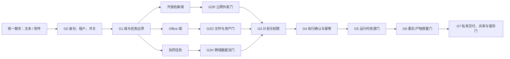

# 开放检索与 Office 协同门禁管控方案 v1.0

> 状态：方案评审稿；不改变现有巡检业务链路  
> 适用域：Open Research（Tavily 本地版）与 Office Agent（附件、文档、表格、PPT）
>
> 2026-08-17 整合说明：本文保留七道门禁的领域安全细节；与开放检索、Office 的入口、数据模型、运行时和分期实施，以《开放检索与 Office 协同统一落地蓝图 v1.0》为准。

## 1. 管控目标

两个能力合并到统一聊天入口后，最大的风险不是“路由错一次”，而是两类数据边界被意外打通：

- Office 附件可能含经营、个人或客户敏感数据，不能因为用户说“查一下”就发往 Tavily。
- 开放检索结果是不可信外部内容，不能因为用户说“做成 PPT”就跳过引用、事实质量和文档渲染校验。
- 创建私有文档可以是低副作用操作；覆盖原件、外发邮件、创建共享链接、写回 Microsoft 365/WPS 则是高副作用操作，必须独立确认。

因此采用 **“统一入口、分域执行、逐门放行、默认拒绝跨域外发”** 的模型。门禁不是一个总开关，而是每一步针对风险作出 `ALLOW / DEGRADE / NEED_CLARIFICATION / NEED_CONFIRMATION / DENY / QUARANTINE` 的可审计决定。



## 2. 统一门禁契约

每次计划、工具调用、确认和交付都传入不可由前端伪造的 `GateContext`：

```text
principal: user_id, role, tenant_id, allowed_scope
conversation: conversation_id, selected_mode, request_id
task: domain, intent, action, risk_level, normalized_spec_hash
data: classification, asset_ids, source_run_ids, egress_payload_fingerprint
policy: feature_flags, provider_policy, budget, retention, confirmation_state
target: provider / artifact / share recipient / connector
```

门禁返回 `GateDecision`：

```text
status: ALLOW | DEGRADE | NEED_CLARIFICATION | NEED_CONFIRMATION | DENY | QUARANTINE
reason_code: 稳定、面向程序的错误码
user_message: 可理解且不泄露内部策略的提示
required_slots: 仍需补充的范围、模板、接收人等
confirmation: 摘要、确认有效期、idempotency_key（仅 NEED_CONFIRMATION）
trace_summary: 可展示的脱敏输入、规则版本与判定理由
```

所有决策在服务端执行。前端仅渲染计划卡、确认卡、失败状态和 Trace，不能通过隐藏按钮或伪造 `domain/risk_level` 绕过检查。

## 3. 七道门禁

| 门禁 | 核查内容 | 允许结果 | 阻断/降级结果 | 审计事件 |
|---|---|---|---|---|
| G0 身份、租户、开关 | 登录、用户/租户归属、角色、各域 Feature Flag | 进入路由 | 未授权拒绝；能力关闭时不进入对应域 | `agent.gate.identity` |
| G1 域与任务边界 | 巡检/开放检索/Office/协同任务；模式锁；意图置信度 | 选定唯一域或显式复合计划 | 模糊时澄清；巡检模式禁用公网检索 | `agent.gate.route` |
| G2 输入与数据流 | 开放检索的最小出站 Query；Office 文件类型、宏、大小、恶意载荷；跨域数据流 | 获得安全输入 | 过滤、隔离或要求明确授权 | `agent.gate.input` |
| G3 计划与权限 | 用户是否有权访问资产、来源和模板；任务槽位、数据分级、预算 | 生成受控 Plan/Spec | 缺槽位、超范围或不支持时停止 | `agent.gate.plan` |
| G4 执行确认与幂等 | 风险等级、确认有效期、接收人/权限、重复请求 | 执行新文件生成或已确认操作 | 高副作用未确认则暂停；重复请求返回原结果 | `agent.gate.confirm` |
| G5 运行时资源 | Tavily 限流/额度、并发、超时；Office Worker 沙箱、队列、文件资源上限 | 受限执行或重试 | 熔断、排队、部分失败，不影响巡检 | `agent.gate.runtime` |
| G6 质量与完整性 | 引用/时效/冲突；Office 结构、数据、渲染、来源定位 | 标记为 `VERIFIED` 或 `SUCCEEDED` | 明确部分成功、待复核或失败，禁止伪造交付 | `agent.gate.quality` |
| G7 交付与生命周期 | 私有下载授权、共享/外发、留存、删除、记忆归档 | 用户私有交付；受确认的外发 | 无权限下载 404；过期/未确认共享被拒绝 | `agent.gate.delivery` |

## 4. G1：域路由门——先划清任务边界

总路由只决定“由谁处理”，不直接授予工具权限：

| 输入特征 | 域 | 默认动作 |
|---|---|---|
| 门店、摄像头、告警、巡检、视觉任务，或用户处于“巡检工作”模式 | 既有巡检域 | 原链路执行；不调用 Tavily，不读取 Office 附件内容 |
| 公开事实、事件状态、政策、作品、人物、新闻、且无企业业务/附件数据 | Open Research | 进入检索意图和公网外发门 |
| 明确 Word/Excel/PPT/报表/图表任务，或受支持附件 | Office | 进入资产门和 Office Job |
| “查最新政策并做 PPT”等明确两步任务 | 协同任务 | 拆为有依赖关系的子计划，不把两个域混为一次工具调用 |
| “用这份经营 Excel 查竞品并做 PPT”等 Office 内容可能需要出网的任务 | 协同任务 | 先停在跨域数据流门，默认不向 Tavily 发起请求 |

若 Office 意图与开放问题同时出现但用户没有明确两者关系，系统只给出澄清卡，例如“要基于公开检索结果制作新 PPT，还是仅处理你上传的文件？”不从附件或会话中自行推断外发目的。

## 5. G2：数据门——两域最重要的隔离点

### 5.1 开放检索出站门 `G2R`

仅允许经过脱敏和最小化的公开 Query 发送到 Tavily：

- 拒绝或阻断：AppKey/AppSecret、Token、手机号、邮箱、住址、门店/摄像头/告警标识、未公开经营数据、附件原文、原始表格数值。
- 不向 Tavily 发送 tenant ID、user ID、conversation ID；仅将内部 `run_id` 用于本地审计。
- Query 经过敏感扫描、长度限制和实体策略检查；有风险时返回 `RESEARCH_EGRESS_BLOCKED`，不尝试“替用户改写”来绕过规则。
- Tavily 返回内容视为不可信数据，只能进入证据标准化层，不能驱动权限、工具或文件操作。

### 5.2 Office 资产门 `G2O`

Office 上传与生成前必须通过：文件扩展名/魔数一致性、病毒/内容安全、宏/加密/OLE/外链/DDE 拦截、ZIP bomb 与大小限制、CSV 公式注入防护、对象存储租户隔离。原件不可变；工具只接受 `asset_id` 与经校验的 `Spec`，不接受绝对路径、任意 URL、VBA、Shell 或裸 SQL。

### 5.3 跨域数据流门 `G2H`

协同任务按照方向给出不同默认策略：

| 方向 | 默认策略 | 放行条件 |
|---|---|---|
| `Open Research → Office` | 允许 | Office 只读取已完成的 `ResearchBrief`：结论、引用、时间、来源等级；不重新抓取网页，不把网页原文写入资产 |
| `Office → Open Research` | 默认拒绝 | 用户在本次任务明确勾选“允许基于下列脱敏公开关键词联网检索”，并逐条看到将发出的 Query；附件内容不得作为 Query 载荷 |
| `Office → Office` | 允许同用户私有处理 | 资产 ACL、模板 ACL、文件安全和新版本规则全部通过 |
| `Open Research → 外部共享` | 默认关闭 | 先由 Office 生成私有产物；外部共享属于 G4/G7 的高副作用操作 |

特别地，“基于销售 Excel 搜索竞品”不是把 Excel 发送给 Tavily。系统可以建议公开且最小化的 Query（如“某公开品牌 2026 新品发布”），但必须让用户逐条确认；含未公开品牌、客户、指标、战略和内部项目名时直接阻断外发。

## 6. G3/G4：计划、确认与幂等门

### 6.1 风险分级

沿用现有 Agent Core 风险语义，并由服务端根据实际动作重算，不能相信模型标注：

| 动作 | 风险 | 确认策略 |
|---|---|---|
| Tavily 公开检索、来源查看、Office 文件检查/提取 | `READ_ONLY` | 不需确认；仍受 G2/G5 限制 |
| 生成一个仅当前用户可下载的新 Word/Excel/PPT/PDF | `TRANSIENT_SESSION` | 默认可执行；超大成本、敏感分级或批量任务可要求确认 |
| 覆盖原文件、发送邮件/IM、创建外部共享、同步 Microsoft 365/WPS、写回企业数据、启用定时任务 | `HIGH_WRITE` | 必须展示计划卡并确认；确认只对该摘要、该接收人、该版本、短有效期内有效 |
| 不支持的复杂编辑、未备案 Connector、任意脚本 | `DESIGN_ONLY` / `DENY` | 仅生成方案，不执行 |

### 6.2 确认卡的最小内容

高副作用操作必须在确认前展示：操作类型、源资产/目标版本、是否覆盖、外发接收人和权限、有效期、公开检索来源列表、将外发的最小数据摘要、成本/额度影响、回滚方式。确认请求携带服务端生成的 `plan_id + normalized_spec_hash + idempotency_key`；任一字段变化均需重新确认。

## 7. G5/G6/G7：执行、质量和交付门

### 7.1 运行时隔离

- Tavily 调用受租户/用户预算、单轮 Query 上限、超时、重试和熔断控制；额度耗尽仅降级开放检索，不影响 Office 私有生成或巡检。
- Office 解析、LibreOffice 渲染和生成在独立 Worker/队列/资源限制中运行；不能占用巡检在线请求线程。每个 Worker 只拿到短期 `asset_id` 授权，不能访问巡检数据库或出网搜索凭证。
- 协同任务以 DAG 编排：`research_run` 成功或明确降级后，才允许下游 Office Job 消费其受控 `ResearchBrief`；每一步独立重试和取消。

### 7.2 质量门

开放检索回答需校验实体相关性、来源等级、时效、冲突和每条动态声明的引用；无合格证据只能返回 `NO_AUTHORITATIVE_SOURCE`，不能写入可复用事实记忆。

Office 产物需依次通过：Spec Schema、数值/来源核对、文件可重开、LibreOffice PDF/PNG 渲染、文本溢出/图片缺失/空白页检查。仅 `SUCCEEDED` 产物显示正式下载；`PARTIAL_SUCCESS` 必须把缺失项展示给用户。

当 Office 文档引用开放检索结论时，文档中的每项动态事实必须带可见引用或脚注，并附“信息截至时间”；过期或冲突的 Research Run 不得被标为“已核验”的正式结论。

### 7.3 交付、共享和留存门

- 默认交付是当前用户、当前租户的私有下载链接；后端在每次下载再次校验身份、会话/资产归属和版本状态。
- 打开、下载、删除、生成、确认、外发、共享、检索记忆归档均写审计。Trace 只记录资产 ID、来源 ID、摘要哈希与门禁决定，不展示文档原文或密钥。
- 开放检索记忆维持已确认的“用户级 60 天、不存网页全文、不共享”；Office 资产采用独立保留期，绝不因检索记忆策略被自动归档。
- 外部共享、邮件/IM 和第三方网盘同步在 P0 默认关闭；若后续开启，必须走 `HIGH_WRITE`、接收人白名单、短期授权、撤销与完整审计。

## 8. 权限与策略配置

| 角色 | 允许 | 不允许 |
|---|---|---|
| 普通用户 | 自己的开放检索、私有 Office 资产/产物、私有反馈与删除 | 查看他人资产/记忆、配置 Provider、共享租户事实 |
| 租户管理员 | Tavily 额度与策略、Office 模板/配额、脱敏聚合看板 | 查看普通用户的文档正文或私有检索问题（除非另行授权） |
| 平台安全管理员 | Provider 白名单、全局开关、应急熔断、保留期基线 | 以运维权限下载业务文档；需要独立受审计的紧急流程 |

关键 Feature Flag：`open_research_enabled`、`office_enabled`、`research_to_office_enabled`、`office_to_research_egress_enabled`（默认关闭）、`office_external_share_enabled`（默认关闭）。开关关闭时路由应回退而非报错，并且不改变巡检行为。

## 9. 必测门禁用例

| 编号 | 场景 | 预期 |
|---|---|---|
| GATE-01 | 巡检问题带“最新” | 保留巡检链路，Tavily 调用数为 0 |
| GATE-02 | 《长安的离职》何时上映 | 进入开放检索，将“离职”高置信改写为“荔枝”，产生规范实体 Query、原/改写 Query Trace 与来源状态 |
| GATE-03 | 上传 `.xlsm` 或伪造扩展名文件 | G2O 隔离/拒绝，原件不进入解析器 |
| GATE-04 | 上传经营 Excel 后要求“搜索竞品” | 默认停在 G2H；未显式批准的情况下 Tavily 调用数为 0 |
| GATE-05 | 用户批准脱敏 Query 后重试 | 仅确认展示过的 Query 可出站；Excel 内容不出站 |
| GATE-06 | “查政策并做 PPT” | 检索完成后只把带引用 `ResearchBrief` 传入 Office；PPT 有来源与截至时间 |
| GATE-07 | 对同一高风险共享操作重复确认 | 命中同一幂等键，不重复外发 |
| GATE-08 | Office Worker 资源耗尽 | 任务排队/失败可见，巡检和 Tavily 服务不受影响 |
| GATE-09 | PPT 渲染异常或数值不一致 | 不展示正式下载，标记待复核或失败 |
| GATE-10 | 他人尝试下载资产或读取检索记忆 | 返回资源不存在/权限拒绝，不泄露存在性 |

## 10. 推荐落地顺序

1. **先做横向门禁底座**：`GateContext/GateDecision`、服务端策略、Feature Flag、审计事件、确认/幂等适配与 Trace 节点。
2. **接入 Open Research P0**：Tavily、证据、60 天私有记忆、反馈/埋点，所有出站先经过 G2R。
3. **接入 Office P0**：私有附件、提取、模板化 PPT/Word/Excel、新版本产物和渲染质检，所有资产先经过 G2O。
4. **最后开放协同任务**：先只开 `Open Research → Office`；`Office → Open Research` 保持默认关闭，等脱敏 Query 确认卡和数据分类验证通过后再灰度。

该顺序的关键收益是：即使 Office 或搜索某一域尚未完成，另一个域和既有巡检均不会被牵连；最危险的“附件数据自动出网”也不会在首期发生。
