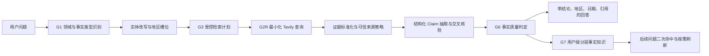

# 开放检索事实核验与回答修复方案 v2

| 项目 | 内容 |
|---|---|
| 状态 | P0 已实现；详情页二次取证与私有知识复用的扩展设计见《开放检索二次取证与私有知识复用方案 v3》 |
| 日期 | 2026-08-20 |
| 适用范围 | Open Research / Tavily；不改动既有巡检、Office 私有处理链路 |
| 目标 Case | `《长安的离职》什么时候上映？` → `《长安的荔枝》` 的可核验日期结论 |

## 1. 结论与问题边界

当前问题不是 Query 改写失败。真实运行记录已证明：路由进入 `OPEN_RESEARCH`、同音实体改写成功、Tavily 被调用、引用被展示；但 G6 质量门将结果降级为 `NO_AUTHORITATIVE_SOURCE`，最终回答没有交付上映日期。

本方案的目标是让系统从“展示若干搜索链接”升级为“交付带地区、日期、状态和引用的受控事实”。它不允许模型或搜索摘要自行补事实；没有满足规则的证据时仍须明确降级。

非目标：不保存网页全文；不把 Office 内容、租户数据、用户标识发送给 Tavily；不改变巡检意图优先级与巡检模式的零公网检索约束。

## 2. 已确认根因

| 编号 | 根因 | 真实影响 | 优先级 |
|---|---|---|---|
| R1 | `上映`、`什么时候`被一律判为日级动态问题 | 过去或已确定的上映日期也按近一天新闻检索，历史事实召回不稳定 | P0 |
| R2 | 来源等级只依据 `.gov/.edu` 或域名中包含 `official/gov/publisher` | 新华网、受审媒体、片方/发行方等正常域名会被错误标成 `SECONDARY` | P0 |
| R3 | G6 只检查“是否存在合格来源”，不检查“来源是否支撑了具体日期” | 有链接但没有可交付 Claim；或有日期但被错误降级 | P0 |
| R4 | 回答生成只枚举来源标题，不抽取 `上映日期 / 地区 / 状态` | 即使 G6 通过，用户也看不到可直接使用的答案 | P0 |
| R5 | `published_at`经常缺失，且所有事实共用 7 天时效规则 | 稳定历史事实会被误判过期；真正高时效信息又可能放得过宽 | P1 |
| R6 | 回归用例断言“改写发生”而非“运行中返回正确事实” | 模拟测试通过，但真实 8000 进程、真实租户和页面结果未被有效覆盖 | P0 |
| R7 | Tavily 摘要会混入旧定档、首映礼/票房和页面推荐日期 | 日期仅因与“上映”同页或相邻而被误绑定，可能造成错误冲突或错误年份 | P0 |

本次 OPPO Run 的两条计划分别为“`《长安的荔枝》 上映 影视化`（day）”和“`《长安的荔枝》 官方 上映 影视化`（general）”。返回的引用均被标为 `SECONDARY`，故 G6 按当前规则必然返回 `NO_AUTHORITATIVE_SOURCE`；其中包含日期信息的标题也没有进入 Claim 或回答层。

## 3. 修复后的目标链路



### 3.1 事实类型而非关键词决定时效

新增 `FactIntent`，至少覆盖：

| 类型 | 示例 | Provider 检索策略 | G6 时效策略 |
|---|---|---|---|
| `EVENT_DATE` | 什么时候上映、何时发布、何时开幕 | `general`，优先“实体 + 地区 + 日期/定档/上映” | 事件日期已发生后可复用；未来排期须在 30 天内或由官方源刷新 |
| `LIVE_STATUS` | 现在是否上映、今天是否停运 | `day` / `news` | 默认 24 小时 |
| `PRICE_WEATHER_FLIGHT` | 当前价格、天气、航班 | `day` / 专题数据源 | 按 5 分钟至 24 小时的类型策略 |
| `POLICY_APPOINTMENT` | 最新政策、现任负责人 | `general + day` | 以生效/发布时间及权威发布源共同判断 |
| `EVERGREEN_FACT` | 作者是谁、成立时间 | `general` | 不以近 7 天淘汰，仍须来源支撑 |

“上映”不再天然代表实时状态。问题中未指定地区时，界面默认先展示中国大陆结果，并明确标注“未指定地区”；同时保留其他已核验地区的独立日期，不能用美国上映日期替代中国大陆日期。

### 3.2 受控检索计划

`EVENT_DATE` 最多三条 Query，按质量而非热点排序：

1. `《实体》 中国大陆 上映 日期`：取得目标地区的日期候选；
2. `《实体》 定档 上映 官方`：寻找片方、发行方、院线或权威发布；
3. `《实体》 上映日期 site:<已审核可信域>`：只在前两条缺乏可核验证据时执行。

检索适配器扩展 `include_domains`、`search_depth`、`max_results`，但只允许 `ResearchPlanner` 生成这些参数。Tavily 仅接收脱敏后的文本 Query、受控来源策略和匿名请求标识；不接收附件、会话、用户或租户信息。

## 4. 可信来源与事实质量设计

### 4.1 平台级来源策略库

新增平台受管的 `research_source_policies`，不能由租户管理员自行提升来源等级。

| 字段 | 说明 |
|---|---|
| `domain` / `subdomain_rule` | 精确域名或已审核子域规则 |
| `tier` | `OFFICIAL`、`PRIMARY`、`PUBLISHER`、`SECONDARY` |
| `allowed_fact_types` | 该域可支撑的事实类型，如 `EVENT_DATE` |
| `status`、`reviewed_by`、`reviewed_at` | 双人审核、启停和可审计性 |
| `expires_at` | 临时授权来源自动失效 |

规则示例：片方/发行方/权威票务公告可为 `OFFICIAL`；经过平台审核的新闻机构可为 `PUBLISHER`；百科、聚合站、促销站和未审核博客始终为 `SECONDARY`。禁止使用“域名包含 official”这样的字符串猜测来授予可信等级。

### 4.2 Claim 结构化抽取

新增 `ClaimExtractor`，从 Tavily 返回的标题与受控摘要中提取，而不持久化网页全文。

```json
{
  "subject": "长安的荔枝",
  "predicate": "RELEASE_DATE",
  "value": "2025-07-18",
  "territory": "CN-MAINLAND",
  "event_state": "RELEASED",
  "evidence_ids": ["ev_xxx"],
  "claim_status": "VERIFIED"
}
```

首期以日期正则、地区词典、实体同现和谓词词典抽取为主；模型只能帮助归类候选，不能生成没有证据跨度的日期。日期候选必须与“上映/定档/公映/发行/发布/上线”等谓词处于**同一标题或同一摘要的同一句/分句**；标题和摘要之间不得互借谓词。`首映礼`、票房、推荐阅读或页面更新时间不能单独形成上映日期。缺失年份时，只能依次使用来源发布时间、已审核来源 URL 中的年份、同次已审核证据的共同年份；不得用抓取时间替代事件年份。持久化内容仅为结构化 Claim、证据 URL、来源等级、页面/摘要哈希、抓取时间，不保存网页全文或 Tavily 原始内容。

### 4.3 G6 判定矩阵

| 结果 | `EVENT_DATE` 判定 | 用户输出 |
|---|---|---|
| `VERIFIED` | 1 条 `OFFICIAL/PRIMARY`，或按该事实类型审核通过的可信 `PUBLISHER` 明确支撑“实体 + 地区 + 日期”；无同等级冲突 | 直接给出日期与引用 |
| `PARTIALLY_VERIFIED` | 有可信日期但地区缺失，或不同地区日期均存在但默认地区未核验 | 限定表述并列出已知地区；不把候选说成唯一答案 |
| `CONFLICTING` | 同一地区存在同等级来源的不同日期 | 展示冲突及来源，不选边 |
| `NO_AUTHORITATIVE_SOURCE` | 没有合格来源或没有能支撑日期的 Claim | 明确说明缺什么，不归档事实记忆 |

价格、政策、医疗、金融等高风险类型可配置为“必须 OFFICIAL/PRIMARY”，不得因一条普通媒体报道而放宽。

## 5. 回答、记忆与用户反馈

### 5.1 回答合同

对本 Case 的成功形态必须类似：

> 我已按高置信实体改写为《长安的荔枝》检索。中国大陆上映日期为 **2025 年 7 月 18 日**；其他地区如有独立上映日期，将单独列出。信息截至 `<as_of>`，每条日期紧跟引用链接。

回答 DTO 新增 `claims[]`、`fact_intent`、`territory_assumption`、`quality_status`。页面在“开放信息检索”卡中把改写、结论、地区、截至时间与引用一并展示；不得把“未找到权威来源”与包含可核验日期的事实混在同一结果中。

### 5.2 用户级记忆

只归档 `VERIFIED/PARTIALLY_VERIFIED` 的结构化 Claim，按“客观永久 / 缓慢变化 60 天 / 高时效不归档”生命周期管理，仍遵守“用户级、不跨用户、不保存网页全文”。二次 Query 命中时：

- 客观且已发生的稳定事实可长期直接给出记忆结论与原引用，并标明最后核验时间；
- 缓慢变化事实 60 天后失效；用户明确要求“最新/当前”时即使未到期也刷新；
- 未来排期、实时状态、价格、天气、车票等高时效事实不归档，必须先刷新；其回答、引用和限长采用证据可保留在聊天中供回看，但绝不进入知识、相似召回或下一轮事实输入；
- 新证据与旧 Claim 冲突时，旧记忆失效并进入 `CONFLICTING`，不覆盖为确定事实。

反馈增加 `CLAIM_WRONG`、`DATE_WRONG`、`REGION_MISSING`、`SOURCE_TIER_WRONG`。这些只保存枚举和哈希，不把用户补充内容当作事实自动写入记忆。

## 6. 数据、接口与权限

| 对象/API | 变更 |
|---|---|
| `open_research_runs` | 增加 `fact_intent`、`quality_status`、`territory_assumption`；保留 Query 哈希而非原始出站内容 |
| `open_research_claims` | 保存结构化 Claim、地区、谓词、ISO 日期、证据关联、核验状态与过期策略 |
| `research_source_policies` | 平台安全管理员维护；租户管理员只读，不可提高等级 |
| `POST /messages` 返回体 | `research.answer.claims` 是页面结论唯一来源；无合格 Claim 时不显示确定日期 |
| `GET /open-research/runs/{id}` | 返回脱敏计划、Claim、质量判定和证据，不返回网页全文或 Tavily 密钥 |

所有新表按 `tenant_id + user_id` 过滤 Claim 和记忆；来源策略为平台只读配置。G0、G1、G2R、G3、G5 保持现有约束；主要改动限定在 G3 计划、G6 事实质量与 G7 记忆归档，巡检模式仍然保证 Tavily 调用数为 0。

## 7. 开发拆分与验收门禁

| 阶段 | 交付 | 必过用例 |
|---|---|---|
| P0-1 | `FactIntent`、事件日期 Planner、真实运行版本标识 | 目标 Query 的首条计划不再为 `day`；巡检问题仍不出网 |
| P0-2 | 来源策略库、可信域审核脚本、证据标准化 | 未审核域不可升级；已审核来源按事实类型生效 |
| P0-3 | ClaimExtractor、G6 判定矩阵、回答 DTO/UI | Fake Tavily 返回日期后，页面直接显示“地区 + 日期 + 引用” |
| P0-4 | 记忆、反馈、埋点与灰度开关 | 用户 A/B 互不可读；永久/60 天/不归档生命周期；错误反馈可统计 |
| P1 | 多语言地区、更多事实类型、来源运营后台 | 冲突、未来排期变更、地区并列结果可控 |

新增不可省略的测试：

1. `GATE-OR-201`：`《长安的离职》什么时候上映？` 必须改写为“荔枝”，计划为 `EVENT_DATE`，且无日级历史限制；
2. `GATE-OR-202`：审核来源含 `2025年7月18日` 时，返回 `VERIFIED`、结构化日期和可点击引用；
3. `GATE-OR-203`：未审核百科/聚合站含日期，不得单独形成确定 Claim；
4. `GATE-OR-204`：中国大陆与美国日期不同，必须按地区并列，不能互相覆盖；
5. `GATE-OR-205`：同地区可信来源日期冲突，返回 `CONFLICTING`；
6. `GATE-OR-206`：证据和审计中不存在网页全文、用户/租户出站字段或 Tavily 密钥；
7. `GATE-OR-207`：同一 Case 的运行中 E2E——启动新进程、OPPO 开启能力、提交真实 UI 请求，断言 JSON 与页面同时含改写、日期、地区和引用；
8. `GATE-OR-208`：`INSPECTION` 模式重复该问题，Tavily 调用数仍为 0。
9. `GATE-OR-209`：同次 Tavily 结果同时包含“2025 年旧定档”“2026 年页面推荐日期”和“7 月 18 日中国内地上映”时，只可交付 `2025-07-18 / CN-MAINLAND`；不得将页面日期视为事件日期，也不得把无地区的旧定档当作地区冲突。

CI 使用受控 Fake Tavily 金样本；灰度环境用测试租户和受限额度跑真实 Tavily。任何“仅 Fake 通过、运行中进程未重启、页面未断言日期”的结果不得标记验收通过。

## 8. 灰度与放行标准

1. 先关闭 OPPO 的开放检索灰度入口，完成 P0-1 至 P0-3 和所有自动化用例；
2. 在隔离测试租户验证真实 Tavily，人工核对 Run Trace、来源等级和页面事实；
3. OPPO 仅对租户管理员灰度开启，设置每用户/每租户额度和一键熔断；
4. 观察 `rewrite_applied_rate`、`claim_extraction_rate`、`verified_answer_rate`、`no_authoritative_rate`、`DATE_WRONG` 反馈率及来源等级分布；
5. 连续通过目标 Case、天气/价格等高时效 Case、巡检零回归与敏感 Query 零出站后，才扩大用户范围。

本 Case 的发布门槛是：用户在 OPPO 页面输入原错别字 Query 后，看到“已按《长安的荔枝》检索”，并收到含地区、日期、截至时间和可点击可信引用的结论；不能再以“有若干链接”或“改写已发生”代替正确答案。
