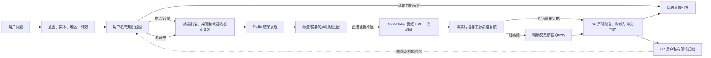

# 开放检索二次取证与私有知识复用方案 v3

| 项目 | 约定 |
|---|---|
| 状态 | 设计评审稿，作为 v2 事实核验方案的 P0.5 扩展 |
| 目标 | 让“检索已返回正确 URL、但标题/摘要不足”时仍可受控取证；让同一用户的已核验历史事实优先复用，并提供与知识库隔离的历史查询记录页 |
| 适用域 | 仅 `Open Research`；巡检/VLM 零公网检索、Office 私有资产链路保持不变 |
| 已确认边界 | Tavily 首期唯一搜索引擎；用户级分层知识生命周期；不跨用户共享；不持久化网页全文 |

## 1. 本次 Badcase 的完整结论

目标问题的正确用户答案应是：

> 《长安的荔枝》已于 **2025 年 7 月 18 日在中国大陆上映**。

本次 Run 已完成同音改写并从 Tavily 结果中拿到百度百科 URL；该 URL 的页面正文确实包含正确事实。但当前链路有三处通用缺口：

1. Tavily 的标题/摘要是唯一可供抽取的文本，系统不读取结果 URL 的详情页；“链接存在”不等于“可抽取到事实”。
2. 当前实体相关性按“整条标题/摘要任意位置出现”判定。一篇主讲其他作品、仅顺带提及目标实体的页面，会把同页其他日期错误归给目标实体，形成伪冲突。
3. 百度百科未处于平台可信来源策略，属于 `SECONDARY`。即便详情页含正确事实，也不能直接升级为可交付事实；它应成为精确交叉核验的线索。

因此，方案不是把百度百科简单升级为可信来源，而是补齐“结果发现 → 受控详情取证 → 高可信交叉核验 → 私有知识复用”的通用闭环。

## 2. 目标链路



“详情取证”是证据处理的子步骤，不新增面向用户的独立能力，也不改变现有七道门禁；它属于 `G2R` 的受控子门 `G2R-Detail`，必须在同一 Open Research Run 内执行并写入脱敏 Trace。

## 3. 历史知识优先：不是普通聊天记忆，而是私有事实索引

### 3.1 归档对象与匹配键

只归档已通过 G6 的结构化事实。每条 `ResearchKnowledge` 使用以下 `FactKey`：

```text
owner: tenant_id + user_id
entity_id / canonical_entity + aliases
fact_intent + predicate + object_type
territory + qualifier + time_scope
claim_value + event_state
source_policy_version + evidence_fingerprints
retention_class + verified_at + valid_until + status
```

`ResearchKnowledge` 不保存网页全文、Tavily 原始响应、完整用户问题或正文片段。页面定位信息只保留 URL、来源策略 ID、提取字段类型、片段哈希、时间戳和事实三元组；它与会话消息是两个严格隔离的存储域。

### 3.1.1 会话留痕与知识复用的双轨边界（已确认）

用户需要能够在刷新页面或重新进入会话后，查看当时的实时查询。因此，高时效问题的用户提问、回答、可点击引用和**已脱敏、限长且只支撑最终结论的证据片段**都按正常会话保留策略写入 `Conversation/Message`；它们是“当时查询的留痕”，不是可供事实问答复用的知识。

为避免“历史消息虽然可见，却被模型暗中当成实时答案复述”，`NO_MEMORY` 必须同时满足下列硬约束：

1. 不创建 `ResearchKnowledge`、向量/词法索引、别名召回项或可供检索计划使用的历史 Claim；相同或相似输入一律不查知识索引。
2. 新一轮被识别为高时效的请求始终写入 `force_fresh=true`，必须调用受控实时数据源/外部检索；即使消息历史中已有完全相同的问题和答案也不能直接回答。
3. 若用户使用“那现在呢/明天呢/这个价格呢”等省略表达，只允许从历史消息抽取**实体、地区、产品或时间范围**来补全本轮 Query；不得把旧的价格、余票、天气数值、日期结论或旧引用送入模型作为事实依据。本轮结论只能来自新 Run 的证据。
4. 会话卡必须显示“截至时间”和“实时查询；再次提问将重新检索”。历史回看不等于仍然有效。

会话中的证据片段仅允许保留最终 Claim 对应的净化事实窗口（单来源最多 300 个汉字/等长字符，去除 HTML、脚本、导航、账号/联系方式和提示注入文本）；不得保存原始 HTML、网页全文、Tavily 原始响应或未被采用的候选片段。会话访问仍遵循创建人和租户隔离；运行审计仅保存时间、状态、额度、Query 哈希等最小元数据。

### 3.1.2 独立“开放检索记录”页：查询留痕的只读投影

该页面服务于“找回我以前问过什么、当时系统如何回答”的需求，不能被命名或实现为“知识库”。它以 `run_id` 为记录主键，从 Open Research Run、关联用户/助手消息、最终 Claim 和已采用 Evidence 生成只读投影；不复制正文，也不能向 `ResearchKnowledge` 回写任何事实。

| 页面层级 | 可展示 | 明确禁止 |
|---|---|---|
| 列表 | 原问题、改写实体、事实类型、质量状态、截至时间、来源数、反馈状态、实时/可复用标签 | 网页正文、完整 Trace、其他用户记录、原始 Query 出站日志 |
| 详情 | 最终回答、可点击引用、最终采用的限长净化证据窗口、改写原因、质量状态、原会话回跳 | 原始 HTML、Tavily 原始响应、未采用候选、门禁内部字段、模型输入 |
| 实时记录动作 | “重新检索”创建新 `run_id`；只继承实体/地区/产品/时间范围 | 直接复述旧数值/日期/引用，或将旧 Claim 写入新 Run |

列表查询和详情读取必须由后端固定 `tenant_id + user_id`，再处理游标、筛选或关键词；普通租户管理员不因管理角色获得查看其他用户问题、答案、引用或证据窗口的权限，只能访问脱敏聚合指标。该页面是独立一级入口，不纳入巡检“操作记录”，切换租户、登出、403/404 均清空前端记录状态。

### 3.2 三层知识生命周期

知识生命周期由**结构化谓词**决定，不能按“电影/名人/政策”这类宽主题一刀切。`永久`指不会因时间自动删除，不代表永远可信或永远可以直接回答；用户删除、负反馈核实、来源策略撤销和新证据纠正都可使其失效。

| 层级 | `retention_class` | 归档与留存 | 典型可归档谓词 | 不属于本层的相邻事实 |
|---|---|---|---|---|
| 客观永久事实 | `PERMANENT_FACT` | 通过 G6 后长期保留，`valid_until=NULL` | 已发生的上映/发布/开幕日期、作品主创/片长、人物姓名/出生日期/已公开作品、机构成立日期 | “是否仍在上映”“现任职位”“最新票房” |
| 缓慢变化事实 | `SLOW_60D` | 通过 G6 后保留 60 天，到期不可复用 | 美国总统、中国总理、机构负责人、政策当前有效状态、组织当前 CEO/负责人 | 任命公告的发布日期可为永久；“最新是否仍任职”不是永久 |
| 高时效事实 | `NO_MEMORY` | 不创建知识记录，不进入记忆索引；但查询结果按会话策略可回看 | 股票/汇率价格、天气实况、火车票余票/票价、航班/路况、实时库存 | 公开产品的固定规格、历史天气统计等可按其实际谓词另行归类 |

“名人信息”需拆成事实：出生日期、已上映作品、已获奖项等客观事实进入 `PERMANENT_FACT`；当前经纪公司、现任职务、最新行程等进入 `SLOW_60D` 或 `NO_MEMORY`。同理，电影的正式上映日期可永久保存，而“当前是否在院线上映”属于实时状态，不得复用永久日期替代。

`KnowledgeRetentionPolicy` 由平台按 `fact_intent + predicate + event_state` 维护、版本化和审计，租户不能把一个实时谓词提升为永久事实；未配置谓词默认 `NO_MEMORY`。每次归档都记录生命周期判定和策略版本，防止模型或页面文本自行决定保留期。

高时效问题仍会保留最小化的运行审计（时间、状态、额度、Query 哈希）以满足安全与成本追溯。其最终回答、引用和限长证据窗口写入聊天历史供用户回看，但不会写入 `ResearchKnowledge`、检索索引或检索规划提示；会话历史中的实时结果必须标注截至时间和“再次提问将重新检索”。

### 3.3 三档命中行为

| 命中级别 | 条件 | 是否直接回答 | 外部搜索行为 |
|---|---|---|---|
| `EXACT_REUSABLE` | `PERMANENT_FACT`：实体、谓词、地区/限定词一致且仍为 `VERIFIED`；`SLOW_60D`：上述条件成立且未到期、用户未要求“最新/当前”刷新 | 是，引用历史来源并注明最后核验时间 | 0 次 Tavily |
| `SIMILAR_HINT` | 实体或别名一致、任务相近；但地区、谓词、版本或时效不完全一致 | 否 | 将别名、已验证来源和候选值作为检索计划提示，重新核验 |
| `STALE_OR_REVOKED` | `SLOW_60D` 到期、用户负反馈成立、来源策略失效、此前冲突或用户删除 | 否 | 仅用于识别实体；必须重新检索 |
| `NO_MEMORY` | 高时效事实或其相似问题 | 否 | 不查知识索引；忽略历史结果值，仅可用历史实体补全本轮 Query，然后直接走受控外部检索/专用实时数据源 |

`SIMILAR_HINT` 可先用规范化 `FactKey`、别名和词法召回实现；P1 再引入仅限当前用户分区的本地语义索引。即使语义相似度很高，也不能绕过“实体 + 谓词 + 地区 + 有效期”的直接回答门槛。

### 3.4 时效、纠正与删除

- `PERMANENT_FACT` 不设时间过期；同一 `FactKey` 的重复证据合并来源，不产生重复知识。事实被纠正时旧版本标为 `SUPERSEDED`，不再直接回答。
- `SLOW_60D` 自核验时起 60 天后转为 `EXPIRED`。带“最新/当前/是否仍然”等明确实时语义的问题，即使未到期也必须刷新。
- `NO_MEMORY` 不进入 `ResearchKnowledge`；价格、天气、车票、航班等的结果、引用和证据窗口仅作为可回看的聊天消息保留，没有“昨日结果”可被下次问答复用。下一次相同或相似查询必须新建实时 Run。
- 用户点击“日期不对/来源分级有误”并经规则确认、平台禁用来源策略或用户主动删除后，关联知识立即 `REVOKED/DELETED`，所有层级均不再直接命中。
- 任何可信新事实与旧知识冲突时，旧条目变为 `SUPERSEDED`，不可静默覆盖；永久记录保留版本关系和审计，不保留正文。

## 4. 搜索结果的两阶段取证

### 4.1 阶段 A：SERP 声明级匹配

Tavily 每条结果先被划为下列之一，而非立即成为 Claim：

| 分类 | 条件 | 可否形成最终 Claim |
|---|---|---|
| `DIRECT_SERP_EVIDENCE` | 目标实体、关系、值、地区在同一标题或摘要片段内直接成立 | 可以，仍须来源和时效通过 |
| `DETAIL_REQUIRED` | URL 可信可访问，但标题/摘要缺少完整事实或只显示结论线索 | 进入受控详情取证 |
| `DISCOVERY_LEAD` | 事实可能存在，但来源为 `SECONDARY` 或证据不完整 | 只能生成交叉核验假设 |
| `REJECTED` | 实体在其他作品/导航/推荐语境，或日期为页面元数据 | 不参与后续聚合 |

**声明级范围约束**：目标实体、谓词和日期必须在同一标题、同一摘要分句、同一表格行或同一正文段落中匹配；若出现另一个具名实体，日期默认归属该实体，除非结构化表格明确显示目标实体行。这样可彻底避免“文章提到《长安的荔枝》，但日期实际属于《戏台》”的伪 Claim。

关系还应区分：`ACTUAL_RELEASE_DATE`（已于/正式/全国上映）、`SCHEDULED_RELEASE_DATE`（定档/将于/拟于）、`PREMIERE_DATE`（首映礼）、`ARTICLE_PUBLISHED_AT`（页面发布时间）。只有同一实体、同一关系、同一地区的 `ACTUAL_RELEASE_DATE` 才可彼此构成冲突。

### 4.2 阶段 B：G2R-Detail 受控 URL 二次取证

当结果属于 `DETAIL_REQUIRED` 或 `DISCOVERY_LEAD` 时，系统可读取详情页，但不是任意 URL 爬取器：

1. **来源限定**：仅允许读取本次 Tavily 已返回的 HTTPS URL；用户输入的 URL 不自动抓取。
2. **网络安全**：每次重定向都重新校验 DNS/IP；拒绝私网/回环/内网域名、凭证 URL、非 HTTPS；最多 3 次重定向、5 秒超时、每轮最多 3 个 URL/每 host 1 个 URL。
3. **内容安全**：仅 HTML/文本；拒绝下载、脚本执行、Cookie/登录态、表单提交；限制响应与解压后大小；移除脚本、样式、导航和广告；扫描提示注入文本。
4. **最小提取**：页面仅在内存中短暂解析。只保留候选事实所在的最多 300 字片段、字段路径（标题/元描述/正文段落/信息表行）和哈希；原 HTML 与全文不入库、不入记忆、不进入前端。
5. **模型边界**：先由确定性规则定位实体—谓词—值窗口；如需模型消歧，只把已净化且限长的候选片段交给已批准模型网关，模型只能做“是否支撑该三元组”的结构化判断，不能生成新事实或调用工具。

来源策略决定详情页的用途：

| 来源等级 | 详情读取 | 结果用途 |
|---|---|---|
| `OFFICIAL/PRIMARY/PUBLISHER` | 自动受控读取 | 可形成直接证据，进入 G6 |
| `SECONDARY` | 自动受控读取（额度更低） | 仅形成“待证实事实假设”，不可直接回答 |
| 禁止域/安全异常 | 不读取 | 记录拒绝原因 |

这意味着百度百科可以帮助发现“`中国大陆 / 2025-07-18`”这一候选，但不会因一次页面读取就被升为 `PUBLISHER`。

### 4.3 精确交叉核验

`DISCOVERY_LEAD` 或多个低质量候选会生成有预算的精确核验 Query，例如：

```text
《长安的荔枝》 2025年7月18日 中国大陆 上映
```

该 Query 只携带公开实体、日期、地区与谓词；使用已审核域名策略（片方、发行方、1905/权威电影媒体等）。平台安全管理员需按双人复核把新增影视权威域纳入 `research_source_policies`，而不是临时信任某个结果。

单次预算建议为“基础 Tavily 3 次 + 详情取证最多 3 页 + 精确交叉核验最多 2 次”。只有在直接证据不足、但有高相关线索时才消耗升级预算；重复 Query、相同 host 和已否决 URL 不重试。

## 5. G6、回答与页面合同

### 5.1 事实聚合规则

每个候选必须携带 `subject_id`、`predicate`、`value`、`territory`、`evidence_type`、`source_tier`、`extraction_locator` 和 `support_status`。G6 仅用 `DIRECT` 且来源策略允许的候选聚合。

- `SECONDARY` 线索不能触发冲突，也不能进入用户答案的 Claim 列表。
- `SCHEDULED_RELEASE_DATE`、`PREMIERE_DATE`、`ARTICLE_PUBLISHED_AT` 不与 `ACTUAL_RELEASE_DATE` 冲突。
- 只有“相同实体、相同谓词、相同地区、可信直接证据”的不同值才是 `CONFLICTING`。
- 无高可信佐证时返回 `NO_AUTHORITATIVE_SOURCE`，但 Trace 应说明“已发现线索，缺少可交付佐证”。

### 5.2 面向用户的简洁回答

用户首屏只看最终结果，不展示内部候选列表：

| 状态 | 首屏示例 |
|---|---|
| `VERIFIED` | `《长安的荔枝》已于 2025 年 7 月 18 日在中国大陆上映。` |
| `MEMORY_HIT` | `《长安的荔枝》已于 2025 年 7 月 18 日在中国大陆上映。依据你于 2026-08-20 的已核验记录。` |
| `CONFLICTING` | `暂无法确认中国大陆上映日期：两条直接可信来源给出不同日期。` |
| `NO_AUTHORITATIVE_SOURCE` | `已找到相关线索，但尚未找到可直接佐证中国大陆上映日期的可信来源。` |

“改写、截至时间、来源等级、历史命中、候选线索和执行轨迹”放在可展开的“核验详情”中。引用列表默认仅显示支撑最终事实的 1–3 条来源；线索来源单独标为“未作为结论依据”。

## 6. 数据、接口、审计与门禁

| 对象 | 新增字段/能力 | 禁止持久化 |
|---|---|---|
| `research_knowledge` | `FactKey`、`retention_class`、匹配级别、状态、有效期、来源指纹、版本关系、负反馈/失效原因 | 网页正文、原始 Query、跨用户内容 |
| `open_research_evidence` | `evidence_type`、`detail_fetch_status`、`extraction_locator_type`、`fact_fragment_hash`、拒绝码 | HTML、完整摘要、原始详情片段 |
| `open_research_claims` | `subject_id`、关系类型、直接/线索标识、支持范围哈希 | 模型推理链、完整上下文 |
| `open_research_runs` | 记忆匹配级别、详情取证预算、交叉核验次数、精简回答状态 | Tavily 密钥、用户/租户出站字段 |

建议接口：

- `GET /api/open-research/memories?query=`：只返回当前用户的脱敏命中摘要和复用状态。
- `POST /api/open-research/runs/{id}/refine`：可选策略 `detail_verify` / `trusted_corroborate`，由后端重算预算，不接受任意 URL。
- `GET /api/open-research/runs/{id}`：返回“为何使用/拒绝某来源”的枚举原因，不返回正文或片段原文。

新增 Trace 枚举：`MEMORY_EXACT_REUSED`、`MEMORY_SIMILAR_HINT`、`SERP_DIRECT`、`DETAIL_FETCHED`、`DETAIL_NO_FACT`、`SECONDARY_LEAD`、`TRUSTED_CORROBORATED`、`ENTITY_OUT_OF_SCOPE`、`DATE_METADATA_REJECTED`。审计只记录 URL 指纹、来源策略、耗时、预算、决定与哈希。

## 7. 门禁与隔离要求

| 门禁 | 设计要求 |
|---|---|
| G0/G1 | 仅 `OPEN_RESEARCH` 可进入详情取证；`INSPECTION` 强制 0 次 Tavily、0 次 URL 读取 |
| G2R-Detail | 仅搜索结果 URL、SSRF/重定向/MIME/大小/超时/注入扫描全通过后读取 |
| G3 | 决定来源策略、详情页数量、交叉核验预算和模型片段许可 |
| G5 | Tavily、详情读取和模型判断分别计量、限流、熔断；失败不影响巡检或 Office |
| G6 | 线索与直接证据隔离；仅直接可信 Claim 可交付或写入知识 |
| G7 | 知识仅当前用户；按 `PERMANENT_FACT / SLOW_60D / NO_MEMORY` 生命周期归档或拒绝归档；删除、失效、来源打开和反馈均写审计 |

Office 仍只可消费已完成的 `ResearchBrief` 中最终 Claim、引用与截至时间；不得访问详情页内容或 `DISCOVERY_LEAD`。Office → Open Research 的附件外发策略不变，仍默认拒绝。

## 8. 开发拆分与验收

| 阶段 | 交付 | 关键验收 |
|---|---|---|
| P0.5-1 | 声明级实体/关系/日期抽取与候选分类 | 其他作品页面中的日期不可归属到目标实体 |
| P0.5-2 | `G2R-Detail` URL 安全读取与最小片段提取 | URL 正文有事实、摘要无事实时可产出受控候选；原文不落库 |
| P0.5-3 | 线索→可信来源交叉核验与 G6 聚合 | `SECONDARY` 不可直接回答，但能引导可信来源命中 |
| P0.5-4 | 私有事实索引与分层生命周期命中 | 永久客观事实精确命中 0 Tavily；缓慢变化事实 60 天到期；高时效事实零归档、必刷新 |
| P0.5-5 | 紧凑回答 UI、Trace、反馈与看板 | 首屏只显示可交付结论；候选仅在详情可见；实时结果可在会话回看但强制新 Run |

新增不可省略用例：

1. `GATE-OR-210`：文章正文提到目标实体，但日期/上映谓词属于另一具名实体，必须 `ENTITY_OUT_OF_SCOPE`，不得形成 Claim。
2. `GATE-OR-211`：标题/摘要没有日期、详情页信息表有“2025-07-18 中国大陆上映”，详情页产生候选；可信域交叉核验后返回简洁 `VERIFIED` 答案。
3. `GATE-OR-212`：仅 `SECONDARY` 详情页有正确日期、无可信佐证时，不得确定回答或进入用户知识。
4. `GATE-OR-213`：同用户“《长安的荔枝》何时在内地上映”精确命中 `PERMANENT_FACT`，直接回答且 Tavily/详情读取数均为 0；存储超过 60 天仍可命中。
5. `GATE-OR-214`：同实体但改问美国地区/当前是否上映/未来排期，只能为 `SIMILAR_HINT`，必须重新检索。
6. `GATE-OR-215`：美国总统/中国总理等 `SLOW_60D` 事实在 60 天内可按策略复用，到期或请求“最新/当前”时必须刷新。
7. `GATE-OR-216`：天气、股票价格、火车票和航班等 `NO_MEMORY` 请求完成后，知识索引中不存在结果、Claim 或可召回证据；再次查询必走实时数据源。
8. `GATE-OR-217`：私网重定向、非 HTML、超限页面、提示注入文本和用户自带 URL 都被详情读取门阻断。
9. `GATE-OR-218`：来源策略禁用、用户负反馈或用户删除后，永久/60 天知识均不再直接命中。
10. `GATE-OR-219`：巡检模式重复任意开放问题，Tavily 和详情读取调用数均为 0。
11. `GATE-OR-220`：冲突态首屏不展示内部候选清单；验证态首句即为用户问题的直接答案。
12. `GATE-OR-221`：人物出生日期/电影已发生上映日期与现任职位分别落入 `PERMANENT_FACT`、`SLOW_60D`，不得按实体整体套用同一保留期。
13. `GATE-OR-222`：数据库、记忆、审计、前端响应中不存在 HTML、全文或原始片段，仅有事实、哈希和定位类型。
14. `GATE-OR-223`：未在 `KnowledgeRetentionPolicy` 配置的谓词默认 `NO_MEMORY`，租户配置或模型输出均不能把它升级为永久归档。
15. `GATE-OR-224`：天气/股票/余票等 `NO_MEMORY` 的回答、引用和限长已采用证据片段在刷新和重新打开会话后可见；`ResearchKnowledge`、词法/语义索引和计划提示中均不存在其事实值或证据。
16. `GATE-OR-225`：带有历史实时结果的“那现在呢/这个价格呢”只可继承实体等非事实槽位，必须产生新 Run 和外部调用；模型输入、最终答案和引用不得使用旧 Run 的数值、引用或 Claim。
17. `GATE-OR-226`：当前用户在“开放检索记录”页可按时间/类型/状态筛选并分页查看自己的历史 Run；详情与原会话中的最终回答、引用、截至时间和已采用证据窗口一致，但不含网页全文或未采用候选。
18. `GATE-OR-227`：用户 B、其他租户和普通租户管理员读取用户 A 的记录列表或猜测 `run_id` 均返回空集/404；对象读取、详情组装和前端缓存均不泄露 A 的信息。
19. `GATE-OR-228`：记录页的 `NO_MEMORY` 条目刷新或重新登录后仍可回看，且任何记录 API、缓存、审计、前端详情和检索关键词结果均不存在原始 HTML、Tavily 原始响应或超过限长的证据正文。
20. `GATE-OR-229`：从一条历史天气/价格/余票记录点击“重新检索”或发起省略追问时，生成不同的 `run_id` 和 `force_fresh=true`；调用新实时数据源，旧事实值、旧引用、旧 Claim 不参与新答案。

## 9. 放行指标与风险

新增指标：`detail_fetch_attempt/success/reject_rate`、`serp_to_detail_fact_yield`、`secondary_lead_to_trusted_confirmation_rate`、`entity_out_of_scope_reject_rate`、`memory_exact_direct_answer_rate`、`memory_hint_refresh_rate`、`answer_first_sentence_direct_rate`、`detail_fetch_p95` 与 `per_run_total_cost`。

上线门槛：`GATE-OR-210..229` 全通过；巡检零外网调用；网页全文零落库；`NO_MEMORY` 结果零知识归档且历史追问强制新 Run；记录页私有 ACL、内容限界和租户切换清理通过；目标 Case 在真实 Tavily 灰度中返回单句正确答案和可点击可信引用；`DATE_WRONG`、`NOT_FOUND`、`ANSWER_NOT_DIRECT` 反馈率可观测且可回溯至拒绝码。

### 开发前唯一需锁定的策略

建议采用：**自动受控读取本次 Tavily 返回的公开 URL（每轮最多 3 页），但任何 `SECONDARY` 来源只作线索，必须由已审核来源交叉核验后才可直接回答。** 这既能解决“正确事实只在 URL 正文”的召回问题，也不以降低来源门禁换取答案。
